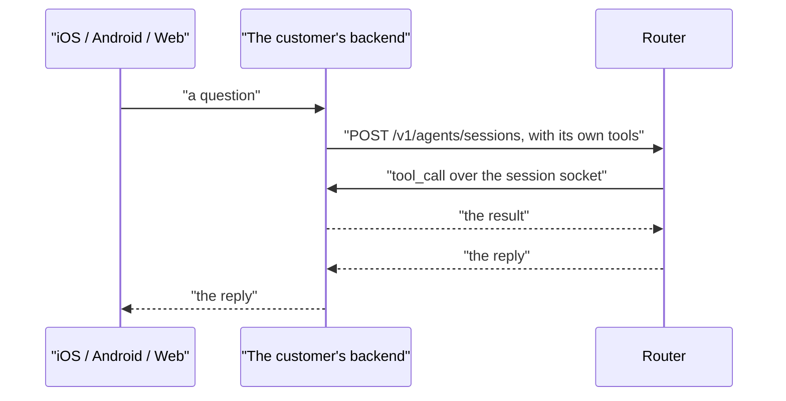
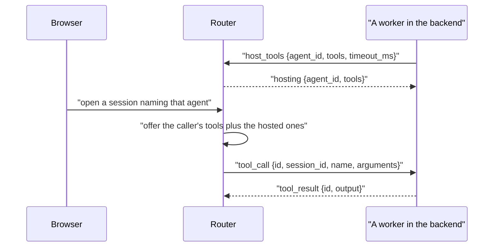

# Two architectures: direct and acceleration first

Every agent built on this stack is one of two shapes, and the difference is only who opens
the session. Both end up in the same [session manager](../../acceleration/internal/session),
running the same pipeline.

## Direct

The app — iOS, Android, a browser — calls the customer's own backend, and that backend opens
the session on the router with one of the [SDKs](sdk.md): PHP, Ruby, Go, Python, .NET, Rust
or JavaScript. The backend declares its functions when it opens the session, so every tool
call comes back over the socket it is already holding, to the process that has the database
connection, the session cookie and the source tree.

Nothing is missing in this shape. The cost is a hop: the backend is in the path of the audio
or the token stream, and it has to stay up for the length of the conversation.

## Acceleration first

The app opens the session on the router itself, with a token the backend minted. The router
runs the whole thing — the [voice pipeline](voice-agent.md), the model
[routing](routing.md), [search](knowledge.md) and the standard Daytona sandbox — so nothing
of the customer's has to be in the path.

What the router cannot run is anything that only exists on the customer's side: a function
over their database, a tool behind their auth, a sandbox of their own. Nobody on the session
can answer those calls, because the session was opened by a browser.

## Hosted tools are the bridge

The [dispatch socket](dispatch.md) is how the second shape reaches the first. A worker in
the customer's backend holds `/v1/dispatch` open and sends one `host_tools` frame naming an
**agent id** and the tools it runs for it. From then on every session opened under that
agent id, whoever opened it, is offered those tools, and each call reaches the worker as a
`tool_call` and is answered with `tool_result`.

A custom sandbox needs nothing else: it is hosted tools whose implementations happen to talk
to the customer's own VMs.

## Why the agent id

The alternative, and what was built first, was to key hosting by stored agent config. It
does not reach the sessions that need it: a browser opening a session names an agent id and
its own instructions, not a config, so nothing matched and the hosted tool was never
offered. Both sides of the pair already agree on the agent id — it is what transcripts,
statistics and the conversation are keyed by — so that is the key.

The trust model follows the worker, not the id. Anyone who can open a session for a customer
can name any of that customer's agent ids and be offered the hosted tools, which is
acceptable because a dispatch worker is already trusted with all of its customer's
conversations; hosting is scoped to the worker's customer, so no other customer can reach
it. An agent id is a name, not a secret, and a tool that must not be offered to an end user
should not be hosted.

The rules around a call are the worker's, not the session's:

| Question | Answer |
| ------------------------------------------ | --------------------------------------------------------------- |
| Two tools with one name | The caller's wins. Whoever opened the session asked for that one |
| How long a call has | The worker's `timeout_ms`, two minutes by default, not the session's tool timeout |
| The worker disconnects mid-call | The call fails at once rather than waiting out the timeout |
| Several workers host the same agent | They take turns, and one whose queue is full is passed over |
| The router restarts | The Go worker reconnects and declares what it hosts again |

## Not done

- **Only Go can host.** `Dispatch.Host(agentID, functions, timeout)` exists in
  [sdks/go](../../sdks/go/stream/dispatch.go); PHP, Ruby, Rust, .NET, JavaScript and Python
  have a dispatch worker but no way to host tools on it.
- **Hosting lives in one router.** The pool is in process, so a worker connected to one
  router is not offered to a session held by another.
- **Nothing tells a caller a tool went away.** A session offered a hosted tool keeps it for
  the turn; if the worker leaves, the call fails when the model makes it.
