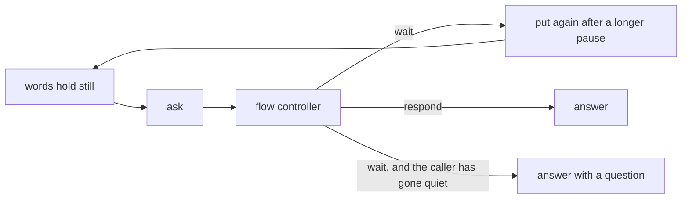

# How the conversation is handled

Every judgement a call makes lives in
[converse.go](../../acceleration/internal/agent/converse.go), gathered there in
[sprint 15](../sprint15.md). This is what that class decides and why. See
[the voice agent](voice-agent.md) for the machinery around it and
[speaking while listening](duplex.md) for the overlap rules.

## The loop

    10|[cadence.go](../../acceleration/internal/agent/cadence.go) gathers transcript revisions per
participant and puts a turn when the words stop changing. `converse.Settled` asks the fast
flow controller in [flow.go](../../acceleration/internal/harness/flow.go) about it (`ask`),
and `converse.Ruled` turns the answer into what the agent should do: `answer`, `wait`,
`ignore`, or, when the agent was mid-sentence, `interrupt`, `shorten` or `queue` first.
`Agent.perform` carries it out. Deciding and acting are separate so deciding stays a pure
function of the state it is handed.

`wait` is not a dead end: the words go back to settling and are put again after a longer
pause, so a caller who paused mid-sentence keeps their turn.
    20|

    30|## Silence ends the waiting

The retry puts the same words to the controller for as long as the caller says nothing more,
and the controller answers the same way every time, so waiting is a loop only the caller can
end. After `defaultPatience` of unchanged words the conversation stops waiting and answers
with a short question instead.

It matters because the reason for waiting is often wrong. A transcriber that mishears half a
sentence produces something that reads as unfinished, the agent decides not to reply, and the
caller is left talking to a line that has gone quiet on them. Asking them to say it again
    40|recovers the turn; waiting never does.

The two reasons to ask a question rather than answer are told to the model separately:
`ambiguousNote` for a clear sentence with an unclear intent, which is the controller's own
`clarify` ruling, and `unfinishedNote` for a thought that never arrived.

## An overlap buys the next turn 150ms

Whenever somebody was talked over, whichever of them gives way, `cadence.Grace` gives the next
turn `interruptGrace` longer to hold still. Two people talking at once is as often a line
running late as it is a change of mind, and words arriving late are answered half-said if the
    50|next turn is settled at the usual pace. It is spent on that one turn: a call is not slow for
having had one collision in it.

## The trail, and what is left out of it

Every judgement goes through one `decide`, which logs it, emits a `Decided` event and records
it through [decisions.go](../../acceleration/internal/agent/decisions.go). That is the trail
the dashboard's decision log reads, and it is a byproduct of the reasoning rather than
something written alongside it and able to disagree with it.

An `ask` and a `wait` are only written down when they say something the last one did not. A
    60|caller stopped mid-thought is asked about and waited on again on every retry, and a trail with
all of those laps in it is one nobody can read. Any other judgement means the words moved on,
which clears the memory, so the same sentence said again later is written down again.

## Not done

Patience is one duration for the whole call rather than something learned from how the caller
speaks, and the grace after an overlap is a constant rather than a measurement of the line.
