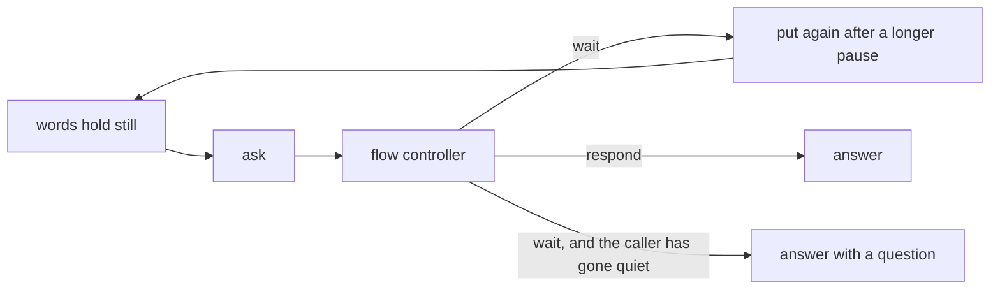

# How the conversation is handled

Every judgement a call makes lives in
[converse.go](../../acceleration/internal/agent/converse.go), gathered there in
[sprint 15](../sprint15.md). This is what that class decides and why. See
[the voice agent](voice-agent.md) for the machinery around it and
[speaking while listening](duplex.md) for the overlap rules.

## The loop

[cadence.go](../../acceleration/internal/agent/cadence.go) gathers transcript revisions per
participant and puts a turn when the words stop changing. `converse.Settled` asks the fast
flow controller in [flow.go](../../acceleration/internal/harness/flow.go) about it (`ask`),
and `converse.Ruled` turns the answer into what the agent should do: `answer`, `wait`,
`ignore`, or, when the agent was mid-sentence, `interrupt`, `shorten` or `queue` first.
`Agent.perform` carries it out. Deciding and acting are separate so deciding stays a pure
function of the state it is handed.

`wait` is not a dead end: the words go back to settling and are put again after a longer
pause, so a caller who paused mid-sentence keeps their turn.

## What it can decide

Every live judgement hangs off two answers from the controller and one fact it is never asked
about, which is whether the agent was talking at the time:

- `Disposition` is what to do with the words: `wait`, `ignore`, `respond` or `clarify`.
- `Floor` is what to do about having heard them at all: `stop`, `shorten` or `continue`.

Both are asked at once and answered at once, because the same words mean different things
depending on who holds the floor. "Make it six" is a request when the agent is quiet and a
correction when it is mid-sentence, and a cough is neither either way. What the two axes and
the floor produce between them is the twelve states below.

### The floor is free and a turn has settled

| State | What it is | What the agent does |
| ----- | ---------- | ------------------- |
| `respond` | A complete thought addressed to the agent | `answer` |
| `wait` | Probably incomplete, and especially so when it ends on a PIN, a member ID, a phone number or a clock time that may still be growing | `wait`, and the words go back to settling |
| `wait-menu` | A recorded menu still reading out its options, which is one thought however long the pauses between its parts | `wait`, and never an interrupt: a menu is not listening, and starts again from the top if it is talked over |
| `clarify` | The caller addressed the agent, but what they want is ambiguous | `answer` carrying `ambiguousNote` |
| `recover` | The same unfinished words, waited on past `defaultPatience` | `answer` carrying `unfinishedNote` |
| `ignore` | Background speech, or speech addressed to somebody else | `ignore` |

`recover` is not a ruling the controller ever returns. It is what the conversation does with a
`wait` it has seen too many times, and the reasoning for it is in the next section.

`ignore` is the only state a second voice bears on. Where the transcriber can tell voices apart
and reports one other than the participant whose microphone the words arrived on,
`FlowTurn.AnotherVoice` tells the controller to lean towards `ignore`, because somebody else in
the room is usually talking to the room. It leans rather than decides: they may equally have
leaned in to answer for the caller.

### The agent holds the floor and somebody talks over it

| State | What it is | What the agent does |
| ----- | ---------- | ------------------- |
| `stop` | A correction, a new request, a question, or a direct interruption: "wait", "no", "hang on" | `interrupt` the reply, then `answer` the new words |
| `shorten` | A related addition that makes the answer in flight too long | `queue` the words, then `shorten` |
| `continue-ack` | A brief acknowledgement | `queue`, and `Waiting` answers it once the agent has stopped |
| `continue-noise` | A cough or other non-speech | `ignore` |
| `continue-echo` | The caller's line playing the agent's own words back at it | `queue` |
| `continue-elsewhere` | Clearly unrelated background speech | `queue` |

`shorten` is not a quieter `stop`. It closes the model's stream and leaves the audio already
sent to the voice to play out, so the sentence being spoken lands rather than being cut in half.
`stop` takes the voice down with it. That is the difference between an agent that heard you add
something and one that heard you contradict it.

Two of these six are settled before the controller gets a vote. `overlapNoise` recognises a
cough, an "ahem" and the shorter fillers, because a controller shown one on its own reads it as
a new request and stops a reply nobody wanted stopped. And whatever floor comes back, an
`ignore` disposition becomes `continue` in `overlapRuled`: speech that was not meant for the
agent cannot take the floor from it.

### Decisions nobody's words asked for

Three states come from a clock rather than a transcript, and all three are
[duplex.go](../../acceleration/internal/agent/duplex.go)'s:

| State | When |
| ----- | ---- |
| `backchannel` | The caller has been talking, or work they were promised is still running, and they have heard nothing back for `defaultBackchannelGap` |
| `checkin` | Nobody has said anything at all for `defaultIdleGap`, asked at most `idleAsks` times before the silence is allowed to stand |
| `hold` | The agent owes an answer, has stopped talking, and the caller has started again within `callerHold` |

`hold` is what keeps a queued turn honest. Finishing a sentence earns the right to answer what
was said over it, but not the right to answer it over the top of somebody who has since started
saying something else.

### Bookkeeping

`supersede`, `fail`, `compact`, `delegate` and `settle` decide nothing about the floor. They are
in the same trail so that a call reads end to end: what was asked about and then abandoned, what
could not be judged at all, when the history was summarised, and what the subagent was sent away
with and what came back.

## Asking while the caller is still talking

Waiting for a pause before asking who should have the floor means talking over a correction for
as long as the correction takes to say. So the overlap states are also asked about from
transcript revisions, mid-utterance, with `Unfinished` set. The only question then is the floor,
and the disposition is always `wait`, because words that have not finished cannot be answered.

That would be a controller round trip per revision if nothing bounded it, so three things do. It
is asked only while the agent actually holds the floor; one utterance earns at most
`overlapAsks` of them; and the words have to have grown by `overlapReaskWords` since the last
one. An ask still in flight is replaced rather than waited on, so "okay" does not occupy the
controller while the caller has already said "wait, make it six". Provisional candidates carry
`overlapPrefix`, so a ruling about one is never mistaken for a ruling about a settled turn.

A provisional ruling never answers. It decides the floor and stops there; when the words do
settle they go through `Settled` and `Ruled` against a quiet floor and earn the ordinary answer.
It is checked against the reply it was asked about too, because revisions arrive faster than a
round trip and the reply may have ended on its own while the question was still in the air.

## Silence ends the waiting

The retry puts the same words to the controller for as long as the caller says nothing more,
and the controller answers the same way every time, so waiting is a loop only the caller can
end. After `defaultPatience` of unchanged words the conversation stops waiting and answers
with a short question instead.

It matters because the reason for waiting is often wrong. A transcriber that mishears half a
sentence produces something that reads as unfinished, the agent decides not to reply, and the
caller is left talking to a line that has gone quiet on them. Asking them to say it again
recovers the turn; waiting never does.

The two reasons to ask a question rather than answer are told to the model separately:
`ambiguousNote` for a clear sentence with an unclear intent, which is the controller's own
`clarify` ruling, and `unfinishedNote` for a thought that never arrived.

## An overlap buys the next turn 150ms

Whenever somebody was talked over, whichever of them gives way, `cadence.Grace` gives the next
turn `interruptGrace` longer to hold still. Two people talking at once is as often a line
running late as it is a change of mind, and words arriving late are answered half-said if the
next turn is settled at the usual pace. It is spent on that one turn: a call is not slow for
having had one collision in it.

## When the controller cannot be read

A decision that does not arrive, or arrives as JSON that will not parse, still has to become one
of the twelve. Which one depends on who was talking.

Mid-overlap the fallback is `wait` and `stop`. Truncated JSON used to be read as `continue`,
which is how a thinking model that spent its token budget before the closing brace left a caller
talking over an agent that would not stop. Giving up the floor to somebody who may not have
wanted it costs a beat; keeping it from somebody who did costs the turn.

On a settled turn the fallback is `respond` and `continue`: answering the caller is better than
dropping what they said. And a ruling that failed outright is an `ask` that never happened, so
`Unasked` puts the words back to settling for another try rather than charging the caller for a
failure they had no part in.

## The trail, and what is left out of it

Every judgement goes through one `decide`, which logs it, emits a `Decided` event and records
it through [decisions.go](../../acceleration/internal/agent/decisions.go). That is the trail
the dashboard's decision log reads, and it is a byproduct of the reasoning rather than
something written alongside it and able to disagree with it.

An `ask` and a `wait` are only written down when they say something the last one did not. A
caller stopped mid-thought is asked about and waited on again on every retry, and a trail with
all of those laps in it is one nobody can read. Any other judgement means the words moved on,
which clears the memory, so the same sentence said again later is written down again.

## Not done

Patience is one duration for the whole call rather than something learned from how the caller
speaks, and the grace after an overlap is a constant rather than a measurement of the line.

Which model should be making these twelve judgements is an open question rather than a settled
one. [The flow controller benchmark](../evals/flow-controller.md) is the labelled set for
answering it.
