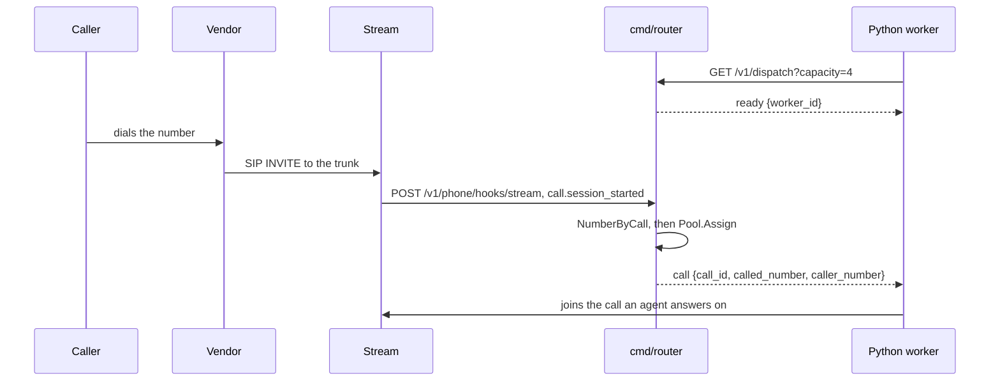

# Inbound calls and dispatch

[Sprint 14](../sprint14.md).

## Asked for

A dispatch endpoint in the Go backend exposing a WebSocket that Python workers wait on.
Workers report how many agents they are running, their CPU and memory, and their latency to
the backend. The backend routes arriving calls across them, round robin to start with. Then
the whole path end to end: somebody rings a Telnyx number, Telnyx sends SIP to Stream,
Stream routes it to a call, and a worker joins an agent to it.

## What exists



| Piece                                                              | What it does                         |
| ------------------------------------------------------------------ | ------------------------------------ |
| [dispatch.go](../../acceleration/internal/dispatch/dispatch.go)     | The pool of connected workers and who gets the next call |
| [dispatchws.go](../../acceleration/internal/api/dispatchws.go)      | `GET /v1/dispatch`, the socket a worker holds |
| [callhooks.go](../../acceleration/internal/api/callhooks.go)        | `POST /v1/phone/hooks/stream`, where Stream reports an arriving call |
| [phone/hooks.go](../../acceleration/internal/phone/hooks.go)        | Registering that URL with Stream, via `cmd/phone hooks -url` |
| [dispatch.py](../../plugins/stream/vision_agents/plugins/stream/dispatch.py) | The worker side |

A worker sends `load` every fifteen seconds and `ping` to measure the round trip; the router
answers `pong` and sends `call`. The worker replies `accepted` or `rejected`.

## Stream tells us, not the vendor

The call arrives as a Stream webhook rather than a vendor callback, because by then it is a
Stream call: the vendor's only part was putting SIP into the trunk. That means one webhook
covers every vendor that can be attached, and the router recognises the call by looking up
which of the customer's numbers is bound to it. The body is verified with an HMAC signature
against `STREAM_API_SECRET`, and the endpoint 404s when that is unset rather than accepting
unsigned calls.

Business failures still answer 200. Stream retrying a delivery while somebody is holding a
ringing handset would only produce more calls nobody is there to answer.

## Round robin, and nothing is queued

Workers are keyed by customer and each customer has its own rotation. A worker whose channel
is full is skipped rather than waited on. Load is collected and deliberately not used to
route: it is there to be looked at, and a policy worth having needs numbers to have been
watched first.

When no worker is connected, or all of them are full, the caller hears ringing and nothing
is kept. There is no queue, no lease and no retry — `accepted` and `rejected` are log lines,
not acknowledgements — because a call is only worth dispatching for as long as the person is
still on the line.

## In Python

```python
dispatch = stream.StreamDispatch()

@dispatch.wait_for_call()
async def answer(call: InboundCall) -> None:
    agent = Agent(edge=getstream.Edge(), llm=stream.Accelerated(config="john"))
    async with agent.answer(call):
        await agent.simple_response("greet the caller and ask how you can help")
        await agent.finish()

await dispatch.run()
```

`agent.answer` joins the call that is already there and waits for the SIP participant, since
the webhook can arrive before the caller is in the session.

## Not done

- **Two vendors can be rung.** Only Twilio and Telnyx implement `ConfigureInbound`; see
  [telephony](telephony.md).
- **A worker connects once.** `run()` returns when the socket closes; reconnecting is the
  caller's problem.
- **One pool, one process.** Nothing coordinates dispatch across routers, and worker ids are
  not stable across reconnects.
- **Load-aware routing**, which is what the reported load is for.
