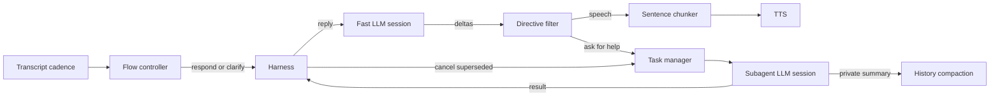

# The harness

[Sprint 5](../sprint5.md), parts A and B, and [Sprint 6](../sprint6.md).

## Asked for

**A.** The agent should have a harness controlling things such as spawning subagents and
loading skills. Instead of text going straight to the LLM it goes into the harness, which
decides and forwards. Handling speech must be non-blocking.

**B.** The main LLM is optimised for voice and so is not very smart. There should be a subagent
with greater intelligence, creating an architecture where the main loop never waits.

Told later, in conversation: build task delegation rather than tool calling, because tool
calling is too simple. Tasks have to be creatable *and* cancellable, since the context changes.

## What exists

[internal/harness](../../acceleration/internal/harness) is its own package, so it is testable
alone and `agent` depends on it rather than the reverse. `agent.respond` sends turns to
`harness.Respond` instead of calling the model directly.



| Piece                                                             | What it does                                  |
| ----------------------------------------------------------------- | --------------------------------------------- |
| [harness.go](../../acceleration/internal/harness/harness.go)      | Assembles each turn's prompt, filters replies  |
| [skills.go](../../acceleration/internal/harness/skills.go) + [skills.yaml](../../acceleration/internal/harness/skills.yaml) | What may be handed over |
| [directive.go](../../acceleration/internal/harness/directive.go)  | Splits a reply into speech and requests        |
| [manager.go](../../acceleration/internal/harness/manager.go)      | Creates, supersedes, times out and abandons tasks |
| [task.go](../../acceleration/internal/harness/task.go)            | `Result`, `State` and why work was dropped     |
| [flow.go](../../acceleration/internal/harness/flow.go)            | Constrained cadence and floor decisions        |
| [compaction.go](../../acceleration/internal/harness/compaction.go) | Cache-aware private conversation summaries     |

## A skill is not a tool

There is nothing behind a skill but a better model. What it declares is the *kind* of work
worth paying that model's latency for, and the instructions it answers under: a name, one line
the fast model sees, and a full prompt only the subagent sees. `skills.yaml` is embedded, and
`HARNESS_SKILLS` or `-skills` replaces it, the way `router.yaml` and `phone.yaml` already work.
The built-in three are `think`, `recall` and `explain`.

## Why delegation instead of tool calling

A tool call blocks the reply on the result. On a phone call that is the one thing that cannot
happen: the caller hears silence while the model waits. So the fast model asks for help *in its
own reply stream*, and the harness takes the request back out before the reply reaches the
voice:

```
Let me check that for you. <ask skill="think">15% of 84.20</ask>
```

The caller hears "Let me check that for you." and never the rest.
[directive.go](../../acceleration/internal/harness/directive.go) is the streaming filter that
makes this work, and it is the fiddly part: a tag arrives across several deltas, so text before
one cannot be released until enough of the next piece has arrived to know whether a tag is
starting. Everything that cannot yet be a tag is released immediately, because the caller is
listening to the gap, and a lone angle bracket that goes on too long to be a tag stops being
treated as one rather than silencing the agent forever.

## Cancellation, because the context changes

A task *is* a completion on the subagent session, so its id is the completion id and
cancelling it is one targeted `Interrupt(id)` — which is why
[completions](completions.md) grew a variadic `Interrupt` in this sprint. The subagent has its
own session, so barge-in on the conversation cannot kill work in flight.

Work is abandoned when:

- a newer request for the same skill supersedes it
- a revised conversational candidate invalidates the turn that created it
- the model writes `<drop skill="…"/>`, because the caller moved on
- its deadline passes, per skill, 15 to 25 seconds for the built-in three
- the call ends

A cancelled task is never mentioned to the caller. Its premise is gone, so nobody is waiting to
hear about it.

## Answers arrive as a turn nobody asked for

When work lands, the harness folds it into the next prompt as something the fast model is told
to pass on in its own words, and the agent starts a turn on its own. The caller was told an
answer was coming, so they should not have to ask again. Two details:

- **It waits for the agent to stop talking.** An answer arriving mid-sentence would have the
  agent talking over itself.
- **A subagent can ask back.** It replies `NEED: …` when it cannot answer without something only
  the caller knows, and that becomes a clarifying question in the agent's own words while the
  task stays open.

Failures are told to the caller too — "I could not find out" — because after promising an answer,
silence is the one option that is not available.

## Cache-aware compaction

Large histories remain verbatim while prefix caching is effective. Once a completion reports at
least 2,048 input tokens and less than half cached, the thinking session privately summarizes the
old prefix while recent turns stay verbatim. The result is applied only if that prefix still
matches, so late maintenance cannot erase newer conversation. It emits `Compacted`, not
`Settled`, and never creates a caller-facing follow-up.

## Not done

Nothing outstanding from A or B. Part C, the [finetuning dataset](finetuning-dataset.md), was
excluded from the sprint plan and has not been started. Part D is
[speaking while listening](duplex.md).
