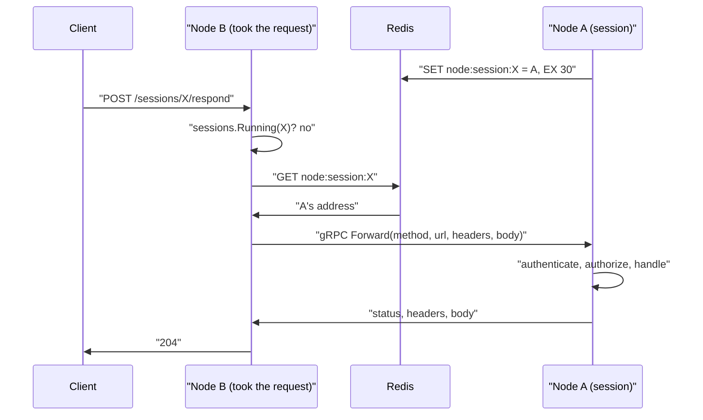

# Session requests across nodes

## Asked for

The events socket already crosses nodes ([websocket](websocket.md)). Everything else a
session is asked over HTTP still had to land on the node running it. Solve it with a gRPC
call from one node to the other.

## The problem

Eleven operations went through `Server.session(ctx, id)`, which is `Manager.Get` against
this process's map and nothing else:

| Path                                      | Handler                   |
| ----------------------------------------- | ------------------------- |
| `GET /v1/agents/sessions/{id}`            | `GetSession`              |
| `POST .../say`                            | `SaySession`              |
| `POST .../respond`                        | `RespondSession`          |
| `POST .../interrupt`                      | `InterruptSession`        |
| `POST .../rewind`                         | `RewindSession`           |
| `PUT .../instructions`                    | `SetSessionInstructions`  |
| `PATCH .../settings`                      | `SetSessionSettings`      |
| `POST .../responses`                      | `CreateResponse`          |
| `POST .../stop`                           | `stopSession`             |
| `GET .../commands/{command_id}`           | `GetSessionCommand`       |
| `POST .../commands/{command_id}/interrupt`| `InterruptSessionCommand` |

On the wrong node each answered 404 for a conversation running three feet away. Two others
were worse than a 404, because they acted:

- `DELETE /v1/agents/sessions/{id}` authorized off the row through `storedOrLiveSession`,
  then called `Manager.Delete`, whose `Close` returns `(false, nil)` for a session it is
  not running and which carries on regardless. Deleting from the wrong node wiped the
  rows, the turns and the memories while the node running it kept writing to them.
- The chat message hook asked `s.sessions.ByAgent(channelID)` and, on a miss, handed the
  message to a worker: a second agent writing into a conversation the first was already
  answering in.

## What exists

| Piece                                                              | What it does                                                  |
| ------------------------------------------------------------------- | ------------------------------------------------------------- |
| [node/node.proto](../../acceleration/internal/node/node.proto)      | The `Node` service: one `Forward` rpc carrying a whole request |
| [node/directory.go](../../acceleration/internal/node/directory.go)  | Which node runs which session and writes as which agent       |
| [node/forward.go](../../acceleration/internal/node/forward.go)      | `Serve` (h2c beside the API), the peer client, replaying a request |
| [api/forward.go](../../acceleration/internal/api/forward.go)        | The middleware, and the message hook's own handover            |
| [session/manager.go](../../acceleration/internal/session/manager.go)| Holds a session in the directory on create, releases it on close |
| [config/config.go](../../acceleration/internal/config/config.go)    | `node.advertise`                                               |
| [cmd/router/main.go](../../acceleration/cmd/router/main.go)         | Builds the directory wherever Redis is configured              |

## One rpc, not eleven

`Forward` carries the method, the path and query, the headers and the body, and answers
with a status, headers and a body. The node receiving it rebuilds the request and runs it
through its own `http.Handler`. It is generated by `go run .../buf@v1.73.0 generate`:
carrying buf as a tool directive instead would have merged its dependency graph into the
router's, which cost 71 new requirements and dragged nine of the router's own
dependencies, `otelhttp` and `x/crypto` among them, forward with it. As pinned `go run`
commands the whole of it is three deps moving from indirect to direct.

Eleven typed rpcs would have duplicated the OpenAPI schema in a second place and needed
touching for every operation added afterwards. This way one middleware covers all of them
and everything added later, and the node that answers does its own authentication,
authorization, quota and logging — the same rule the relay already follows, that a node is
not trusted to have checked. `TestAnotherAppCannotReachASessionOnAnotherNode` is the test
for it.

The middleware is **outermost** of the server's own handlers, so a request that belongs
elsewhere is not authenticated, logged or counted against a quota twice.

## One port

gRPC wants HTTP/2, which a peer speaks without TLS by prior knowledge, so `node.Serve`
wraps the API in `h2c.NewHandler` and hands anything with an `application/grpc` content
type to the gRPC server. An HTTP/1.1 request passes through untouched, socket upgrades
included. A second listener would have been a second port to open between pods.

`node.Address` works out what to advertise by opening a UDP socket to an address it never
sends to and reading back which of this machine's addresses it would leave from. In a pod
that is the address its peers use. `node.advertise` overrides it for the deployment where
it is not.

## What stops it forwarding

- A request a peer handed over, marked with `X-Acceleration-Forwarded`. Two nodes each
  believing the other holds the session would otherwise pass it back and forth.
- A socket upgrade. A connection cannot be carried over a call that answers once, and does
  not need to be: the relay reaches a session's events wherever the socket lands.
- A session this node is running, asked of `Manager.Running`, which takes no owner because
  which node holds a session is not a question about who may see it. This is what keeps
  the ordinary single-node request off Redis entirely.
- A session nobody claims. The register is empty for a session that ended, so what reads
  the row answers here as it did before.

## The register is a statement about now

`SET node:session:<id> = <address> EX 30`, renewed every ten seconds while the session
runs, and deleted on `Close` and on `supersede`. A node that stops saying it runs a session
stops being asked about it, whether it let go or died. `Directory.Close` deliberately does
not give the claims up: a process on its way out has a shutdown grace period to finish the
calls it is carrying, and is still the only node that can answer for them.

The agent id is held beside the session id, because an arriving message names a channel and
no session at all. Its claim is left to **expire** rather than deleted on release: a second
session for the same agent may have started on another node and overwritten it, and
deleting that would leave the agent unreachable rather than merely stale.

## Tests

[api/forward_test.go](../../acceleration/internal/api/forward_test.go): six tests against
two real routers sharing Postgres and Redis, with sessions of their own. Every session is
opened on the other node and then asked about on the suite's, which is what a load balancer
with no reason to prefer either produces about half the time.

The sessions are incognito, so they keep no row: a 200 is then the running conversation or
it is nothing. The read-back, the respond (checked end to end through the relayed socket),
the 404 for a session nobody runs and the refusal of another app's backend are four of
them. The other two are the bugs above: deleting from the wrong node now ends the
conversation where it runs, and a message arriving on the wrong node reaches the model
there without a worker being given it as well.

`RouterSuite` builds its node on an unstarted `httptest.Server`, because a node has to be
able to say where it is before it has anything to say it is running.

## Not done

- **`/v1/agents/socket` and `/v1/dispatch` are still node-local**, and cannot be anything
  else: the first carries the call's audio on the connection, and the second is the
  worker's own socket into a per-process pool. Dispatch has its own version of this
  problem; see [dispatch](dispatch.md).
- **`query` and `search` merge this node's live sessions with stored rows.** A session
  running elsewhere appears through its row, so the models routing resolved for it are
  missing, and an incognito session does not appear from another node at all. The register
  knows where they are but nothing fans a query out across nodes.
- **`calls.go` degrades quietly on the wrong node.** Minting a call token falls back to the
  default call type, and `attachUsed` reads models off request rows rather than the live
  selection.
- **A node that died is a 502 until its claim expires**, up to thirty seconds. Nothing
  notices a peer has gone and takes its claims back for it.
- **Nothing is retried.** A forward that fails is reported to the caller, who knows
  whether asking twice is safe better than this does.
- **The forward is unary**, so a streamed answer could not be carried. None of the
  operations it covers streams one.
- **No chart change, and no TLS.** Peers reach each other on the API port with insecure
  credentials, which is only sound because both ends are the deployment's own processes on
  its own network.
