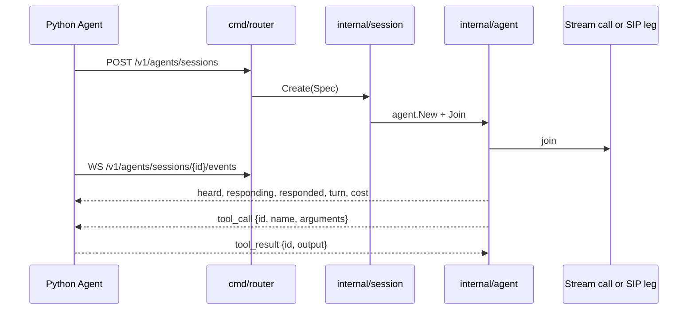

# The Python SDK over the Go backend

[Sprint 8](../sprint8.md), with telephony added in sprints
[13](../sprint13.md) and [14](../sprint14.md). Its Go counterpart is the
[Go SDK](go-sdk.md).

## Asked for

The Python SDK should be able to use the Go flow like this:

```python
agent = Agent(
    llm=stream.Accelerated(model="gemma4", stt="realtime-best", tts="model"),
    harness=DefaultHarness(use_skills=True, subagents={}, vm=Daytona),
    cost_tracking={"customer_id": 123, "project": "moderation", "environment": "dev"},
    memory_filter={"user_id": 222, "company_id": 12312},
)
```

So `stream.Accelerated` uses the LLM slot as a whole multimodal flow running on the Go
servers, with a new example00 that routes through it. Or, one modality at a time:

```python
agent = Agent(tts=stream.Router("sonic_36"))
```

And OpenAPI should generate the client, rather than a second hand-written surface.

Said in conversation: Python exposes function calling; the realtime connection, the voice
pipeline and the leg to the phone or the Stream call all run in Go. A pipeline that stays
in Python keeps working.

## What exists

Everything the agent package could already do, offered to somebody outside the process.



| Piece                                                              | What it does                                     |
| ------------------------------------------------------------------ | ------------------------------------------------ |
| [session/spec.go](../../acceleration/internal/session/spec.go)      | The decisions `cmd/agent` takes on the command line, as a body |
| [session/manager.go](../../acceleration/internal/session/manager.go) | Create, Get, List, Close, Shutdown               |
| [session/tools.go](../../acceleration/internal/session/tools.go)    | The bridge a remote tool call crosses and comes back over |
| [api/sessions.go](../../acceleration/internal/api/sessions.go)      | The generated REST handlers                      |
| [api/sessionws.go](../../acceleration/internal/api/sessionws.go)    | The event socket, hand-written                   |
| [api/streamws.go](../../acceleration/internal/api/streamws.go)      | One socket per modality, for pipelines that stay in Python |
| [sandbox/](../../acceleration/internal/sandbox)                     | Where the subagent runs code it writes           |
| [plugins/stream](../../plugins/stream)                              | The Python side: `Accelerated`, `STT`, `TTS`, `LLM`, `Router`, `StreamDispatch` |

## The LLM slot holds a pipeline

`stream.Accelerated` is an LLM by position rather than by nature. It runs no inference and
touches no media: the backend joins the call, hears the caller, answers and speaks, and
what arrives in Python are the events saying so. `Agent.join` notices that its LLM
satisfies the `RemotePipeline` protocol and takes a different path — no `edge.join`, no
published tracks, no inference flow — but still creates the conversation and writes the
transcripts from the events coming back, so observability reads the same either way.

What stays in Python is function calling, because the functions are in Python.
`@agent.llm.register_function` is unchanged: the registry's schemas are serialized into the
session spec, a `tool_call` frame arrives on the socket, the function runs locally and a
`tool_result` goes back. A tool that raises reports the failure rather than dropping it —
the model is mid-sentence waiting, and it can only say something useful about a tool that
did not work if it is told that it did not work.

## Configuration objects, not a second implementation

`Harness`, `DefaultHarness`, `Skill` and `Daytona` in
[core/harness](../../sdks/python/vision_agents/core/harness/harness.py) carry no loop.
They are serialized into the session spec and the decisions are taken in
[internal/harness](../../acceleration/internal/harness). Reimplementing the loop in Python
would mean two of them to keep in step, and the one that mattered would be the one holding
the conversation.

The same is true of `cost_tracking`, which becomes `routing.Tags` on every request the
session makes, and `memory_filter`, which splits into who the memories are about and what
narrows recall further.

## A call is a context manager

Telephony arrived in the same shape. `agent.outbound_call(...)` places the call and joins the
agent to where the answered leg lands; `agent.answer(call)` joins one that is already ringing
and waits for the SIP participant. Both are context managers for the same reason `join` is:
the interesting thing is what happens inside the call, and leaving it should not be something
a caller remembers to do.

The dispatch worker is the one piece with no equivalent in the Go SDK. `StreamDispatch` holds
a socket, reports its load and runs a handler per arriving call — see
[dispatch](dispatch.md).

## One modality at a time

A pipeline that stays in Python can still route through the backend a piece at a time:
`stream.STT`, `stream.TTS` and `stream.LLM` implement the core ABCs over
`GET /v1/{modality}/stream`. Failover and cost tracking work exactly as they do inside a
session, because it is the same router doing the routing.

`stream.Router("sonic_36")` asks which modality serves a name and returns the matching
plugin. It costs a request at startup, so a pipeline that knows what it wants is better off
saying `stream.TTS("sonic_36")`, which is what the README recommends.

Audio on the text-to-speech socket is raw PCM16 behind an eight-byte header carrying the
sample rate and channel count, rather than base64 in a JSON field. Providers disagree about
sample rates, so a client told the rate once at the start would mis-play the first session
that failed over to another voice.

## The client is generated

[plugins/stream/generate.py](../../plugins/stream/generate.py) runs
`openapi-python-client` against `acceleration/api/openapi.yaml`, the same file
`oapi-codegen` generates the Go server from. The output is committed, so installing the
plugin needs no code generation. WebSockets are hand-written in `_socket.py`: OpenAPI
cannot describe a socket past the upgrade, and the two sockets are in the spec with a `101`
response only so a reader knows they exist.

## Running code, on the far side of the handover

`vm=Daytona` gives the *subagent* a `run_code` tool, never the model holding the
conversation. Running code takes seconds and a conversation has none to spare; the subagent
has already left the live path, so it can afford them. The provider creates one sandbox the
first time code actually runs and keeps it for the life of the session, since booting one
is the slow part.

The tool loop is in [manager.go](../../acceleration/internal/harness/manager.go): a task
whose completion asks for code has the code run, the output appended as a tool result, and
the same task put again, up to four rounds and always inside the skill's own deadline. Work
abandoned while its code was running still settles, because the completion it was waiting
on has already been and gone.

## Not done

- Daytona is the only sandbox provider, and only stateless Python. The stateful interpreter
  and shell sessions are not wrapped.
- `stream.Router` probes each modality in turn rather than asking one endpoint, which is
  three requests in the worst case.
- Video: `Accelerated` accepts a video track and ignores it, because the backend's agent
  has no video path yet.
