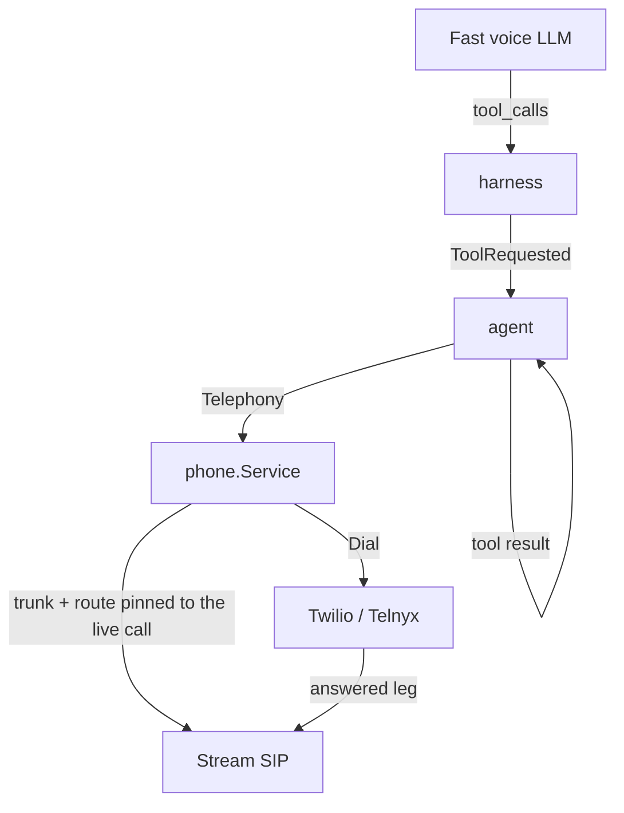

# Transfer and IVR navigation

[Sprint 7](../sprint7.md), "Call transfer support" and "IVR navigation".

## Asked for

A cold transfer to a human, instantly. A warm transfer, where the agent shares a short
summary with the person it is handing the call to. And IVR navigation, both by generating
DTMF and by speaking the option.

## What exists

The agent decides both by calling a tool. That is the part of this sprint with the widest
blast radius: [internal/llm](../../acceleration/internal/llm) used to say tool calling was
deliberately absent, and now carries it.



### Tools in the LLM contract

`llm.Tool` is a name, a description and a JSON Schema. `Request.Tools` offers them,
`CompletionComplete.ToolCalls` carries what the model asked for, and `llm.ToolResult` is the
role a result comes back on.

Arguments are streamed a few characters at a time under an index, so
[completion.go](../../acceleration/internal/llm/completion.go) assembles them and the caller
is handed a finished call rather than the fragments. A `ToolCallDelta` is emitted alongside,
mirroring `TextDelta`, for anyone who wants to watch it happen.

`openaicompat` maps all of it, so `openai`, `deepseek` and `gemma` inherit tools at once.
Standardising this turned out to be the small question it was assumed not to be: every
provider the router reaches speaks the same schema.

### Two tools, declared not coded

[tools.yaml](../../acceleration/internal/harness/tools.yaml) declares `transfer` and
`press`, next to `skills.yaml`. A tool is explicitly not a skill. A skill hands a question to
a better model and folds the answer back into the conversation; a tool changes something
outside the conversation and cannot be taken back. That is why a skill is run by the harness
and a tool is not: the harness reports `ToolRequested` and the agent, which knows what call
it is on, does the rest.

The agent runs them behind `agent.Telephony`, a two-method interface sitting beside `Edge`
for the same reason `Edge` exists — the decision to hand a caller over is testable without a
phone network. `phone.Line` is the implementation. Without one, the tools are never offered:
a model told it may transfer, on a call with nowhere to transfer to, promises the caller a
person who never arrives.

### Transfer is a third party, not a handover

Stream's SIP is inbound only, so nobody's leg is moved. A transfer creates a trunk, points a
routing rule at the **live call id**, and has the vendor dial the human into it. Three
parties are then on the call and the agent leaves.

That shape has consequences worth knowing:

- The caller is never touched, so a human who does not answer costs nothing.
- Recording, transcription and cost tracking survive the handoff, because the call is still
  the same Stream call.
- Both legs stay billed after the agent goes, since the call continues to run through
  Stream rather than being handed back to the carrier.

The trunk is made per transfer rather than reused. `CreateTrunk` returns the SIP password
once and it is not stored, so reusing the attached number's bridge would mean a migration
holding SIP credentials at rest — a worse trade than a second trunk.

Cold and warm are the same call to the same tool. A `summary` argument makes it warm: the
agent waits until it hears a voice it has not heard before, says the summary, and leaves.
The caller hears it too. Stream publishes one agent track, so a private consult would need a
second call and hold audio; the model is told to write the summary as though the caller were
listening, because they are.

Nobody announces a participant joining, so "the human answered" is inferred from a
transcription session opening for someone new. The first thing a person does on answering a
phone is say hello, which is close enough to an arrival to introduce a caller to. After 45
seconds the agent leaves without the summary rather than talking to an empty seat.

### Pressing digits

`phone.Provider` gained `SendDigits`. Telnyx implements it as a call-control action, which
sends the tones without disturbing the leg. **Twilio refuses it**, and says why: the only way
to make tones at Twilio is to replace the TwiML the leg is running, and the TwiML the leg is
running is the `<Dial>` holding the agent on the call. Pressing one would drop the other.
`Client()` reaches Twilio's own API for a deployment that decides the trade is worth making.

The leg pressed at is the one the vendor gave an id for when it was dialled, so this only
works on calls placed from here. Inbound DTMF is a webhook we do not have.

### Speech-based IVR

Mostly prompt work, because the agent already hears the menu through transcription and
answers through the voice. `agent.NavigatingInstructions` is the preset for an agent that
placed the call: let a recording finish, do what it asked, and never press at a person. It is
a preset rather than the default because the two situations want opposite things — silence on
a support line is a caller wondering whether anyone is there.

The flow controller was taught that a recorded menu is one thought and not several, however
long the pauses between its options, and that talking over one only makes it start again.

### Using it

```bash
go run ./cmd/phone transfer -from +15125551234 -to +15550002222 -call support-line
go run ./cmd/phone press -vendor telnyx -call-id v3:abc -digits 1
go run ./cmd/agent -call support-line -number +15125551234
go run ./cmd/agent -call outbound-1 -number +15125551234 -vendor-call v3:abc -navigating
```

`POST /v1/phone/calls/transfer` and `POST /v1/phone/calls/{vendor_call_id}/digits` are the
same two operations over HTTP.

## Not done

**Tool calling on the fast model is unproven.** `deploy/gemma-4` now starts vLLM with
`--enable-auto-tool-choice --tool-call-parser pythonic`, but that deployment has never been
pushed, so no model in `router.yaml`'s low-latency tier has been watched emitting a tool call.
If the parser turns out to be unreliable, the voice path may need a directive tag while the
tool contract stays for the stronger models.

**A private consult before a warm transfer.** The summary is spoken on the call, so the
caller hears their own handover. Doing it privately means a second Stream call, hold audio
for the caller, and the agent publishing into two calls at once.

**Inbound DTMF.** The agent cannot hear a caller pressing keys, which is what an agent
running its *own* menu would need. That is a webhook per vendor and a route to receive it.

**Transfer to a SIP address or a queue.** Only a phone number can be transferred to, because
`Provider.Dial` takes a number. An in-app agent would be a different destination type.

**One caller per number.** The default route template puts every caller to a number into one
Stream call. Pinning a transfer to a live call id assumes that call has one caller in it,
which is the same assumption attaching already made — transfer just makes it visible.
