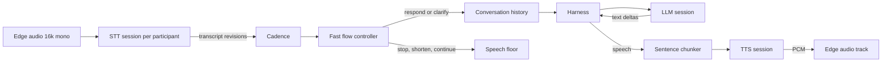

# The voice agent

[Sprint 3](../sprint3.md), steps 5 and 6, through [Sprint 6](../sprint6.md).

## Asked for

Create a Go agent class, similar to the `Agent` the Python framework uses — see its examples
folder. Then verify a call can be joined with Stream's Go SDK.

## What exists

[internal/agent](../../acceleration/internal/agent) is built from the three routers plus a
target each, rather than from provider instances, which is the whole point: every turn of a
conversation gets the same failover, health and billing as a direct API call.

One conversation is one LLM session and one voice session, but a transcription session per
participant, because a speech-to-text stream is bound to a single speaker.

| Piece                                                              | What it does                            |
| ------------------------------------------------------------------ | --------------------------------------- |
| [agent.go](../../acceleration/internal/agent/agent.go)              | The conversation loop and its lifecycle  |
| [cadence.go](../../acceleration/internal/agent/cadence.go)          | Debounces evolving participant transcripts |
| [edge.go](../../acceleration/internal/agent/edge.go)                | The transport contract, four methods     |
| [streamedge](../../acceleration/internal/agent/streamedge)          | The real transport: a Stream call over WebRTC |
| [chunker.go](../../acceleration/internal/agent/chunker.go)          | Splits a reply into sentences for the voice |
| [turns.go](../../acceleration/internal/agent/turns.go)              | Measures each exchange, see [observability](observability.md) |
| [cmd/agent](../../acceleration/cmd/agent)                           | Joins a call and holds a conversation    |

## Three decisions

- **Cadence decides when to act.** A stable transcript revision goes to a separate fast-model
  session, which waits, ignores background speech, responds, or clarifies. A provider final is
  metadata rather than the response trigger, and new words invalidate a stale decision.
- **The reply is spoken sentence by sentence.** A model emits a few characters at a time and a
  voice given two words at a time pauses in the wrong places. The chunker holds text until a
  sentence ends, then streams it as deltas of one utterance, so one turn stays one billed
  synthesis.
- **Overlap is a floor decision.** A correction stops the model and voice, a related addition
  shortens generation while queued speech finishes, and an acknowledgement lets the current
  answer continue. Audio from an abandoned turn is still dropped.

## Why `Edge` is an interface

`Join`, `Audio`, `PublishAudio`, `Leave`. That is the entire transport contract, and it exists
so the conversation can be tested in-process against a loopback rather than only against a
real call — which is what
[agent_test.go](../../acceleration/internal/agent/agent_test.go) does, including barge-in and
the duplex behaviour added later.

[streamedge](../../acceleration/internal/agent/streamedge) is the real one, step 6 of the
sprint. It joins over the private `getstream-go-webrtc` SDK, subscribes to the audio of
everyone else in the call — joining subscribes to nothing on its own, which is easy to miss —
decodes inbound Opus to 16 kHz mono and encodes the reply back to 48 kHz Opus. That path is
cgo, so libopus, libopusfile and libsoxr have to be installed to build `cmd/agent`.

## Not done

The exact Sprint 6 stack needs external credentials and deployments: Gemma and Parakeet on
Baseten, OpenAI Sol, Stream, and either licensed self-hosted S2 Pro or Fish's hosted S2 Pro.
