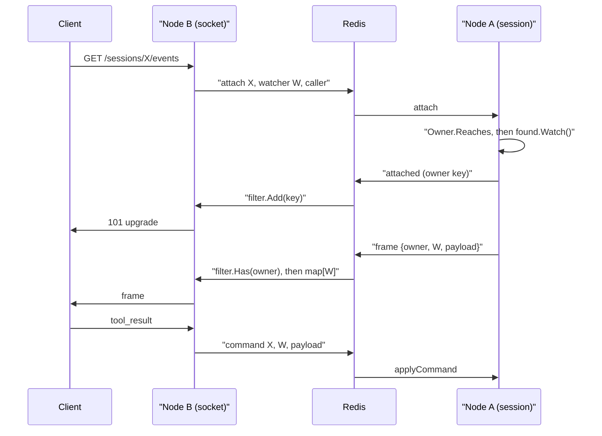

# Session sockets across nodes

## Asked for

The backend keeps a WebSocket per user. To run more than one of them, updates have to be
broadcast over Redis pub/sub to every connected server, so that the server actually
holding the socket is the one that writes to it. A Cuckoo filter makes it cheap to ask
whether a given node has a socket for a given user.

## The problem

A session lives in one process's memory, in `session.Manager.sessions`. `watchSession`
looked it up with `s.sessions.Get(...)` and answered 404 when it missed, so
`GET /v1/agents/sessions/{id}/events` only worked on the node running the conversation. A
browser reconnecting, or a load balancer with no reason to prefer one node, lands wherever
it lands.

## What exists

| Piece                                                            | What it does                                              |
| ---------------------------------------------------------------- | --------------------------------------------------------- |
| [relay/bus.go](../../acceleration/internal/relay/bus.go)         | The two pub/sub channels, the node's identity, the messages |
| [relay/filter.go](../../acceleration/internal/relay/filter.go)   | The Cuckoo filter of the owners this node holds sockets for |
| [api/relayws.go](../../acceleration/internal/api/relayws.go)     | Both halves: the proxy watchers and the relayed sockets    |
| [api/sessionws.go](../../acceleration/internal/api/sessionws.go) | `applyCommand`, `takesFrame`, and the branch that relays   |
| [api/server.go](../../acceleration/internal/api/server.go)       | The `Relay` option, and starting the two subscriptions     |
| [cmd/router/main.go](../../acceleration/cmd/router/main.go)      | Builds the bus wherever Redis is configured                |

Two channels, `<prefix>:session-events` and `<prefix>:session-commands`. A node ignores its
own messages by id. The prefix exists because pub/sub ignores the database number the rest
of a deployment's keys are kept apart by.

## The watcher on the holding node is a real one

Node A does not special-case anything. It calls `found.Watch()`, or
`WatchPendingVoiceTools()` when the client asked for pending tool replay, and publishes
what arrives through the same `frameOf` a local socket writes. The `session` package never
learns that the socket is somewhere else, which is what keeps three behaviours honest:
`askTool` finds somebody connected, a tool host reconnecting mid-call gets its replay, and
a persistent text conversation still ends when the last watcher goes away.

## Receiver-side filtering, which is what the Cuckoo filter is for

Every node is sent every session's frames, so the question "is this for me" is asked far
more often than it is answered yes, and a node holding nothing has to drop a message
without touching anything a new socket contends for. `Filter.Has` is one hash and two
bucket reads under a read lock. On a hit the node looks up the watcher id in a map, so a
false positive costs one map miss and nothing else.

The key is the **session owner** (`customerID\x00userID`), not the watcher, because a
backend watching somebody else's conversation still has to be found by it.

A Cuckoo filter stores a fingerprint rather than the key, so deleting one key's entry twice
takes a different key's. The filter therefore keeps a reference count per key: it inserts
on a key's first socket, deletes on its last, and ignores a delete for a key it never held.
That is the one way the filter could be made to say no about a key it holds, and
`TestRemovingAKeyThatWasNeverAddedLeavesTheOthersAlone` is the test for it.

An attach is answered before any frame is published, so the asking node holds the key its
filter is keyed on before there is anything to filter. The `attached` message is the one
thing not filtered on the key, since it is what carries the key; there is one per socket
against many frames a second.

## Who may watch is decided where the session is

Node B names the caller on the bus and Node A checks it, with `Owner.Reaches` and the same
question `canReadSession` asks of a local watcher. The socket's node is not trusted to have
asked, and the authority is settled once, at attach: the owner is kept on the proxy rather
than read off each command, so a node cannot change who it claims to be halfway through a
conversation.

An attach that is refused simply goes unanswered. Node B waits two seconds and then answers
404 — the same answer a session that never existed gets, because a refusal would confirm
the id is real. A session nothing is running anywhere is answered the same way, from the
same timeout.

This is also why the relay needs no database. Reading the row on Node B would have been a
second, weaker check racing the writer that puts the row there behind the conversation.

## Commands run on a queue of their own

`found.Respond` blocks for as long as the model does. Running a relayed command where it
arrives would block the one subscriber goroutine serving every relayed session on the node,
so each proxy watcher has its own channel and goroutine. Order is preserved per socket
without the shared stall. The frame itself is passed on exactly as the client wrote it and
decoded once, on the holding node, so `applyCommand` stays the only thing that decides what
a command means.

## A node that crashes does not leak watchers

Node B republishes a `refresh` on the same tick as the socket's ping, and Node A drops a
proxy it has not heard about for longer than a socket is given to answer one. Closing a
socket cleanly publishes `detach` instead. Either way the proxy's detach closes the
session's events channel, which ends the publishing goroutine, which publishes `closed`,
which closes the socket on the other side.

## Tests

- [relay/filter_test.go](../../acceleration/internal/relay/filter_test.go): a key is found
  once added and gone once removed, survives one of two sockets leaving, is not taken by a
  removal with nothing behind it, and misses on unknown keys at well under one percent.
- [api/relayws_test.go](../../acceleration/internal/api/relayws_test.go): six tests against
  two real routers sharing Postgres, Redis and a relay prefix, each with sessions of its
  own. A conversation's answer crosses to the other node's socket, a tool result crosses
  back and reaches the model, `close` from the far socket ends the conversation, the far
  socket is told when the session is stopped, a session no node is running is a 404, and
  another app's backend is refused from the far node too.

`RouterSuite.otherNode()` is what a second node looks like in the harness, and
`testClient.on(node)` is the same caller sending to it.

## Not done

- **Only the events socket is relayed.** The REST session operations (`say`, `interrupt`,
  `respond`) are carried to the node holding the session by gRPC instead; see
  [nodes](nodes.md). `/v1/agents/socket` and `/v1/dispatch` are node-local either way, the
  first because the audio is on the connection. Dispatch has its own version of this
  problem; see [dispatch](dispatch.md).
- **Interim frames cross the bus whether or not they are wanted.** `interim` and
  `decisions` are applied by the receiving node with `wanted.takesFrame`, so a `hearing`
  several times a second is published to every node and dropped by most of them. The attach
  could carry what the client asked for and let the holder skip them.
- **Nothing is replayed.** A relayed socket sees the conversation from the moment it
  attached, which is what a local one does, so a reconnect across nodes loses whatever
  arrived in the gap.
- **The two-second attach wait is the only way a missing session is found out.** A caller
  watching an id nothing is running pays it in full.
- **No API, spec or SDK change.** A client cannot tell a relayed socket from a local one,
  which is the point, but it also means nothing reports which node a session is on.
