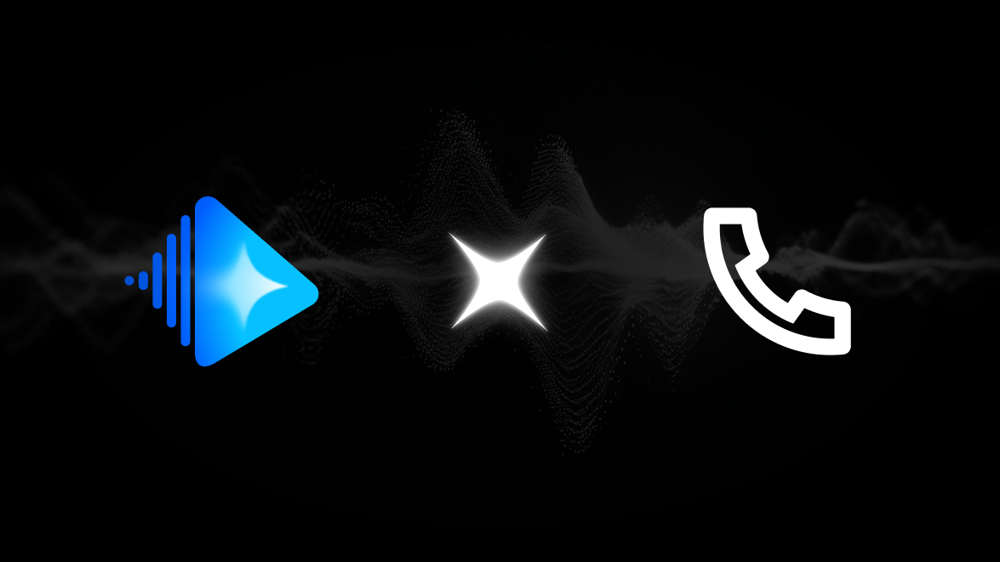
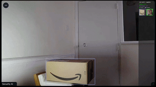

# Open Vision Agents by Stream

[](https://github.com/GetStream/Vision-Agents/actions)
[](http://badge.fury.io/py/vision-agents)

[](https://github.com/GetStream/Vision-Agents/blob/main/LICENSE)
[](https://discord.gg/RkhX9PxMS6)
[](https://x.com/visionagents_ai)

https://github.com/user-attachments/assets/d9778ab9-938d-4101-8605-ff879c29b0e4

### Multi-modal AI agents that watch, listen, and understand video.

Vision Agents give you the building blocks to create intelligent, low-latency video experiences powered by your models,
your infrastructure, and your use cases.

### Key Highlights

- **Video AI:** Built for real-time video AI. Combine YOLO, Roboflow, and others with Gemini/OpenAI in real-time.
- **Low Latency:** Join quickly (500ms) and maintain audio/video latency under 30ms
  using [Stream's edge network](https://getstream.io/video/).
- **Open:** Built by Stream, but works with any video edge network.
- **Native APIs:** Native SDK methods from OpenAI (`create response`), Gemini (`generate`), and Claude (
  `create message`) — always access the latest LLM capabilities.
- **SDKs:** SDKs for React, Android, iOS, Flutter, React Native, and Unity, powered by Stream's ultra-low-latency
  network.

## Getting Started

**Step 1: Install via uv**

`uv add vision-agents`

**Step 2: (Optional) Install with extra integrations**

`uv add "vision-agents[getstream, openai, elevenlabs, deepgram]"`

**Step 3: Obtain your Stream API credentials**

Get a free API key from [Stream](https://getstream.io/). Developers receive **333,000 participant minutes** per month,
plus extra credits via the Maker Program.

Follow the [quickstart guide](https://visionagents.ai/introduction/overview) to build your first agent.

## See It In Action

https://github.com/user-attachments/assets/d1258ac2-ca98-4019-80e4-41ec5530117e

This example shows you how to build golf coaching AI with YOLO and Gemini Live.
Combining a fast object detection model (like YOLO) with a full realtime AI is useful for many different video AI use
cases.
For example: Drone fire detection, sports/video game coaching, physical therapy, workout coaching, just dance style
games etc.

```python
# partial example, full example: examples/02_golf_coach_example/golf_coach_example.py
agent = Agent(
    edge=getstream.Edge(),
    agent_user=agent_user,
    instructions="Read @golf_coach.md",
    llm=gemini.Realtime(fps=10),
    processors=[ultralytics.YOLOPoseProcessor(model_path="yolo11n-pose.pt", device="cuda")],
)
```

## Features

| **Feature**              | **Description**                                                                                         |
|--------------------------|---------------------------------------------------------------------------------------------------------|
| **Real-time WebRTC**     | Stream video directly to model providers for instant visual understanding.                              |
| **Video Processing**     | Pluggable processor pipeline for YOLO, Roboflow, or custom PyTorch/ONNX models before/after LLM calls. |
| **Turn Detection**       | Natural conversation flow with VAD, diarization, and smart turn-taking.                                 |
| **Tool Calling & MCP**   | Execute code and APIs mid-conversation — Linear issues, weather, telephony, or any MCP server.          |
| **Phone Integration**    | Inbound and outbound voice calls via Twilio with bidirectional audio streaming.                         |
| **RAG**                  | Retrieval-augmented generation with TurboPuffer vector search or Gemini FileSearch.                     |
| **Memory**               | Agents recall context across turns and sessions via Stream Chat.                                        |
| **Text Back-channel**    | Message the agent silently during a call — coaching overlays, silent instructions, etc.                 |
| **Production Ready**     | Built-in HTTP server, Prometheus metrics, horizontal scaling, and Kubernetes deployment.                |

## Out-of-the-Box Integrations

**LLMs:** [OpenAI](https://visionagents.ai/integrations/openai) · [Gemini](https://visionagents.ai/integrations/gemini) · [xAI](https://visionagents.ai/integrations/xai) · [OpenRouter](https://visionagents.ai/integrations/openrouter) · [Hugging Face](https://visionagents.ai/integrations/huggingface) · [Kimi AI](https://visionagents.ai/integrations/kimi)

**Realtime:** [OpenAI](https://visionagents.ai/integrations/openai) · [Gemini Live](https://visionagents.ai/integrations/gemini) · [AWS Bedrock](https://visionagents.ai/integrations/aws-bedrock) · [Qwen](https://visionagents.ai/integrations/qwen)

**STT:** [Deepgram](https://visionagents.ai/integrations/deepgram) · [AssemblyAI](https://www.assemblyai.com/docs/streaming/universal-3-pro) · [Fast-Whisper](https://visionagents.ai/integrations/fast-whisper) · [Fish Audio](https://visionagents.ai/integrations/fish) · [Wizper](https://visionagents.ai/integrations/wizper) · [Mistral Voxtral](https://visionagents.ai/integrations/mistral)

**TTS:** [ElevenLabs](https://visionagents.ai/integrations/elevenlabs) · [Cartesia](https://visionagents.ai/integrations/cartesia) · [Deepgram](https://visionagents.ai/integrations/deepgram) · [AWS Polly](https://visionagents.ai/integrations/aws-polly) · [Pocket](https://visionagents.ai/integrations/pocket) · [Kokoro](https://visionagents.ai/integrations/kokoro) · [Inworld](https://visionagents.ai/integrations/inworld) · [Fish Audio](https://visionagents.ai/integrations/fish)

**Vision:** [Ultralytics](https://visionagents.ai/integrations/ultralytics) · [Roboflow](https://visionagents.ai/integrations/roboflow) · [Moondream](https://visionagents.ai/integrations/moondream) · [NVIDIA Cosmos](https://visionagents.ai/integrations/nvidia) · [Decart](https://visionagents.ai/integrations/decart)

**Avatars:** [LemonSlice](https://visionagents.ai/integrations/lemonslice)

**Turn Detection:** [Vogent](https://visionagents.ai/integrations/vogent) · [Smart Turn](https://visionagents.ai/integrations/smart-turn)

**Other:** [Twilio](https://github.com/GetStream/Vision-Agents/tree/main/examples/03_phone_and_rag_example) · [TurboPuffer](https://visionagents.ai/guides/rag)

## Documentation

Check out the full docs at [VisionAgents.ai](https://visionagents.ai/).

**Quickstart:** [Voice AI](https://visionagents.ai/introduction/voice-agents) · [Video AI](https://visionagents.ai/introduction/video-agents)

**Guides:** [MCP & Function Calling](https://visionagents.ai/guides/mcp-tool-calling) · [Video Processors](https://visionagents.ai/guides/video-processors) · [Phone Calling](https://visionagents.ai/guides/calling) · [RAG](https://visionagents.ai/guides/rag) · [Testing](https://visionagents.ai/guides/testing)

**Production:** [HTTP Server](https://visionagents.ai/guides/http-server) · [Deployment](https://visionagents.ai/guides/deployment) · [Kubernetes](https://visionagents.ai/guides/kubernetes-deployment) · [Horizontal Scaling](https://visionagents.ai/guides/horizontal-scaling) · [Prometheus Metrics](https://visionagents.ai/guides/prometheus-metrics)

## Examples

| 🔮 Demo Applications                                                                                                                                                                                                                                                                                                                                                                                                                                                                              |                                                                                         |
|:--------------------------------------------------------------------------------------------------------------------------------------------------------------------------------------------------------------------------------------------------------------------------------------------------------------------------------------------------------------------------------------------------------------------------------------------------------------------------------------------------|-----------------------------------------------------------------------------------------|
| <br><h3>Real-time Narration</h3>Using Cartesia's Sonic 3 model alongside a vision model to tell a story with emotion based on what's in the frame.<br><br>• Real-time visual understanding<br>• Emotional storytelling<br>• Frame-by-frame analysis<br><br> [>Source Code and tutorial](https://github.com/GetStream/Vision-Agents/tree/main/plugins/cartesia/example)                                                                                                                                                    |                |
| <br><h3>Live Video Restyling</h3>Realtime stable diffusion using Vision Agents and Decart's Mirage 2 model to create interactive scenes and stories.<br><br>• Real-time video restyling<br>• Interactive scene generation<br>• Stable diffusion integration<br><br> [>Source Code and tutorial](https://github.com/GetStream/Vision-Agents/tree/main/plugins/decart/example)                                                                                                                 |                    |
| <br><h3>Sports & Fitness Coaching</h3>Using Gemini Live together with Vision Agents and Ultralytics YOLO, we're able to track the user's pose and provide realtime actionable feedback on their golf game.<br><br>• Real-time pose tracking<br>• Actionable coaching feedback<br>• YOLO pose detection<br>• Gemini Live integration<br><br> [>Source Code and tutorial](https://github.com/GetStream/Vision-Agents/tree/main/examples/02_golf_coach_example)                                                     |                  |
| <br><h3>Visual Scene Understanding</h3>Together with OpenAI Realtime and Vision Agents, we can take GeoGuesser to the next level by asking it to identify places in our real world surroundings.<br><br>• Real-world location identification<br>• OpenAI Realtime integration<br>• Visual scene understanding<br><br> [>Source Code and tutorial](https://visionagents.ai/integrations/openai#openai-realtime)                                                                                                    |            |
| <br><h3>Phone and RAG</h3>Interact with your Agent over the phone using Twilio. This example demonstrates how to use TurboPuffer for Retrieval Augmented Generation (RAG) to give your agent specialized knowledge.<br><br>• Inbound/Outbound telephony<br>• Twilio Media Streams integration<br>• Vector search with TurboPuffer<br>• Retrieval Augmented Generation<br><br> [>Source Code and tutorial](https://github.com/GetStream/Vision-Agents/tree/main/examples/03_phone_and_rag_example) |           |
| <br><h3>Smart Surveillance</h3>A security camera with face recognition, package detection and automated theft response. Generates WANTED posters with Nano Banana and posts them to X when packages disappear.<br><br>• Face detection & named recognition<br>• YOLOv11 package detection<br>• Automated WANTED poster generation<br>• Real-time X posting<br><br> [>Source Code and tutorial](https://github.com/GetStream/Vision-Agents/tree/main/examples/05_security_camera_example)             |  |
| <br><h3>Autonomous Fraud Response</h3>A demonstration of how an AI agent can autonomously help a victim of fraud, using function calls to quickly take actions like cancelling a compromised credit card.<br><br>• NVIDIA Nemotron Super 3 LLM via Baseten<br>• Real-time voice conversation<br>• Tool calling for transaction lookup & fraud flagging<br>• Automatic card freeze & replacement issuing<br><br> [>Source Code and tutorial](https://github.com/GetStream/Vision-Agents/tree/main/plugins/openai/examples/nemotron_example) |  |

## Development

See [DEVELOPMENT.md](DEVELOPMENT.md)

Want to add your platform or provider? See [Create Your Own Plugin](https://visionagents.ai/integrations/create-your-own-plugin) or reach out to **nash@getstream.io**.

## Current Limitations

- Video AI struggles with small text — models may hallucinate scores, signs, etc.
- Context degrades on longer sessions (~30s+) for continuous video understanding
- Most use cases need a mix of specialized models (YOLO, Roboflow) with larger LLMs
- Real-time models require audio/text to trigger responses — video alone won't prompt output

## Star History

[](https://www.star-history.com/#GetStream/vision-agents&type=timeline&legend=top-left)
