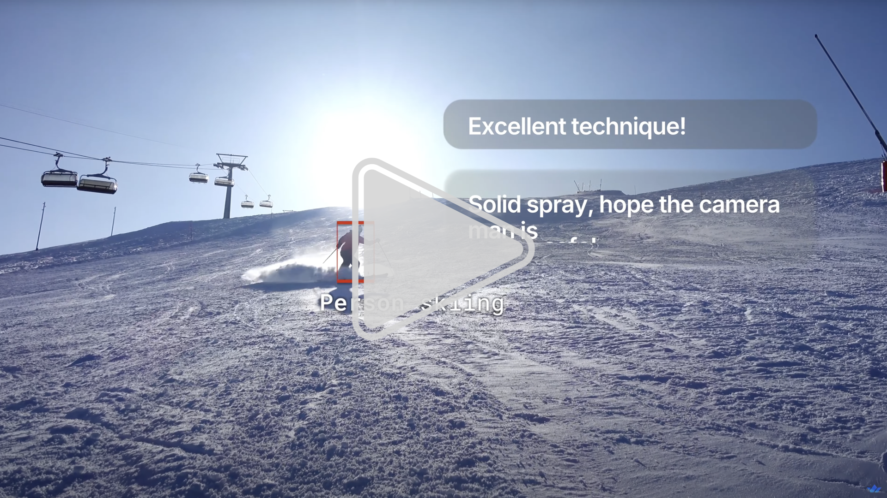
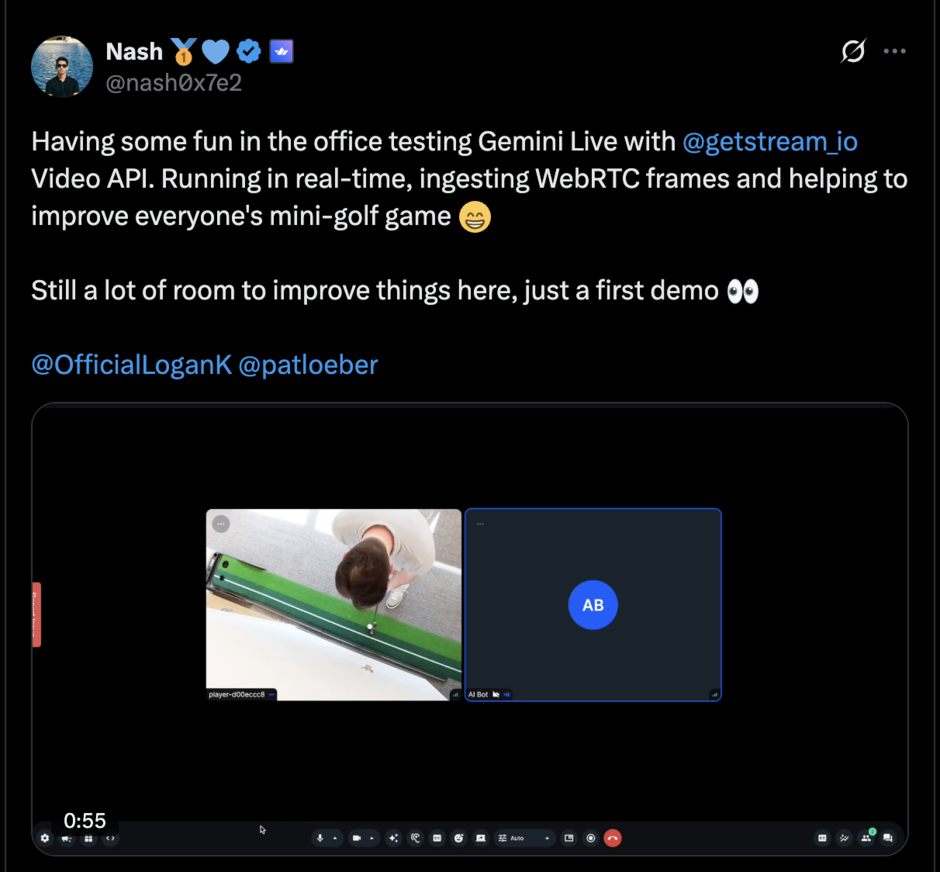

# Open Vision Agents by Stream

[](https://github.com/GetStream/Vision-Agents/actions)
[](http://badge.fury.io/py/vision-agents)

[](https://github.com/GetStream/Vision-Agents/blob/main/LICENSE)
[](https://discord.gg/RkhX9PxMS6)

---

## Build Real-Time Vision AI Agents

<a href="https://youtu.be/Hpl5EcCpLw8">
  
</a>

### Multi-modal AI agents that watch, listen, and understand video.

Vision Agents give you the building blocks to create intelligent, low-latency video experiences powered by your models, your infrastructure, and your use cases.

### Key Highlights

- **Video AI:** Built for real-time video AI. Combine YOLO, Roboflow, and others with Gemini/OpenAI in real-time.
- **Low Latency:** Join quickly (500ms) and maintain audio/video latency under 30ms using [Stream's edge network](https://getstream.io/video/).
- **Open:** Built by Stream, but works with any video edge network.
- **Native APIs:** Native SDK methods from OpenAI (`create response`), Gemini (`generate`), and Claude (`create message`) — always access the latest LLM capabilities.
- **SDKs:** SDKs for React, Android, iOS, Flutter, React Native, and Unity, powered by Stream's ultra-low-latency network.

---

## See It In Action

### Sports Coaching

This example shows you how to build golf coaching AI with YOLO and OpenAI realtime.
Combining a fast object detection model (like YOLO) with a full realtime AI is useful for many different video AI use cases.
For example: Drone fire detection, sports/video game coaching, physical therapy, workout coaching, just dance style games etc.

```python
# partial example, full example: examples/02_golf_coach_example/golf_coach_example.py
agent = Agent(
    edge=getstream.Edge(),
    agent_user=agent_user,
    instructions="Read @golf_coach.md",
    llm=openai.Realtime(fps=10),
    #llm=gemini.Realtime(fps=1), # Careful with FPS can get expensive
    processors=[ultralytics.YOLOPoseProcessor(model_path="yolo11n-pose.pt")],
)
```

This example shows you how to build golf coaching AI with YOLO and OpenAI realtime.
Combining a fast object detection model (like YOLO) with a full realtime AI is useful for many different video AI use cases.
For example: Drone fire detection. Sports/video game coaching. Physical therapy. Workout coaching, Just dance style games etc.

<a href="https://x.com/nash0x7e2/status/1950341779745599769">
  
</a>

### Cluely style Invisible Assistant (coming soon)

Apps like Cluely offer realtime coaching via an invisible overlay. This example shows you how you can build your own invisible assistant.
It combines Gemini realtime (to watch your screen and audio), and doesn't broadcast audio (only text). This approach
is quite versatile and can be used for: Sales coaching, job interview cheating, physical world/ on the job coaching with glasses

Demo video

```python
agent = Agent(
    edge=StreamEdge(),  # low latency edge. clients for React, iOS, Android, RN, Flutter etc.
    agent_user=agent_user,  # the user object for the agent (name, image etc)
    instructions="You are silently helping the user pass this interview. See @interview_coach.md",
    # gemini realtime, no need to set tts, or sst (though that's also supported)
    llm=gemini.Realtime()
)
```

## Quick Start

**Step 1: Install via uv**

`uv add vision-agents`

**Step 2: (Optional) Install with extra integrations**

`uv add "vision-agents[getstream, openai, elevenlabs, deepgram]"`

**Step 3: Obtain your Stream API credentials**

Get a free API key from [Stream](https://getstream.io/). Developers receive **333,000 participant minutes** per month, plus extra credits via the Maker Program.

## Features

| **Feature**                         | **Description**                                                                                                                                       |
| ----------------------------------- | ----------------------------------------------------------------------------------------------------------------------------------------------------- |
| **True real-time via WebRTC**       | Stream directly to model providers that support it for instant visual understanding.                                                                  |
| **Interval/processor pipeline**     | For providers without WebRTC, process frames with pluggable video processors (e.g., YOLO, Roboflow, or custom PyTorch/ONNX) before/after model calls. |
| **Turn detection & diarization**    | Keep conversations natural; know when the agent should speak or stay quiet and who's talking.                                                         |
| **Voice activity detection (VAD)**  | Trigger actions intelligently and use resources efficiently.                                                                                          |
| **Speech↔Text↔Speech**              | Enable low-latency loops for smooth, conversational voice UX.                                                                                         |
| **Tool/function calling**           | Execute arbitrary code and APIs mid-conversation. Create Linear issues, query weather, trigger telephony, or hit internal services.                   |
| **Built-in memory via Stream Chat** | Agents recall context naturally across turns and sessions.                                                                                            |
| **Text back-channel**               | Message the agent silently during a call.                                                                                                             |

## Out-of-the-Box Integrations

| **Plugin Name** | **Description**                                                                                             | **Docs Link**                                                  |
| --------------- | ----------------------------------------------------------------------------------------------------------- | -------------------------------------------------------------- |
| **Cartesia**    | TTS plugin for realistic voice synthesis in real-time voice applications                                    | [View Docs →](https://visionagents.ai/integrations/cartesia)   |
| **Deepgram**    | STT plugin for fast, accurate real-time transcription with speaker diarization                              | [View Docs →](https://visionagents.ai/integrations/deepgram)   |
| **ElevenLabs**  | TTS plugin with highly realistic and expressive voices for conversational agents                            | [View Docs →](https://visionagents.ai/integrations/elevenlabs) |
| **Kokoro**      | Local TTS engine for offline voice synthesis with low latency                                               | [View Docs →](https://visionagents.ai/integrations/kokoro)     |
| **Moonshine**   | STT plugin optimized for fast, locally runnable transcription on constrained devices                        | [View Docs →](https://visionagents.ai/integrations/moonshine)  |
| **OpenAI**      | LLM plugin for real-time reasoning, conversation, and multimodal capabilities using OpenAI's Realtime API   | [View Docs →](https://visionagents.ai/integrations/openai)     |
| **Gemini**      | Multimodal plugin for real-time audio, video, and text understanding powered by Google's Gemini Live models | [View Docs →](https://visionagents.ai/integrations/gemini)     |
| **Silero**      | VAD plugin for voice activity detection and turn-taking in low-latency real-time conversations              | [View Docs →](https://visionagents.ai/integrations/silero)     |
| **Wizper**      | Real-time variant of OpenAI's Whisper v3 for Speech-to-Text and on-the-fly translation, hosted by Fal.ai    | [View Docs →](https://visionagents.ai/integrations/wizper)     |

## Processors

Processors let your agent **manage state** and **handle audio/video** in real-time.

They take care of the hard stuff, like:

- Running smaller models
- Making API calls
- Transforming media

… so you can focus on your agent logic.

## Documentation

Check out our getting started guide at [VisionAgents.ai](https://visionagents.ai/).

**Quickstart:** [Building a Voice AI app](https://visionagents.ai/introduction/voice-agents)  
**Quickstart:** [Building a Video AI app](https://visionagents.ai/introduction/video-agents)  
**Tutorial:** [Building real-time sports coaching](https://github.com/GetStream/Vision-Agents/tree/main/examples/02_golf_coach_example)  
**Tutorial:** [Building a real-time meeting assistant](https://github.com/GetStream/Vision-Agents#)

## Development

See [DEVELOPMENT.md](DEVELOPMENT.md)

## Open Platform

Want to add your platform or provider? Reach out to **nash@getstream.io**.

## Awesome Video AI

Our favorite people & projects to follow for vision AI

- https://x.com/demishassabis. CEO google deepmind, won a nobel prize
- https://x.com/OfficialLoganK. Product lead gemini, posts about robotics vision
- https://x.com/ultralytics. various fast vision AI models. Pose, detect objects, segment, classify etc.
- https://x.com/skalskip92. roboflow open source lead
- https://x.com/moondreamai. the tiny vision model that could
- https://x.com/kwindla. pipecat/daily
- https://x.com/juberti. head of realtime AI openai
- https://x.com/romainhuet head of developer experience openAI
- https://x.com/thorwebdev eleven labs
- https://x.com/mervenoyann huggingface, quite some posts about Video AI
- https://x.com/stash_pomichter spatial memory for robots

## Inspiration

- Livekit Agents: Great syntax, Livekit only
- Pipecat: Flexible, but more verbose.
- OpenAI Agents: Focused on openAI only

## Roadmap

### 0.1 – First Release

- Support for 10+ out-of-the-box integrations
- Video processors
- Native Stream Chat integration for memory
- MCP & function calling for Gemini and OpenAI
- Realtime WebRTC video and voice with GPT Realtime

### Coming Soon

[ ] Improved Python WebRTC library  
[ ] Hosting & production deploy example  
[ ] More built-in YOLO processors (object & person detection)  
[ ] Roboflow support  
[ ] Computer use support  
[ ] AI avatar integrations (e.g., Tavus)  
[ ] QWen3 vision support  
[ ] Buffered video capture (for "catch the moment" scenarios)  
[ ] Moondream vision

## Star History

[](https://www.star-history.com/#GetStream/vision-agents&type=timeline&legend=top-left)
