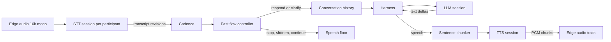
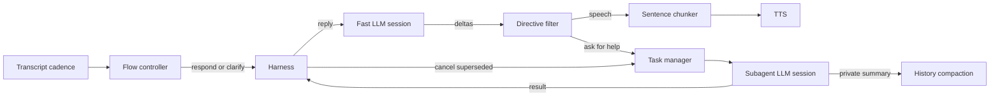

# Model Router

A Go service that fronts several model providers, picks one per request, and records what
each customer used. Speech-to-text, text-to-speech and large language models are routed
today, all three over one modality-agnostic core.

On top of the three there is an agent: it joins a Stream call, transcribes what it hears,
answers with a model and speaks the reply back. Because it is built from the routers rather
than from provider instances, every turn of a conversation gets the same failover, health
and billing as a direct API call.

## Layout

| Path                 | What it is                                                        |
| -------------------- | ----------------------------------------------------------------- |
| `internal/routing`   | The modality-agnostic core: config, registry, selection, failover, stats |
| `internal/audio`     | `PcmData`, the PCM type every provider exchanges                   |
| `internal/emit`      | `Emitter[E]`, the buffered event channel providers hold            |
| `internal/stt`       | The speech-to-text contract: PCM in, transcript and turn events out |
| `internal/sttrouter` | Speech-to-text providers and sessions                              |
| `internal/tts`       | The text-to-speech contract: text in, PCM and synthesis events out |
| `internal/ttsrouter` | Text-to-speech providers and sessions                              |
| `internal/llm`       | The LLM contract: messages in, streamed text and token counts out  |
| `internal/llmrouter` | LLM providers and sessions                                         |
| `internal/search`    | The search contract: a question in, an answer and its sources out  |
| `internal/searchrouter` | Search providers and sessions                                   |
| `internal/agent`     | The conversation: transcribe, answer, speak, with barge-in          |
| `internal/harness`   | Sits between the caller and the model: skills, delegation, cancellation |
| `internal/agent/streamedge` | The agent's transport: a Stream call over WebRTC             |
| `internal/chatlog`   | Writes what was said into a Stream Chat channel                     |
| `internal/memory`    | What an agent remembers between calls; `mem0/` is the one provider  |
| `internal/knowledge` | What the business wrote down; `turbopuffer/` is the one provider    |
| `internal/knowledge/ingest` | Cutting documents into passages, for both the command and the endpoint |
| `internal/knowledge/urls` | Keeping a knowledge base filled from pages published elsewhere   |
| `internal/phone`     | Telephony: the vendor contract, the Stream SIP trunk, the service   |
| `internal/phone/twilio`, `internal/phone/telnyx` | The two vendors that also answer on a number |
| `internal/phone/sinch`, `.../bandwidth`, `.../vonage`, `.../bird`, `.../plivo` | Five more that buy numbers and call out on them |
| `internal/phone/didww`  | Sells numbers and cannot dial: it has no call control API at all    |
| `internal/store`     | Postgres via bun, plus the goose migrations in `migrations/`        |
| `internal/live`      | Redis via rueidis: provider health and live per-customer counters   |
| `internal/api`       | HTTP layer generated from `api/openapi.yaml`                        |
| `cmd/router`         | Serves the HTTP API                                                 |
| `cmd/transcribe`     | Joins a LiveKit room and prints transcripts                         |
| `cmd/say`            | Types a line, hears it                                              |
| `cmd/chat`           | Types a line, reads the answer                                      |
| `cmd/agent`          | Joins a Stream call and holds a conversation                        |
| `cmd/phone`          | Buys numbers, points them at an agent, calls out and transfers live calls |
| `cmd/knowledge`      | Reads documents into a knowledge base an agent can look things up in |
| `deploy/parakeet`    | The streaming Parakeet Truss deployed to Baseten                    |
| `deploy/s2-pro`      | The streaming S2 Pro Truss, written and validated but not yet pushed |
| `deploy/breeze-tts-2` | The streaming Breeze TTS 2 Truss, written but not yet pushed       |
| `deploy/gemma-4`     | The Gemma 4 vLLM Truss, written and validated but not yet pushed    |

Three providers are therefore unreachable until someone deploys them. `s2pro` is under the
Fish Audio Research License and wants an H100, so both questions are worth settling before
the push; the hosted `fish` provider serves the same model in the meantime. `breeze` is in
the same position under the BreezeBlue Research and Non-Commercial License, and there its
hosted API is the licensed alternative. `gemma` needs a dedicated deployment because Gemma
is not on Baseten's shared Model APIs. With `S2PRO_WS_URL`, `BREEZE_WS_URL` or
`GEMMA_BASE_URL` unset each fails to build and routing moves to the next candidate, so a
shortcut still resolves.

All three LLM providers speak OpenAI-compatible chat completions, so they share one
implementation in `internal/llm/openaicompat` and differ only in base URL, credentials and
extra request fields. `deepseek` reaches Baseten's shared Model APIs, which need no
deployment.

## Build prerequisites

`cmd/transcribe` and `cmd/agent` decode and encode Opus through LiveKit's media-sdk, which
is cgo:

```bash
# macOS
brew install pkg-config opus opusfile libsoxr

# Debian/Ubuntu
sudo apt-get install -y pkg-config libopus-dev libopusfile-dev libsoxr-dev
```

Everything else builds without them. `cmd/say` needs `ffplay` at runtime (part of ffmpeg)
to play audio, or `-out` to write a file instead.

## Configuration

| Variable                | Purpose                                                   |
| ----------------------- | --------------------------------------------------------- |
| `ROUTER_ADDR`           | HTTP listen address, defaults to `:8080`                   |
| `ROUTER_POSTGRES_DSN`   | Postgres DSN. Without it, nothing is recorded              |
| `ROUTER_REDIS_ADDR`     | Redis `host:port`. Without it, routing ignores health      |
| `ROUTER_BLOB_URL`       | Bucket for voice recordings, e.g. `s3://voices?region=eu-west-1` or `gs://voices`. Without it, voices of your own are unavailable |
| `ROUTER_CONFIG`         | Path to a capability config; defaults to the built-in one  |
| `ROUTER_PHONE_CONFIG`   | Path to a vendor list; defaults to the built-in one        |
| `ROUTER_CORS_ORIGINS`   | Browser origins allowed to call the API directly, comma separated. Unset means none, which is right unless the dashboard is running |
| `ROUTER_LOG_LEVEL`      | `debug`, `info` (default), `warn` or `error`               |
| `HARNESS_SKILLS`        | Path to a skill set; defaults to the built-in one          |
| `MEM0_API_KEY`          | mem0 credentials. Without it the agent remembers nothing   |
| `TURBOPUFFER_API_KEY`   | turbopuffer credentials. Without it an agent looks nothing up |
| `TAVILY_API_KEY`        | Tavily credentials, one of three ways to find out what is true today |
| `EXA_API_KEY`           | Exa credentials. Also what reads a URL into a knowledge base |
| `PERPLEXITY_API_KEY`    | Perplexity credentials, for the ranked index and for Sonar |
| `DAYTONA_API_KEY`       | Daytona credentials. Without it a session cannot ask for a sandbox |
| `TWILIO_ACCOUNT_SID`    | Twilio credentials, for buying and operating numbers       |
| `TWILIO_AUTH_TOKEN`     | Twilio credentials                                         |
| `TELNYX_API_KEY`        | Telnyx credentials                                         |
| `TELNYX_CONNECTION_ID`  | The Telnyx SIP connection numbers are routed over          |
| `DEEPGRAM_API_KEY`      | Deepgram Flux credentials                                  |
| `CARTESIA_API_KEY`      | Cartesia Sonic credentials                                 |
| `CARTESIA_VOICE_ID`     | Optional default voice; a built-in one is used when unset  |
| `ELEVENLABS_API_KEY`    | ElevenLabs credentials                                     |
| `ELEVENLABS_VOICE_ID`   | Optional default voice; a built-in one is used when unset  |
| `FISH_API_KEY`          | Fish Audio credentials                                     |
| `FISH_VOICE_ID`         | Optional Fish reference id to clone a voice from           |
| `OPENAI_API_KEY`        | OpenAI credentials                                         |
| `GOOGLE_API_KEY`        | Gemini credentials, from AI Studio; used by the LLM and the transcriber |
| `BASETEN_API_KEY`       | Baseten credentials, for the Model APIs and both deployments |
| `XAI_API_KEY`           | xAI credentials, used by the Grok transcriber              |
| `TOGETHER_API_KEY`      | Together AI credentials, used by the Together-hosted Parakeet |
| `PARAKEET_WS_URL`       | The Parakeet WebSocket endpoint                            |
| `S2PRO_WS_URL`          | The S2 Pro WebSocket endpoint. Not yet deployed, see above |
| `BREEZE_WS_URL`         | The Breeze TTS 2 WebSocket endpoint. Not yet deployed, see above |
| `DEEPSEEK_BASE_URL`     | Optional; overrides Baseten's shared Model APIs endpoint    |
| `GEMMA_BASE_URL`        | The Gemma 4 deployment endpoint. Not yet deployed, see above |
| `LIVEKIT_URL`           | LiveKit host, used by `cmd/transcribe`                     |
| `LIVEKIT_API_KEY`       | LiveKit credentials                                        |
| `LIVEKIT_API_SECRET`    | LiveKit credentials                                        |
| `STREAM_API_KEY`        | Stream credentials, used by `cmd/agent` and to say which app a browser joins |
| `STREAM_API_SECRET`     | Stream credentials; the agent mints its own token from them, and the router mints a browser's |
| `STREAM_USER_TOKEN`     | Optional; used in preference to the secret                 |
| `EXAMPLE_BASE_URL`      | Optional; points `cmd/agent`'s demo link at another deployment |

Provider capabilities, prices and the capability shortcuts live in
[internal/routing/router.yaml](internal/routing/router.yaml), one section per modality.
Adding a provider or model is a config edit.

## Targets

A request names either a concrete `provider/model` or one of four capability shortcuts,
which mean the same thing in every modality:

| Shortcut                     | What it asks for                                    |
| ---------------------------- | --------------------------------------------------- |
| `en-low-latency`             | English, fast enough for a live conversation         |
| `multilingual-low-latency`   | More than one language, still fast                  |
| `en-high-accuracy`           | English, quality over speed                         |
| `multilingual-high-accuracy` | More than one language, quality over speed          |

Speech-to-text also keeps its sprint-1 names (`en-realtime-best` and friends) as synonyms.
LLM adds `llm-fast`: whichever model answers quickest, in whatever language.

Which models those shortcuts reach for LLM, and what each is billed at per million tokens:

| Model                            | Tier         | In     | Cached  | Out     |
| -------------------------------- | ------------ | ------ | ------- | ------- |
| `deepseek/DeepSeek-V4-Flash-0731` | low-latency  | $0.13  | $0.028  | $0.26   |
| `openai/gpt-5.6-luna`             | low-latency  | $0.20  | $0.02   | $1.20   |
| `gemini/gemini-3.5-flash-lite`    | low-latency  | $0.30  | $0.03   | $2.50   |
| `gemma/gemma-4-E2B-it`            | low-latency  | $0.032 | -       | $0.16   |
| `deepseek/DeepSeek-V4-Pro-0813`   | high-quality | $1.32  | $0.132  | $3.96   |
| `openai/gpt-5.6-terra`            | high-quality | $2.00  | $0.20   | $12.00  |
| `openai/gpt-5.6-sol`              | high-quality | $5.00  | $0.50   | $30.00  |

Gemma is self-hosted, so its rates are an estimate of what the deployment costs rather than
a published price: Baseten's L4 rate divided by an assumed throughput. Cached prompt tokens
are billed once, at the cached rate, not twice.

DeepSeek's models reason by default, which spends the whole token budget and most of the
latency before the first word of the answer. The provider turns thinking off through the
chat template, since that is the wrong trade for a live conversation; `Options.Thinking`
turns it back on and the reasoning then arrives as `ReasoningDelta` events, separate from
the answer.

Gemini is reached over Google's OpenAI-compatible endpoint, so it needs no implementation of
its own. Every Gemini 3 model thinks and none of them can be told not to, so the provider
pins the effort to `minimal` rather than letting a conversation wait on the model's own
default; `Options.ReasoningEffort` raises it for anything off the live path. Google reports
the thinking as a token count rather than streaming it, so there are no `ReasoningDelta`
events to separate out.

### Transcribers, and what Gemini does differently

| Model                                                    | Languages | Per audio hour |
| -------------------------------------------------------- | --------- | -------------- |
| `deepgram/flux-general-en`                               | en        | $0.276         |
| `deepgram/flux-general-multi`                            | 12        | $0.276         |
| `gemini/gemini-3.5-transcribe-live`                      | 85+       | ~$0.54         |
| `grok/grok-stt`                                          | 25        | $0.20          |
| `muse/muse-voice-transcribe-1.0`                         | 25        | $0.18          |
| `parakeet/parakeet-tdt-0.6b-v3`                          | 25        | $0.079         |
| `together-parakeet/nvidia/parakeet-tdt-0.6b-v3-realtime` | 25        | $0.21          |

The two Parakeets are the same weights in two places: `parakeet` is our own Baseten
deployment and `together-parakeet` is Together's serverless endpoint. They are separate
providers because the bill and the pager are not shared, so routing can pick between them
and fail over from one to the other.

Muse Voice Transcribe is configured by its opening frame rather than by a header or a
query string, credentials included, so a rejected key arrives as an error event on the
socket rather than as a failed dial. It finds turn boundaries itself, which is what
`ENDPOINTING`, the mode the provider defaults to, asks for; `DIARIZATION` adds speaker
labels the router has no use for, since it already knows whose track the audio came in on.

Deepgram, Grok, Muse and Parakeet are speech recognisers. Gemini 3.5 Transcribe is a Gemini model that
happens to be listening, reached over the Live API's `BidiGenerateContent` socket with the
talking half turned off, and that difference shows in three places.

It writes down what you meant rather than what you emitted: filler words go, a
self-correction resolves to the correction, and the text arrives punctuated. That is worth
having on a call and wrong for a compliance transcript, and it is not a setting.

It has no field for a keyterm or a language hint — `AudioTranscriptionConfig` is an empty
message. Both are passed as a system instruction instead, which is the only lever the API
gives and is a request rather than a constraint. Deepgram's `keyterm` is the stronger tool
if the vocabulary matters more than the phrasing.

It sends the words in pieces that append, so a chunk is a `delta` and the turn boundary the
server reports is what settles it. The final restates the whole utterance, which cadence
treats as the transcriber settling rather than as the caller saying it twice.

Billing is per token, not per hour: audio in at $3.50/1M against 25 tokens a second, text
out at $21.00/1M. The router config carries Google's own blended figure of about $0.009 an
audio minute, so a busy call costs more than the table suggests and a quiet one less.

## Run

```bash
# The API
ROUTER_POSTGRES_DSN=postgres://... ROUTER_REDIS_ADDR=localhost:6379 \
  go run ./cmd/router

# Transcribe a LiveKit room to the terminal
go run ./cmd/transcribe -room my-room -target en-low-latency

# Say something
go run ./cmd/say -text "Hello from the router."

# Or type lines and hear them
go run ./cmd/say -target multilingual-low-latency -language es

# Ask a model something
go run ./cmd/chat -text "Name three primary colours."

# Or hold a conversation, which keeps its history between turns
go run ./cmd/chat -target en-high-accuracy

# Join a Stream call and talk to it. A browser opens on a link that joins the same call,
# which -demo=false turns off when the caller is joining from somewhere else.
go run ./cmd/agent -call my-call

# Sprint 6 stack: Gemma speaks, Sol handles the hard parts
go run ./cmd/agent -call my-call \
  -stt parakeet/parakeet-tdt-0.6b-v3 \
  -tts fish/s2-pro \
  -llm gemma/gemma-4-E2B-it \
  -subagent openai/gpt-5.6-sol

# Label what a session costs, so spend can be broken down later
go run ./cmd/agent -call my-call -tag project=support -tag environment=dev

# Give an agent a phone number
go run ./cmd/phone vendors
go run ./cmd/phone search -vendor twilio -country US -area 512
go run ./cmd/phone buy -vendor twilio -number +15125551234 -tag project=support
go run ./cmd/phone attach -number +15125551234 -call support-line

# Or ask every vendor at once, for somewhere specific with the features you need
go run ./cmd/phone search -country US -state CO -type local \
  -feature hd_voice -feature emergency -limit 5

# Call somebody, on the terms the call needs, and join the call it prints
go run ./cmd/phone dial -from +15125551234 -to +15550001111 \
  -call-id support-line -ring-timeout 20s -digits ww1234#

# Let the agent hand a caller to a human, or answer a menu on a call it placed
go run ./cmd/agent -call support-line -number +15125551234
go run ./cmd/agent -call outbound-1 -number +15125551234 -vendor-call v3:abc -navigating

# Or do either by hand
go run ./cmd/phone transfer -from +15125551234 -to +15550002222 -call support-line
go run ./cmd/phone press -vendor telnyx -call-id v3:abc -digits 1
```

Each utterance `cmd/say` finishes prints which provider served it, the wait for the first
audio, how much speech came back and what it cost:

```
elevenlabs/eleven_flash_v2_5  first audio 158ms  audio 2.7s  55 chars  $0.002750
```

`cmd/chat` prints the same shape of line per turn, in tokens rather than characters:

```
deepseek/DeepSeek-V4-Flash-0731  first token 356ms  20 in  13 out  $0.000005
```

## The agent

`internal/agent` is the Go counterpart of the Python `Agent`, built from the three routers
plus a target each. One conversation is one LLM session and one voice session, but a
transcription session per participant, because a speech-to-text stream is bound to a single
speaker.



Three decisions are worth knowing about:

- **Cadence, not turn detection, decides when to act.** Transcript revisions are debounced
  per participant, then a separate fast-model session decides whether to wait, ignore
  background speech, respond, or clarify. A provider final is metadata rather than the
  response trigger; new words cancel a stale decision.
- **The reply is spoken sentence by sentence.** A model emits a few characters at a time,
  and a voice given two words at a time pauses in the wrong places. A streaming voice takes
  a turn's sentences as deltas of one utterance, so one turn stays one billed synthesis; a
  voice that cannot take deltas gets one final request per sentence.
- **Overlap is a floor decision.** A correction stops the model and voice, a related addition
  shortens the current answer after speech already queued, and an acknowledgement lets it
  continue. Audio from an abandoned turn is still dropped at publication.

Those three decisions are where a call goes wrong, so `ROUTER_LOG_LEVEL=debug` narrates
them: every transcript revision, when the words held still, what the flow controller was
asked and what it answered, and why the agent then spoke, waited, murmured, queued the turn
or stopped mid-reply. A quiet agent is usually one of `ignore`, `wait` on repeat, or a turn
queued behind speech that never settled, and each of those says so.

```
transcribed provider=deepgram participant=user-1 mode=replacement text="what's the weather"
the words held still, asking whether to answer them candidate=turn-1787 waited=352ms
the flow controller decided candidate=turn-1787 disposition=respond floor=continue
answering candidate=turn-1787
```

`Edge` is four methods (`Join`, `Audio`, `PublishAudio`, `Leave`), which is what lets the
whole flow be tested in-process against a loopback rather than only against a real call.
`streamedge` is the real one: it joins over the private `getstream-go-webrtc` SDK, subscribes
to the audio of everyone else in the call (joining subscribes to nothing on its own), decodes
inbound Opus to 16 kHz mono, and encodes the agent's speech back to 48 kHz Opus.

## The harness

The model on the live path is chosen for how quickly it starts talking, which is not the
same as how well it thinks. `internal/harness` is what stops that being a trade made on
every sentence: the fast model can hand the hard part to a slower one and go on talking
while it runs.



A skill is a name, a line telling the fast model what it is for, and the instructions the
subagent answers under. `skills.yaml` is embedded, and `HARNESS_SKILLS` or `-skills`
replaces it, the same way `router.yaml` and `phone.yaml` already work.

- **The model asks for help mid-sentence.** It writes `<ask skill="think">…</ask>` into its
  reply. A streaming filter takes it back out before the reply reaches the voice, so the
  caller hears "let me check that" and never the request. Everything that cannot yet be a
  tag is released immediately, because the caller is listening to the gap.
- **A task is a completion, so cancelling one is a targeted interrupt.** `Interrupt` on
  `llm.LLM` takes completion ids, which is what lets a conversation abandon stale work
  without stopping the reply being spoken. Work is abandoned when a newer request for the
  same skill or a revised conversational premise supersedes it, when the model writes
  `<drop skill="…"/>` because the caller moved on, when its deadline passes, or when the
  call ends.
- **Answers come back as a turn nobody asked for.** The caller was told an answer was
  coming, so it arrives without them asking again. If the agent is mid-sentence the answer
  waits for it to finish rather than talking over itself. A subagent that cannot answer
  without knowing something replies `NEED: …`, which becomes a question in the agent's own
  words.

Subagent completions go through `llmrouter` like anything else, so what the thinking costs
lands in `requests` with the same failover and cost tags as the talking.

A session that asks for a sandbox gives the subagent one tool, `run_code`, and the model
holding the conversation none: running code takes seconds that a conversation does not
have, and the subagent has already left the live path. Code the subagent writes runs in
Daytona, its output comes back as a tool result, and the same task is put again, up to four
rounds and always inside the skill's own deadline. One sandbox is created the first time
code actually runs and released when the session ends.

Long histories are compacted privately on the thinking session only when the prompt is large
and the provider's reported cached-token ratio has fallen below half. The result replaces
only the unchanged old prefix; recent turns stay verbatim and a late summary cannot overwrite
newer conversation.

### Listening and talking at the same time

Cadence and floor control are always part of the agent. `-backchannel` defaults on and makes a
short listening noise during long speech or delegated work; pass `-backchannel=false` to turn
it off. `-min-confidence` additionally makes the agent clarify a doubtful transcript. The
flow controller also asks for clarification when the words are clear but the intent is not.

### Voices that act a direction

Some voices perform bracketed directions such as `[laughs]` or `[whispering]` rather than
reading them out. A provider says whether it does, and only then is the model told it may
write them. What it writes is stripped before it reaches the transcript or the
conversation's history, so a direction is heard and never read.

Two providers perform them, and they are not interchangeable.

`elevenlabs/eleven_v3_conversational` acts any bracketed direction, over the Text to
Dialogue socket rather than the streaming one. It is a different bargain from
`eleven_flash_v2_5`: latency is roughly a second to first audio against about 75 ms, and
an open connection holds a dialogue session from a pool separate from the standard
concurrency limit, so a deployment routing calls to it needs headroom of a different kind.
The protocol has no context ids and no cancel frame, so audio is attributed by flush order
and a barge-in reopens the socket.

`breeze/breeze-tts-2` acts four: `[laugh]`, `[sigh]`, `[cough]` and `[clears throat]`. Its
prompt says so, because telling a model any direction works when only four do would have
it write directions that get spoken. In exchange it takes the other half of the
instruction — how the line should sound, or who should say it — which no other provider
here does. Two languages only, English and Chinese, and it runs on our own Baseten
deployment, so see `deploy/breeze-tts-2/README.md` before routing anything at it: the
licence and the single-request engine both matter.

### A voice described rather than chosen

Every other provider takes a voice id. Breeze takes prose: "a warm, thoughtful young woman
with a calm, reflective delivery" designs a voice with no reference audio at all, and the
same field alongside a reference clip steers delivery while the clip keeps the identity. So
`-voice` means something different depending on who is listening, and a voice id from
another provider is meaningless here rather than merely wrong.

That is also why `breeze` registers no cloner in `internal/tts/voices`, the same as
`s2pro`: a customer's own voice is a clip plus a transcript per request, not something
registered upstream and given an id. The router skips it for a call asking for one.

### Directions are written in square brackets, whoever is listening

Breeze's own syntax for an English vocal event is parentheses — `(sigh)` — but the agent
writes `[sigh]` for every provider, because parentheses are ordinary punctuation that a
reply may use for something else. The deployment translates on the way into the engine,
which is the point where an utterance split across text deltas is whole again. A Chinese
event such as `[叹气]` is already in brackets and passes through untouched.

## Sessions, for callers outside this process

Everything above is driven by `cmd/agent` on a command line. `internal/session` is the same
wiring offered over HTTP, so a Python process can have this service hold a conversation on
its behalf: the spec's fields are `cmd/agent`'s flags, and the process that used to be
started per call becomes a session in a process that is already running.

| Endpoint                                | What it does                                    |
| --------------------------------------- | ----------------------------------------------- |
| `POST /v1/agents/sessions`              | Join a call. Returns once the agent is listening |
| `GET  /v1/agents/sessions`              | The customer's sessions, newest first            |
| `GET  /v1/agents/sessions/{id}`         | One of them                                      |
| `DELETE /v1/agents/sessions/{id}`       | Leave the call                                   |
| `POST /v1/agents/sessions/{id}/say`     | Speak, without going through the model           |
| `POST /v1/agents/sessions/{id}/respond` | Answer something, as though it had been said     |
| `POST /v1/agents/sessions/{id}/interrupt` | Abandon the reply being spoken                 |
| `POST /v1/agents/sessions/{id}/instructions` | Change what the agent is, from the next turn |
| `GET  /v1/agents/sessions/{id}/events`  | WebSocket: everything the agent does             |
| `GET  /v1/{modality}/stream`            | WebSocket: one modality, for a pipeline elsewhere |

```bash
curl -s localhost:8080/v1/agents/sessions -H 'X-Customer-Id: acme' \
  -H 'Content-Type: application/json' -d '{
    "call_id": "demo-1",
    "instructions": "Keep your replies short.",
    "llm": "llm-fast",
    "subagent": "llm-smart",
    "sandbox": "daytona",
    "tags": {"project": "support"},
    "memory": {"user_id": "222"}
  }'
```

Two things travel in both directions. The socket carries out what the agent heard, said and
decided, and carries back `say`, `interrupt` and `close`. And it carries `tool_call`: the
caller's own functions live wherever the caller is, so the model asks for one here, the
answer comes back from there, and a caller that does not answer inside the tool timeout
leaves the model to carry on without it rather than leaving the call silent.

Sessions are keyed by customer. A session id that exists but belongs to somebody else is
reported as not existing at all, since a forbidden would confirm it was real.

### Conversations held in writing

`"text": true` and no `call_id` holds the conversation in writing instead. No call is
joined, nothing is transcribed and nothing is spoken, so neither speech target is used:

```bash
curl -s localhost:8080/v1/agents/sessions -H 'X-Customer-Id: acme' \
  -H 'Content-Type: application/json' -d '{"text": true, "config_id": "..."}'
```

Everything between hearing a question and answering it is unchanged, which is the point. A
text session has the same instructions, the same skills handed to the same slower model and
the same knowledge base as a call would have had, so an agent can be built and argued with
in writing before anybody rings it, and a documentation agent or a support chat is the voice
agent with the voice left off.

It is driven over the session's own socket: `respond` goes in, `response_delta` and
`responded` come back, along with `looked_up`, `delegated` and `task_settled` as the agent
works. `say` and `interrupt` do nothing useful here, since there is nothing being spoken to
interrupt.

## Agents that are configured rather than spelled out

A session can be created from a stored configuration instead of a caller repeating the
whole spec every time. `config_id` on `POST /v1/agents/sessions` loads one and everything
inline in the request overrides it, so a config can be reused and one call still changed.

| Endpoint                                    | What it does                                |
| ------------------------------------------- | ------------------------------------------- |
| `/v1/agents/configs`                        | Named agents: models, voice, instructions, skills, knowledge |
| `/v1/agents/skills`                         | What the fast model may hand to the slower one |
| `GET /v1/agents/calls`                      | Calls that happened, running ones included   |
| `GET /v1/agents/calls/{id}`                 | One call, with what a model made of it       |
| `GET /v1/agents/calls/{id}/transcript`      | What was said                                |
| `GET /v1/agents/calls/{id}/timeline`        | Each exchange, said and measured together    |
| `GET /v1/agents/calls/{id}/events`          | What the conversation decided, and why       |
| `POST /v1/agents/knowledge`                 | Fill a knowledge base from documents         |
| `/v1/agents/knowledge/urls`                 | Pages a knowledge base is kept filled from   |
| `/v1/agents/campaigns`                      | Lists of people to ring, and how far they got |

**Skills are named rather than spelled out.** A config carries skill names, and they are
resolved once when the session is created: the customer's own rows, or the built-in
`think`, `recall` and `explain`. A name nothing defines is refused rather than dropped,
because a model offered a skill nobody implements is worse than one offered none. The
runtime lookup is unchanged.

**Knowledge is what the business wrote down.** With `TURBOPUFFER_API_KEY` set, a config's
`knowledge_namespace` gives the model a `lookup` tool over full-text search, so a caller's
question about prices or opening hours is answered out of the handbook rather than guessed
at. Each search is a `requests` row with modality `knowledge`, like everything else that
costs money.

**Search is what is true today.** Neither the model nor the handbook can answer what the
traffic is doing, whether a place is open or what a score is: one was trained months ago and
the other was written down once. A session gets a `search` tool wherever a provider can be
built for it, and an agent asked about any of those looks it up instead of saying it cannot
check.

Search is routed the way the three model modalities are. A config's `search` names a target,
which is a `provider/model` or one of the same capability shortcuts the others use, and the
router ranks the candidates, fails over past a provider whose key is missing, and files one
`requests` row per search under modality `search`. There are three providers and they differ
more between their own modes than they do from each other, which is what the models select
between:

| Target                | What it does                                                     |
| --------------------- | ---------------------------------------------------------------- |
| `exa/fast`            | Exa's index, no crawl and no model: the quickest sources          |
| `perplexity/search`   | Perplexity's ranked index, results only                           |
| `tavily/basic`        | Index plus a written summary in the same round trip               |
| `exa/auto`            | Exa choosing between its neural and keyword indexes               |
| `tavily/advanced`     | Crawls the pages it finds rather than trusting the snippet        |
| `perplexity/sonar`, `perplexity/sonar-pro` | A model reads the pages and writes the answer |

A session that names nothing gets `search-fast`. Sonar is a target rather than a fork:
because it is a language model in the middle of a conversation, whether it is worth its
latency is a routing decision.

The answer lands in the conversation as a tool result, which is what puts it in front of the
subagent too: a caller who asks for the best route given the closures gets the fast model
finding out what the closures are and the subagent reasoning over them. Nothing extra is
configured for that, and nothing is offered at all without a key for something.

**A knowledge base can also be filled from URLs.** Posting a document happens once; a url is
a subscription, because the page behind it changes and nobody re-posts it. With
`EXA_API_KEY` set alongside turbopuffer and a database, `/v1/agents/knowledge/urls` fetches
the page, turns it into markdown and cuts it into passages the same way a document is:

```bash
curl -X POST localhost:8080/v1/agents/knowledge/urls \
  -H "X-Customer-Id: acme" -H "Content-Type: application/json" \
  -d '{"namespace":"docs","url":"https://example.com/pricing"}'
```

Each row records when the page was last read successfully, what it was called and how many
passages it became. That last number is what makes removing it exact: passages are keyed by
the url and a position, so deleting a subscription takes its passages with it, and
re-reading a page that got shorter leaves no orphans behind. A page that could not be
fetched is still stored, in the `failed` state with the reason on it, rather than refused
and forgotten.

Nothing re-crawls on a schedule. `POST /v1/agents/knowledge/urls/{id}/index` reads one
again, and `last_indexed_at` is what a caller with its own schedule decides from.

`cmd/knowledge` fills one from files:

```bash
go run ./cmd/knowledge -namespace docs ../docs ../README.md
```

`POST /v1/agents/knowledge` fills one from a caller that has no access to this machine's
disk, which is what an SDK pushing an agent directory needs. Documents are cut into passages
by the server, in `internal/knowledge/ingest`, so a file read off disk by the command and one
posted over HTTP are cut the same way and replace each other.

```bash
curl -s localhost:8080/v1/agents/knowledge -H 'X-Customer-Id: acme' \
  -H 'Content-Type: application/json' -d '{
    "namespace": "docs",
    "documents": [{"source": "pricing.md", "text": "# Pricing\n\nA call costs..."}]
  }'
```

Markdown is cut at its headings, a section too long to be one passage is cut again at
paragraph breaks, and each piece keeps the heading it was found under so it still says what
it is about when it comes back on its own. A section that is only a heading is skipped:
retrieving a title tells the model nothing. Passages are keyed by the file and the position
they came from, so reading a directory again after editing it replaces that file's passages
rather than leaving two versions of them to be found. `-dry-run` prints what would be
written without writing it.

Search is BM25 only. There are no embeddings here, and nothing to keep in step with a model
that generates them: documentation and handbooks are answered well by the words in them, and
a lookup on the answering path has to be fast.

**A call outlives the session that ran it.** Sessions live in a map in memory, which
answers what is happening now and nothing at all about last Tuesday. A `calls` row is
written when the agent joins and again when it leaves, both off the conversation's path.
What was said is not copied into Postgres: the transcript is already in Stream Chat, keyed
by agent, and the timings are already in `turns`. The timeline endpoint is those two
joined. When the call ends, a short model pass over the conversation writes a summary and
a score from one to five onto the row, billed through the LLM router like anything else.

**Campaigns are the outbound half.** A campaign is one agent, one of the customer's
numbers and a list of people, each with instructions of their own that are added to the
config's. Starting one runs a loop that holds a semaphore sized to `concurrency`, places
each call at the vendor and creates a session for it; contacts are claimed in Postgres, so
a process that stopped mid-campaign resumes rather than starting again. Pausing stops
ringing new people and leaves the conversations already happening alone.

## Voices a customer brought with them

A config's `voice` is normally a name the chosen provider knows. It can also name one of
the customer's own voices, cloned from recordings they uploaded:

```bash
curl -s -X POST localhost:8080/v1/agents/voices \
  -H "X-Customer-Id: acme" -H 'Content-Type: application/json' \
  -d '{"name":"founder","description":"the one from the ad"}'

curl -s -X POST localhost:8080/v1/agents/voices/$ID/samples \
  -H "X-Customer-Id: acme" -H 'Content-Type: application/json' \
  -d '{"audio":"'"$(base64 < clip.wav)"'","filename":"clip.wav","transcript":"..."}'

curl -s -X POST localhost:8080/v1/agents/voices/$ID/prepare \
  -H "X-Customer-Id: acme" -H 'Content-Type: application/json' -d '{}'
```

**The voice is ours and the ids are theirs.** Preparing sends the recordings to each
provider that can be taught one and remembers what each called it back. A session names
our voice, and which id that means is worked out once the router has picked a provider —
which is the point, because the router fails over mid-call and an id ElevenLabs knows
means nothing to Cartesia. A provider that was never given the voice, or that refused the
recordings, is simply not chosen for a call that asks for it. Deleting a voice takes it off
every provider first, so a voice nobody can reach stops being billed for.

Recordings live in the bucket `ROUTER_BLOB_URL` names, not in Postgres, so they can be
re-sent to a provider added later without asking the customer for them again. Without that
variable the voice paths say so rather than half-working. Not every provider clones:
`s2pro` takes reference audio per session rather than registering a voice, so it is not
offered custom voices and the router routes around it for calls that want one.

## What is recorded

| Table                                    | One row per                                        |
| ---------------------------------------- | -------------------------------------------------- |
| `requests`                               | Unit of work: a turn, a synthesis, a completion, a memory call, a number bought |
| `stats_hourly`, `stats_daily`            | Bucket, modality, customer, provider and model      |
| `stats_tags_hourly`, `stats_tags_daily`  | Bucket, modality, customer and one cost label       |
| `turns`                                  | Exchange in a conversation, measured leg by leg     |
| `turn_stats_hourly`, `turn_stats_daily`  | Bucket, customer and agent, with per-leg percentiles |
| `phone_numbers`                          | Number held, kept after release because it was billed |
| `agent_configs`, `skills`                | Named agent, and a kind of work worth delegating    |
| `calls`                                  | Conversation that happened, with its summary and score |
| `campaigns`, `campaign_contacts`         | List of people to ring, and what became of each     |

Three things fall out of this that are worth stating.

**Cost tags are the customer's own labels.** Any keys they like, up to sixteen per request,
carried onto every row a session produces. They get their own rollup tables rather than more
columns on `stats_hourly`, because a request carries a set of labels rather than one more
dimension: a request tagged `{project, environment}` is unrolled into both breakdowns. Ask
what drives spend with `GET /v1/{modality}/stats/tags?key=project`, or narrow the ordinary
stats with a repeatable `tag=project:support`. Filtering reads the raw request rows, since a
rollup bucket has already forgotten which labels its requests carried.

**A turn is not a request.** A request row measures one provider call. A turn measures what
the caller felt: the gap between finishing a sentence and hearing the answer start, which
spans three providers and the agent's own handling. Every leg is nullable, because a
realtime model that hears and speaks for itself fills only `roundtrip_ms`, and an interrupted
turn never reaches the legs that come after the interruption. A leg that never happened is
left out of the percentiles rather than counted as instant. `GET /v1/turns/stats` reports
them.

**Memory and phone are recorded but not routed.** There is one memory store and one vendor
per number, so the provider and route paths do not serve those modalities while the
statistics paths do.

## Transcripts, memory and phone

**Transcripts.** With `STREAM_API_KEY` and `STREAM_API_SECRET` set, `cmd/agent` writes every
relevant transcript committed by the flow controller and every reply into the Stream Chat
channel `messaging:{agentID}`, off
the event stream rather than from inside the conversation loop. A voice call otherwise leaves
nothing behind, and any Stream Chat client can already read a channel.

**Memory.** With `MEM0_API_KEY` set, an agent recalls what it knows about the customer on
join and prepends it to its instructions, then hands each finished exchange over to be
learned from. Both happen off the conversation's path: recalling is bounded and a failure
means the agent starts the call knowing nothing rather than not taking it, and remembering is
queued and dropped under backpressure. `app_id` is the deployment and `user_id` is the
customer, so two deployments sharing one mem0 account do not read each other's memories.
Every call is recorded as a `requests` row with modality `memory`.

**Phone.** `phone.Provider` is the things vendors agree on: search, buy, release, point at
the bridge, dial out, press digits. All eleven vendors are declared in
[internal/phone/phone.yaml](internal/phone/phone.yaml). Eight are implemented; the other
three resolve to a stub that refuses every operation by name, so they list rather than being
absent.

Being implemented means different things for different vendors, so each declares its
`operations` and `GET /v1/phone/vendors` reports them. Seven of the eight can place an
outbound call. **DIDWW cannot, and never will here:** it sells numbers and has no call
control API at all, only SIP origination against a trunk resource it expects you to point
your own switch at. There is nothing to ask it to dial with, so `dial` is absent from its
operations and a number is not bought from it for an agent that has to call people.

Only Twilio and Telnyx also `attach`, which is the inbound direction: pointing a number at a
trunk so calling it reaches an agent. For the other five that is a per-vendor application
rather than a property of the number, and it is declared missing rather than half-done.

Vendors also disagree about how a search can be narrowed. Telnyx filters by US state and
Sinch does not; Plivo matches digits only at the front of a number and Vonage matches at
either end but not both at once. So a provider declares which filters it can express, and
`GET /v1/phone/numbers/available` without a vendor asks every vendor that has its credentials
at once, merges what they offer cheapest first, and reports in `skipped` any vendor it could
not ask and why. Dropping a filter the vendor cannot express would answer a search for
Colorado with numbers from Ohio, which reads as a result. Capabilities are the exception:
every vendor says what its numbers carry even when it cannot filter on them, so those are
checked on the results.

Stream's SIP support is **inbound only** today. A number reaches an agent by the vendor
sending the call to a Stream inbound trunk; an outbound call is originated at the vendor and
bridged into the same trunk, because there is nothing to ask Stream to dial with. Attaching a
number creates the trunk and a routing rule whose caller id is a handlebars template, so the
SIP caller becomes a participant with a stable id that per-participant transcription can key
on.

### Placing a call

`POST /v1/phone/calls` makes its own trunk and routing rule and pins the rule to a call, so
the answered leg lands somewhere an agent can be waiting. The response says which call that
is, and an agent that is not in it hears nothing when the person picks up.

Vendors do not agree on what a call can be asked for, so a provider declares which terms its
API can express and a call naming one it cannot is refused rather than placed without it. A
ring timeout that was silently dropped is a call sitting in somebody's voicemail for a
minute.

| Term | Who can express it |
| --- | --- |
| `ring_timeout_seconds` | Everyone but Bird and Sinch |
| `initial_digits` | Twilio, Telnyx, Bandwidth, Sinch |
| `headers` | Telnyx only |

Getting past the trunk splits the vendors in two. Twilio, Telnyx and Plivo can name SIP
digest credentials in their call plans, so the trunk's own password is enough. Vonage, Bird,
Sinch and Bandwidth have no field for a password anywhere, so their trunk recognises them by
the address they call from, declared as `signalling` in `phone.yaml`. Stream reads an empty
allowlist as "accept everything" rather than "password only", so a vendor that authenticates
by address refuses to place a call until its addresses are declared: a trunk with neither is
a way into a customer's calls for anyone who learns its uri. Vonage's and Bird's addresses
are published and are in `phone.yaml`; Bandwidth's and Sinch's come with the account, so
those are per deployment.

Plivo and Bandwidth also will not take a call plan on the request at all, and fetch one when
the person answers. For those, placing a call parks the plan and hands the vendor a
single-use expiring token at `GET /v1/phone/answer/{token}`, which is the one unauthenticated
path here because the vendor fetching it has no customer to name. It needs `ROUTER_PUBLIC_URL`
to be set to somewhere those vendors can reach, and says so rather than placing a call
nothing will answer. Sinch is the near miss: its callbacks belong to the application rather
than to a call, so its plan travels inline on the callout instead.

```bash
go run ./cmd/phone dial -from +15125551234 -to +15550001111 \
  -call-id support-line -ring-timeout 20s -digits ww1234# -custom reason=callback
```

Buying a number spends money every month, so nothing automated buys one. The runbook, run by
hand:

```bash
# What is on offer, and what it costs
go run ./cmd/phone search -vendor telnyx -country US -state CO \
  -type local -feature hd_voice -feature emergency -limit 5

# Buy one of them. -country is only needed by the vendors that sell out of a
# country's inventory rather than by number, which the search reports.
go run ./cmd/phone buy -vendor telnyx -number +1719XXXXXXX -tag project=sprint12
go run ./cmd/phone list

# Give it back, which is what stops the charge
go run ./cmd/phone release -number +1719XXXXXXX
```

`cmd/router` applies migrations on startup. To run them by hand:

```bash
goose -dir migrations postgres "$ROUTER_POSTGRES_DSN" up
```

## Test

```bash
# Unit tests, no credentials or services needed
go test ./...

# Integration tests hit real providers, Postgres and Redis
go test -tags integration ./...
```

Integration tests skip themselves when the credentials or services they need are absent.

`internal/agent/conversation_test.go` is the conversation-quality suite: a synthesised caller
is played into a real agent at the rate a real call delivers audio, in silence, in a noisy
room, over somebody else's conversation and while the agent is talking. What it asserts is
what a caller would notice, including how long they waited to be answered.

```bash
go test -tags integration -run TestConversationSuite ./internal/agent
```

Postgres and Redis for local runs:

```bash
docker run -d --name va-pg -e POSTGRES_PASSWORD=postgres -e POSTGRES_DB=model_router \
  -p 55432:5432 postgres:16-alpine
docker run -d --name va-redis -p 56379:6379 redis:7-alpine
```

## Regenerate the HTTP layer

`api/openapi.yaml` is the source of truth for every side. After editing it:

```bash
go tool oapi-codegen -config api/oapi-codegen.yaml api/openapi.yaml
uv run ../plugins/stream/generate.py
(cd ../dashboard && npm run types)
```

The two sockets are declared in the spec with a `101` response so a reader and a client
generator know they exist, and excluded from generation: a strict server cannot express an
upgrade. Their handlers are hand-written in `internal/api/sessionws.go` and `streamws.go`,
and the Python side of them in `plugins/stream/.../_socket.py`.

## Design notes

- **The core knows nothing about modalities.** `routing.Router[P]` resolves a target, ranks
  candidates and fails over; each modality adds only a provider contract and a session that
  knows which of its events count as a unit of work.
- **One row per unit of work.** A completed turn for speech-to-text, a completed synthesis
  for text-to-speech, a completed completion for an LLM, one question asked for a search,
  alongside rows for sessions that
  failed to start. Everything is keyed by `modality`, so the same provider can serve two of
  them without its numbers mixing.
- **Latency is the number the customer felt.** For speech-to-text that is the provider's
  decode time; for text-to-speech it is the wait for the first audio, since the rest
  arrives while the listener is already hearing it; for an LLM it is the wait for the first
  token, for the same reason.
- **A conversation lives in the caller, not the provider.** Every LLM request carries the
  whole history, so consecutive turns can be served by different providers and a failover
  loses nothing.
- **Delegation is not tool calling.** Standardising a tool schema across providers is a
  bigger question than routing needs answered, and a tool call is the wrong shape for a
  phone call anyway: it blocks the reply on the result. The harness has the fast model ask
  a slower one for help in its own words, in the middle of a sentence it goes on to finish;
  `Session.LLM()` still reaches the provider's own `Client()` for anything else.
- **Costs come from config, not from the provider.** Each model declares what this
  deployment is billed, and the recorder prices every row once. A model with no price
  reports a cost of zero rather than a guess.
- **Transcript modes.** `delta` appends, `replacement` supersedes the current in-progress
  text, `final` is settled. Both speech-to-text providers send replacements.
- **An audio chunk does not say whether it is the last.** A streaming voice only learns
  that after the fact, and buffering a chunk to find out would cost the latency the design
  is for, so `SynthesisComplete` is what ends an utterance.
- **Uptime and latency come from the same request rows** as billing, so there is no
  separate health-probe pipeline to keep in sync.
- **Nothing a conversation does waits on a database.** Turns, transcripts and memories all go
  through a bounded queue and are dropped when the writer falls behind, because losing a row
  costs a statistic while blocking costs the participant a silence.
- **Failover happens at session start.** A candidate that fails to start is recorded and
  the next one is tried; a provider that keeps failing falls down the ranking.
- **`customer_id` is a trusted header.** Real authentication is not part of this version.
