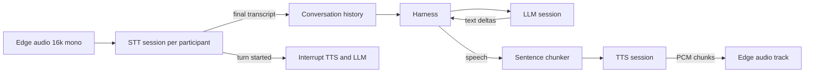
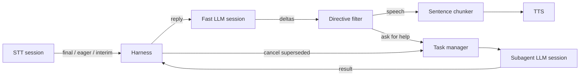

# Model Router

A Go service that fronts several model providers, picks one per request, and records what
each customer used. Speech-to-text, text-to-speech and large language models are routed
today, all three over one modality-agnostic core.

On top of the three there is an agent: it joins a Stream call, transcribes what it hears,
answers with a model and speaks the reply back. Because it is built from the routers rather
than from provider instances, every turn of a conversation gets the same failover, health
and billing as a direct API call.

## Layout

| Path                 | What it is                                                        |
| -------------------- | ----------------------------------------------------------------- |
| `internal/routing`   | The modality-agnostic core: config, registry, selection, failover, stats |
| `internal/audio`     | `PcmData`, the PCM type every provider exchanges                   |
| `internal/emit`      | `Emitter[E]`, the buffered event channel providers hold            |
| `internal/stt`       | The speech-to-text contract: PCM in, transcript and turn events out |
| `internal/sttrouter` | Speech-to-text providers and sessions                              |
| `internal/tts`       | The text-to-speech contract: text in, PCM and synthesis events out |
| `internal/ttsrouter` | Text-to-speech providers and sessions                              |
| `internal/llm`       | The LLM contract: messages in, streamed text and token counts out  |
| `internal/llmrouter` | LLM providers and sessions                                         |
| `internal/agent`     | The conversation: transcribe, answer, speak, with barge-in          |
| `internal/harness`   | Sits between the caller and the model: skills, delegation, cancellation |
| `internal/agent/streamedge` | The agent's transport: a Stream call over WebRTC             |
| `internal/chatlog`   | Writes what was said into a Stream Chat channel                     |
| `internal/memory`    | What an agent remembers between calls; `mem0/` is the one provider  |
| `internal/phone`     | Telephony: the vendor contract, the Stream SIP trunk, the service   |
| `internal/phone/twilio`, `internal/phone/telnyx` | The two implemented vendors    |
| `internal/store`     | Postgres via bun, plus the goose migrations in `migrations/`        |
| `internal/live`      | Redis via rueidis: provider health and live per-customer counters   |
| `internal/api`       | HTTP layer generated from `api/openapi.yaml`                        |
| `cmd/router`         | Serves the HTTP API                                                 |
| `cmd/transcribe`     | Joins a LiveKit room and prints transcripts                         |
| `cmd/say`            | Types a line, hears it                                              |
| `cmd/chat`           | Types a line, reads the answer                                      |
| `cmd/agent`          | Joins a Stream call and holds a conversation                        |
| `cmd/phone`          | Buys numbers and points them at an agent                            |
| `deploy/parakeet`    | The streaming Parakeet Truss deployed to Baseten                    |
| `deploy/s2-pro`      | The streaming S2 Pro Truss, written and validated but not yet pushed |
| `deploy/gemma-4`     | The Gemma 4 vLLM Truss, written and validated but not yet pushed    |

Two providers are therefore unreachable until someone deploys them. `s2pro` is under the
Fish Audio Research License and wants an H100, so both questions are worth settling before
the push; the hosted `fish` provider serves the same model in the meantime. `gemma` needs a
dedicated deployment because Gemma is not on Baseten's shared Model APIs. With `S2PRO_WS_URL`
or `GEMMA_BASE_URL` unset each fails to build and routing moves to the next candidate, so a
shortcut still resolves.

All three LLM providers speak OpenAI-compatible chat completions, so they share one
implementation in `internal/llm/openaicompat` and differ only in base URL, credentials and
extra request fields. `deepseek` reaches Baseten's shared Model APIs, which need no
deployment.

## Build prerequisites

`cmd/transcribe` and `cmd/agent` decode and encode Opus through LiveKit's media-sdk, which
is cgo:

```bash
# macOS
brew install pkg-config opus opusfile libsoxr

# Debian/Ubuntu
sudo apt-get install -y pkg-config libopus-dev libopusfile-dev libsoxr-dev
```

Everything else builds without them. `cmd/say` needs `ffplay` at runtime (part of ffmpeg)
to play audio, or `-out` to write a file instead.

## Configuration

| Variable                | Purpose                                                   |
| ----------------------- | --------------------------------------------------------- |
| `ROUTER_ADDR`           | HTTP listen address, defaults to `:8080`                   |
| `ROUTER_POSTGRES_DSN`   | Postgres DSN. Without it, nothing is recorded              |
| `ROUTER_REDIS_ADDR`     | Redis `host:port`. Without it, routing ignores health      |
| `ROUTER_CONFIG`         | Path to a capability config; defaults to the built-in one  |
| `ROUTER_PHONE_CONFIG`   | Path to a vendor list; defaults to the built-in one        |
| `HARNESS_SKILLS`        | Path to a skill set; defaults to the built-in one          |
| `MEM0_API_KEY`          | mem0 credentials. Without it the agent remembers nothing   |
| `TWILIO_ACCOUNT_SID`    | Twilio credentials, for buying and operating numbers       |
| `TWILIO_AUTH_TOKEN`     | Twilio credentials                                         |
| `TELNYX_API_KEY`        | Telnyx credentials                                         |
| `TELNYX_CONNECTION_ID`  | The Telnyx SIP connection numbers are routed over          |
| `DEEPGRAM_API_KEY`      | Deepgram Flux credentials                                  |
| `ELEVENLABS_API_KEY`    | ElevenLabs credentials                                     |
| `ELEVENLABS_VOICE_ID`   | Optional default voice; a built-in one is used when unset  |
| `FISH_API_KEY`          | Fish Audio credentials                                     |
| `FISH_VOICE_ID`         | Optional Fish reference id to clone a voice from           |
| `OPENAI_API_KEY`        | OpenAI credentials                                         |
| `BASETEN_API_KEY`       | Baseten credentials, for the Model APIs and both deployments |
| `PARAKEET_WS_URL`       | The Parakeet WebSocket endpoint                            |
| `S2PRO_WS_URL`          | The S2 Pro WebSocket endpoint. Not yet deployed, see above |
| `DEEPSEEK_BASE_URL`     | Optional; overrides Baseten's shared Model APIs endpoint    |
| `GEMMA_BASE_URL`        | The Gemma 4 deployment endpoint. Not yet deployed, see above |
| `LIVEKIT_URL`           | LiveKit host, used by `cmd/transcribe`                     |
| `LIVEKIT_API_KEY`       | LiveKit credentials                                        |
| `LIVEKIT_API_SECRET`    | LiveKit credentials                                        |
| `STREAM_API_KEY`        | Stream credentials, used by `cmd/agent`                    |
| `STREAM_API_SECRET`     | Stream credentials; the agent mints its own token from them |
| `STREAM_USER_TOKEN`     | Optional; used in preference to the secret                 |

Provider capabilities, prices and the capability shortcuts live in
[internal/routing/router.yaml](internal/routing/router.yaml), one section per modality.
Adding a provider or model is a config edit.

## Targets

A request names either a concrete `provider/model` or one of four capability shortcuts,
which mean the same thing in every modality:

| Shortcut                     | What it asks for                                    |
| ---------------------------- | --------------------------------------------------- |
| `en-low-latency`             | English, fast enough for a live conversation         |
| `multilingual-low-latency`   | More than one language, still fast                  |
| `en-high-accuracy`           | English, quality over speed                         |
| `multilingual-high-accuracy` | More than one language, quality over speed          |

Speech-to-text also keeps its sprint-1 names (`en-realtime-best` and friends) as synonyms.
LLM adds `llm-fast`: whichever model answers quickest, in whatever language.

Which models those shortcuts reach for LLM, and what each is billed at per million tokens:

| Model                            | Tier         | In     | Cached  | Out     |
| -------------------------------- | ------------ | ------ | ------- | ------- |
| `deepseek/DeepSeek-V4-Flash-0731` | low-latency  | $0.13  | $0.028  | $0.26   |
| `openai/gpt-5.6-luna`             | low-latency  | $0.20  | $0.02   | $1.20   |
| `gemma/gemma-4-E2B-it`            | low-latency  | $0.032 | -       | $0.16   |
| `deepseek/DeepSeek-V4-Pro-0813`   | high-quality | $1.32  | $0.132  | $3.96   |
| `openai/gpt-5.6-terra`            | high-quality | $2.00  | $0.20   | $12.00  |

Gemma is self-hosted, so its rates are an estimate of what the deployment costs rather than
a published price: Baseten's L4 rate divided by an assumed throughput. Cached prompt tokens
are billed once, at the cached rate, not twice.

DeepSeek's models reason by default, which spends the whole token budget and most of the
latency before the first word of the answer. The provider turns thinking off through the
chat template, since that is the wrong trade for a live conversation; `Options.Thinking`
turns it back on and the reasoning then arrives as `ReasoningDelta` events, separate from
the answer.

## Run

```bash
# The API
ROUTER_POSTGRES_DSN=postgres://... ROUTER_REDIS_ADDR=localhost:6379 \
  go run ./cmd/router

# Transcribe a LiveKit room to the terminal
go run ./cmd/transcribe -room my-room -target en-low-latency

# Say something
go run ./cmd/say -text "Hello from the router."

# Or type lines and hear them
go run ./cmd/say -target multilingual-low-latency -language es

# Ask a model something
go run ./cmd/chat -text "Name three primary colours."

# Or hold a conversation, which keeps its history between turns
go run ./cmd/chat -target en-high-accuracy

# Join a Stream call and talk to it
go run ./cmd/agent -call my-call

# Let it hand the hard parts to a better model, and answer before the caller has finished
go run ./cmd/agent -call my-call -subagent en-high-accuracy -speculate -backchannel

# Label what a session costs, so spend can be broken down later
go run ./cmd/agent -call my-call -tag project=support -tag environment=dev

# Give an agent a phone number
go run ./cmd/phone vendors
go run ./cmd/phone search -vendor twilio -country US -area 512
go run ./cmd/phone buy -vendor twilio -number +15125551234 -tag project=support
go run ./cmd/phone attach -number +15125551234 -call support-line
```

Each utterance `cmd/say` finishes prints which provider served it, the wait for the first
audio, how much speech came back and what it cost:

```
elevenlabs/eleven_flash_v2_5  first audio 158ms  audio 2.7s  55 chars  $0.002750
```

`cmd/chat` prints the same shape of line per turn, in tokens rather than characters:

```
deepseek/DeepSeek-V4-Flash-0731  first token 356ms  20 in  13 out  $0.000005
```

## The agent

`internal/agent` is the Go counterpart of the Python `Agent`, built from the three routers
plus a target each. One conversation is one LLM session and one voice session, but a
transcription session per participant, because a speech-to-text stream is bound to a single
speaker.



Three decisions are worth knowing about:

- **Only settled turns are answered.** An interim transcript is a revision of a turn that
  has not finished, so replying to one means replying to half a sentence. Turn boundaries
  come from the speech-to-text provider rather than a separate detector, since Deepgram Flux
  already reports them.
- **The reply is spoken sentence by sentence.** A model emits a few characters at a time,
  and a voice given two words at a time pauses in the wrong places. A streaming voice takes
  a turn's sentences as deltas of one utterance, so one turn stays one billed synthesis; a
  voice that cannot take deltas gets one final request per sentence.
- **Barge-in drops audio at both ends.** A turn is only allowed to produce audio while it is
  the current one, so a provider still sending after being interrupted is ignored, and the
  outbound queue holds only 400 ms of speech so stopping is heard rather than merely
  recorded.

`Edge` is four methods (`Join`, `Audio`, `PublishAudio`, `Leave`), which is what lets the
whole flow be tested in-process against a loopback rather than only against a real call.
`streamedge` is the real one: it joins over the private `getstream-go-webrtc` SDK, subscribes
to the audio of everyone else in the call (joining subscribes to nothing on its own), decodes
inbound Opus to 16 kHz mono, and encodes the agent's speech back to 48 kHz Opus.

## The harness

The model on the live path is chosen for how quickly it starts talking, which is not the
same as how well it thinks. `internal/harness` is what stops that being a trade made on
every sentence: the fast model can hand the hard part to a slower one and go on talking
while it runs.



A skill is a name, a line telling the fast model what it is for, and the instructions the
subagent answers under. `skills.yaml` is embedded, and `HARNESS_SKILLS` or `-skills`
replaces it, the same way `router.yaml` and `phone.yaml` already work.

- **The model asks for help mid-sentence.** It writes `<ask skill="think">…</ask>` into its
  reply. A streaming filter takes it back out before the reply reaches the voice, so the
  caller hears "let me check that" and never the request. Everything that cannot yet be a
  tag is released immediately, because the caller is listening to the gap.
- **A task is a completion, so cancelling one is a targeted interrupt.** `Interrupt` on
  `llm.LLM` takes completion ids, which is what lets a conversation abandon stale work
  without stopping the reply being spoken. Work is abandoned when a newer request for the
  same skill supersedes it, when the model writes `<drop skill="…"/>` because the caller
  moved on, when its deadline passes, or when the call ends.
- **Answers come back as a turn nobody asked for.** The caller was told an answer was
  coming, so it arrives without them asking again. If the agent is mid-sentence the answer
  waits for it to finish rather than talking over itself. A subagent that cannot answer
  without knowing something replies `NEED: …`, which becomes a question in the agent's own
  words.

Subagent completions go through `llmrouter` like anything else, so what the thinking costs
lands in `requests` with the same failover and cost tags as the talking.

### Listening and talking at the same time

Three things, all off by default, because each trades a guess for latency:

- **`-backchannel`** murmurs while the caller is still talking. It never reaches the model:
  a listening noise is not a turn, so it costs no completion and is not what barge-in
  cancels.
- **`-speculate`** starts answering as soon as Deepgram Flux provisionally ends a turn,
  rather than once it is sure. The reply is generated but not spoken; it is promoted when
  the turn really does settle on the same words, and thrown away unheard when it does not.
  What it buys is the model's time to first token, which is most of the wait, without
  needing to buffer audio. It sets `EagerTurnDetection` through `routing.Spec`.
- **`-min-confidence`** has the agent check what a caller meant when the transcriber was
  doubtful, rather than confidently answering the wrong question.

## What is recorded

| Table                                    | One row per                                        |
| ---------------------------------------- | -------------------------------------------------- |
| `requests`                               | Unit of work: a turn, a synthesis, a completion, a memory call, a number bought |
| `stats_hourly`, `stats_daily`            | Bucket, modality, customer, provider and model      |
| `stats_tags_hourly`, `stats_tags_daily`  | Bucket, modality, customer and one cost label       |
| `turns`                                  | Exchange in a conversation, measured leg by leg     |
| `turn_stats_hourly`, `turn_stats_daily`  | Bucket, customer and agent, with per-leg percentiles |
| `phone_numbers`                          | Number held, kept after release because it was billed |

Three things fall out of this that are worth stating.

**Cost tags are the customer's own labels.** Any keys they like, up to sixteen per request,
carried onto every row a session produces. They get their own rollup tables rather than more
columns on `stats_hourly`, because a request carries a set of labels rather than one more
dimension: a request tagged `{project, environment}` is unrolled into both breakdowns. Ask
what drives spend with `GET /v1/{modality}/stats/tags?key=project`, or narrow the ordinary
stats with a repeatable `tag=project:support`. Filtering reads the raw request rows, since a
rollup bucket has already forgotten which labels its requests carried.

**A turn is not a request.** A request row measures one provider call. A turn measures what
the caller felt: the gap between finishing a sentence and hearing the answer start, which
spans three providers and the agent's own handling. Every leg is nullable, because a
realtime model that hears and speaks for itself fills only `roundtrip_ms`, and an interrupted
turn never reaches the legs that come after the interruption. A leg that never happened is
left out of the percentiles rather than counted as instant. `GET /v1/turns/stats` reports
them.

**Memory and phone are recorded but not routed.** There is one memory store and one vendor
per number, so the provider and route paths do not serve those modalities while the
statistics paths do.

## Transcripts, memory and phone

**Transcripts.** With `STREAM_API_KEY` and `STREAM_API_SECRET` set, `cmd/agent` writes every
settled transcript and every reply into the Stream Chat channel `messaging:{agentID}`, off
the event stream rather than from inside the conversation loop. A voice call otherwise leaves
nothing behind, and any Stream Chat client can already read a channel.

**Memory.** With `MEM0_API_KEY` set, an agent recalls what it knows about the customer on
join and prepends it to its instructions, then hands each finished exchange over to be
learned from. Both happen off the conversation's path: recalling is bounded and a failure
means the agent starts the call knowing nothing rather than not taking it, and remembering is
queued and dropped under backpressure. `app_id` is the deployment and `user_id` is the
customer, so two deployments sharing one mem0 account do not read each other's memories.
Every call is recorded as a `requests` row with modality `memory`.

**Phone.** `phone.Provider` is the five things every vendor agrees on: search, buy, release,
point at the bridge, dial out. All eleven vendors are declared in
[internal/phone/phone.yaml](internal/phone/phone.yaml); Twilio and Telnyx are implemented and
the other nine resolve to a stub that refuses every operation by name, so they list rather
than being absent.

Stream's SIP support is **inbound only** today. A number reaches an agent by the vendor
sending the call to a Stream inbound trunk; an outbound call is originated at the vendor and
bridged into the same trunk, because there is nothing to ask Stream to dial with. Attaching a
number creates the trunk and a routing rule whose caller id is a handlebars template, so the
SIP caller becomes a participant with a stable id that per-participant transcription can key
on.

`cmd/router` applies migrations on startup. To run them by hand:

```bash
goose -dir migrations postgres "$ROUTER_POSTGRES_DSN" up
```

## Test

```bash
# Unit tests, no credentials or services needed
go test ./...

# Integration tests hit real providers, Postgres and Redis
go test -tags integration ./...
```

Integration tests skip themselves when the credentials or services they need are absent.
Postgres and Redis for local runs:

```bash
docker run -d --name va-pg -e POSTGRES_PASSWORD=postgres -e POSTGRES_DB=model_router \
  -p 55432:5432 postgres:16-alpine
docker run -d --name va-redis -p 56379:6379 redis:7-alpine
```

## Regenerate the HTTP layer

`api/openapi.yaml` is the source of truth. After editing it:

```bash
go tool oapi-codegen -config api/oapi-codegen.yaml api/openapi.yaml
```

## Design notes

- **The core knows nothing about modalities.** `routing.Router[P]` resolves a target, ranks
  candidates and fails over; each modality adds only a provider contract and a session that
  knows which of its events count as a unit of work.
- **One row per unit of work.** A completed turn for speech-to-text, a completed synthesis
  for text-to-speech, a completed completion for an LLM, alongside rows for sessions that
  failed to start. Everything is keyed by `modality`, so the same provider can serve two of
  them without its numbers mixing.
- **Latency is the number the customer felt.** For speech-to-text that is the provider's
  decode time; for text-to-speech it is the wait for the first audio, since the rest
  arrives while the listener is already hearing it; for an LLM it is the wait for the first
  token, for the same reason.
- **A conversation lives in the caller, not the provider.** Every LLM request carries the
  whole history, so consecutive turns can be served by different providers and a failover
  loses nothing.
- **Delegation is not tool calling.** Standardising a tool schema across providers is a
  bigger question than routing needs answered, and a tool call is the wrong shape for a
  phone call anyway: it blocks the reply on the result. The harness has the fast model ask
  a slower one for help in its own words, in the middle of a sentence it goes on to finish;
  `Session.LLM()` still reaches the provider's own `Client()` for anything else.
- **Costs come from config, not from the provider.** Each model declares what this
  deployment is billed, and the recorder prices every row once. A model with no price
  reports a cost of zero rather than a guess.
- **Transcript modes.** `delta` appends, `replacement` supersedes the current in-progress
  text, `final` is settled. Both speech-to-text providers send replacements.
- **An audio chunk does not say whether it is the last.** A streaming voice only learns
  that after the fact, and buffering a chunk to find out would cost the latency the design
  is for, so `SynthesisComplete` is what ends an utterance.
- **Uptime and latency come from the same request rows** as billing, so there is no
  separate health-probe pipeline to keep in sync.
- **Nothing a conversation does waits on a database.** Turns, transcripts and memories all go
  through a bounded queue and are dropped when the writer falls behind, because losing a row
  costs a statistic while blocking costs the participant a silence.
- **Failover happens at session start.** A candidate that fails to start is recorded and
  the next one is tried; a provider that keeps failing falls down the ranking.
- **`customer_id` is a trusted header.** Real authentication is not part of this version.
