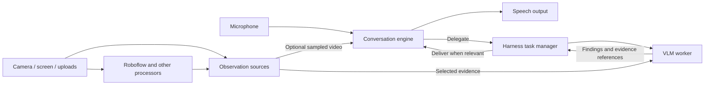

**Vision API and live conversation integration — implementation plan**

Status: phases A–D implemented locally. Native STS integration (E) remains deferred. Nothing has been pushed. The sections below retain the approved design; verification status and remaining limits are recorded at the end.

**1. Architectural decisions**

Keep `llm-fast` and its existing selection policy unchanged. Add `vlm` as an alias in the LLM router for image-capable reasoning models. A VLM alias selects a model; a vision skill defines the work that model performs.

Separate three concerns: the conversation engine, the source of visual evidence, and the execution of visual reasoning. Cascaded voice agents normally delegate visual interpretation. Native multimodal speech-to-speech engines may also receive video directly and delegate heavier analysis when useful.

| Concern | Responsibility |
| --- | --- |
| Conversation engine | Own conversation, speech, interruption handling, and when findings are communicated |
| Observation source | Expose timestamped frames and associated processor results |
| Harness task manager | Schedule work, enforce limits, route skills, cancel obsolete work, and deliver results |
| Vision worker | Interpret selected evidence and return findings or a clarification question |
| Provider adapter | Translate content and session operations into a provider's supported protocol |

The GPT-Live reference supports keeping media delivery independent of delegated reasoning, preparing workers without delaying voice startup, and measuring time to useful results. Applying that separation to vision is our design decision, rather than a vision API specified by the article. Our cascaded engine remains a cascaded engine; this work does not reproduce GPT-Live's continuous inference architecture. [GPT-Live architecture](https://openai.com/index/continuous-voice-interaction-with-gpt-live/)



**2. Behavior across the three use cases**

| Use case | Default behavior | Evidence selection |
| --- | --- | --- |
| Conversational visual question | Conversation delegates to the vision skill and remains available for speech | Capture the relevant image when the task is accepted |
| Continuous Roboflow processing | Processor keeps observations at its own cadence; questions use state or invoke vision as needed | Associate detections with their source frames; choose images, crops, or a recent sequence according to the question |
| Native multimodal STS | STS owns the audio conversation and may receive sampled video directly; substantial analysis remains delegatable | Live sampling and delegated task selection operate independently |

Examples: a fresh detection count can answer “How many flowers are detected?” without another inference. “Does this flower look unhealthy?” needs visual interpretation. “What changed?” requires more than the latest image. A native STS model may handle an immediate visual exchange itself and ask the vision worker for a detailed comparison.

Continuous processing does not imply one VLM invocation per processed frame. Delegation keeps the conversation responsive, but a visual answer still depends on analysis finishing.

**3. Multimodal request contract**

Keep the internal ordered content-parts abstraction and the released text shorthand. Use the same image representation for user messages and image-bearing tool results. SDK convenience methods such as `images=[...]` lower into ordered parts; explicit parts preserve interleaving and multiple images.

Canonical wire content:

```json
{
  "role": "user",
  "content": [
    {"type": "text", "text": "Compare these images."},
    {"type": "image_url", "image_url": {"url": "data:image/jpeg;base64,..."}},
    {"type": "image_url", "image_url": {"url": "https://example.com/image.png"}}
  ]
}
```

This follows OpenRouter's image content shape. The SDK accepts bytes or a URL, optional media type, and supported provider options, following Vercel's useful separation between SDK objects and provider payloads. It does not require changing the router's existing response IDs, streaming events, or other Responses-style request options. [OpenRouter image inputs](https://openrouter.ai/docs/guides/overview/multimodal/image-understanding), [Vercel message parts](https://ai-sdk.dev/docs/reference/ai-sdk-core/model-message)

Provider-specific controls such as image detail are translated by adapters. Validate supported roles, content types, payload limits, and modality requirements before inference. Do not silently discard an image because a role or provider cannot represent it. Image limits are endpoint capabilities, rather than one provider's limit imposed on every request. Server-owned payload bounds still apply independently.

Preserve URL inputs where the selected provider supports them. If bytes must be resolved locally, fetch them in the worker with bounded resources and appropriate URL-fetch restrictions. Fetching and encoding never run on the audio or control-reader loop.

Define named OpenAPI schemas for parts, image sources, and relevant socket commands, even though OpenAPI does not model the complete WebSocket protocol. Regenerate Go, Python, and Swift types. Treat uncommitted `input_image` and `video.frames: per_turn` additions as draft contracts; preserve released text behavior and check publication status before deciding whether any image compatibility layer is necessary.

**4. Capabilities and model selection**

Keep provider-level `input_modalities` metadata, with text implicit for existing LLM configuration. Add an alias requirement:

```yaml
# New entry under llm.aliases; llm-fast is unchanged.
vlm:
  require_input_modalities: [image]
```

Choose the initial preferred provider from verified adapter support and image tests; do not assume every model offered through a Responses-compatible endpoint supports images. Reconcile configured capabilities with adapter support at startup and reject contradictory declarations.

Intersect alias requirements, actual request content, and endpoint capabilities before selection and every fallback. For an open socket, `vlm` establishes image requirements before its first request. More generally, session requirements must be declared before selection or selection must be deferred until content is available. A later image on a session established without that capability gets a clear error and must not be omitted or billed as a successful text-only answer.

Keep protocol capabilities separate from modality capabilities: image input, audio input/output, native live sessions, asynchronous tool execution, and result-delivery controls describe different things. The existing `realtime` routing flag describes suitability for latency-sensitive work; it must not be repurposed to mean native STS protocol support. Native video input is also distinct from sequences of image frames.

**5. Named subagents and skill configuration**

Cascaded-agent configuration:

```yaml
llm: llm-fast
subagents:
  default: llm-thinking
  vision: vlm
```

A vision skill adds `subagent: vision` to its definition. Its description tells the conversation model when visual analysis is useful; its instructions tell the worker to answer from supplied evidence, identify uncertainty, and request clarification when needed. Existing skills without a binding use `default`.

Preserve singular `subagent` as shorthand for `subagents.default`. Reject conflicting declarations at the same configuration layer. Session overrides merge named entries over stored configuration; an omitted entry preserves the stored value. Define explicit removal behavior in the schema rather than overloading omission. Validate unknown skill bindings before the session is used.

Carry these fields through folder loading, config sync, backend storage/migrations, session normalization, and SDK serialization. The existing Python subagents dictionary currently collapses to one target and the backend task manager owns one subagent session; both need to support the declared map.

Make delegation policy appropriate to each skill. The current generic prompt and complete-identifier guard must not prevent visual reasoning. Keep expensive frame-analysis tools with the worker; compact processor state may remain available to the conversation model.

**6. Observation sources and temporal correctness**

Introduce a small observation contract using the existing video processor/forwarder infrastructure. A producer exposes current or recent evidence; the harness resolves that evidence into task inputs. The producer may live in the Python video worker while inference runs in Go. Capture requests therefore need task-correlated replies across that boundary, including failure and cancellation.

| Observation field | Meaning |
| --- | --- |
| Source identity | Participant, camera/screen track, and processor where applicable |
| Frame ID | Stable identity within a source/session |
| Capture time | When the image was captured, with a documented clock domain |
| Image references | Raw image and any explicitly derived annotated image or crop |
| Processor result | Detections or other structured output, linked to its source frame |
| Processing time | When derived output became available; distinct from capture time |

Retain a bounded recent history. Each consumer has independent sampling and queue limits. On-demand analysis defaults to one recent frame; temporal questions request a bounded timestamped sequence. If the requested history is unavailable, report that limitation rather than using the latest frame as though it represented the past.

Freeze explicit attachments and pin selected frame references for the task lifetime. New camera frames can replace buffer entries but cannot replace an active task's evidence. Do not prune all historical images from generic messages or tool results.

For Roboflow, preserve source-frame correlation through asynchronous inference. Do not overlay the latest detection result onto an unrelated current frame and present that as aligned evidence. If the provider lacks reliable correlation, expose separate timestamps and avoid claiming exact alignment. Raw images remain available alongside annotations for inspection.

Select the participant/source explicitly for ambiguous multi-camera requests, or ask for clarification. Do not silently choose whichever processor happened to return first. Keep capture-frame time distinct from delayed transcript/task-arrival time when resolving “what I just showed you.”

**7. Delegation lifecycle and live-agent image submission**

A delegated task has a task ID, conversation premise/turn reference, skill and worker binding, immutable evidence selection, deadline, and completion state. Scheduling acknowledges acceptance before provider connection, URL retrieval, image encoding, or inference completes. The current synchronous provider-open call inside task creation must move off the speech-filter path.

Use the existing task lifecycle and events rather than adding a second job service. Prepare reusable worker sessions asynchronously after the voice path is available. Readiness failures surface as task failures; they do not stop an established audio session. Reuse stable context and provider caching where supported without assuming identical cache behavior across providers.

In a cascaded live agent, `agent.responses.create(text, images=...)` creates visual work with those attachments and the supplied question. It does not send image bytes into `llm-fast`. The conversation sees the question and pending-task context, then receives findings through the normal harness path. A direct `stream.LLM(target="vlm").responses.create(...)` remains a direct streaming inference request. An unsupported local plugin must reject image use clearly rather than ignore it.

Task results include findings or a clarification question, source frame IDs/capture times, and task identity. Treat findings and OCR text as observed data, not as new system instructions. Deliver them when relevant using the existing follow-up mechanism; avoid speaking over the current utterance by default.

Distinguish speech interruption from task cancellation. “Yes, keep looking” need not cancel useful work; “Never mind that flower” can. Explicitly superseded premises and session closure cancel work. New background observations may supersede older background jobs, while an explicit comparison remains pinned unless cancelled. Cancellation covers capture, fetch, provider startup, and generation; late completions cannot introduce obsolete findings.

Limits bound outstanding tasks, frame memory, transfers, and provider work. Slow consumers drop replaceable pending frames or receive a task-capacity error instead of growing an unbounded queue. Audio transport stays independent of media-analysis payloads, and control readers dispatch work without waiting for encoding or inference.

**8. Native speech-to-speech integration**

The conversation engine can be the existing cascade or a native live provider. Keep the native provider's audio protocol, speech activity, interruptions, and transcript events intact; do not route it through an extra STT/LLM/TTS sequence or make it depend on completed transcript turns.

Define an adapter boundary between the conversation engine and the shared task manager: submit work, acknowledge acceptance, deliver a result, cancel work, and report relevant conversation changes. The text engine translates its existing directives. Native STS uses provider tool calls and supported context/result messages; it does not parse directives from spoken transcripts.

Direct video exposure is an independent policy: disabled or sampled for a capable conversation engine. The source and representation are explicit. In the first cascaded milestone, direct exposure is disabled. Existing Python native video behavior is not silently changed. Native direct-video consumers and VLM jobs share evidence sources but have independent queues and sampling rates.

Result delivery requests semantic behavior such as use as context or speak when idle; adapters declare which behaviors they can honor. Google currently documents synchronous-only tools for Gemini 3.1 Flash Live and asynchronous tools for Gemini 2.5 Flash Live. A Python background coroutine does not change that provider behavior. A scheduling tool that immediately returns an accepted task ID, followed by separate context delivery, is a proposed fallback that requires provider validation. Do not report unsupported scheduling semantics as implemented. [Gemini Live tools](https://ai.google.dev/gemini-api/docs/live-api/tools)

The existing Python Realtime abstraction and Gemini video forwarding provide the initial integration surface. A new Go native-STS transport/provider implementation is a later milestone; image support in the LLM router alone does not provide it.

**9. Implementation sequence**

| Phase | Deliverable | Completion gate |
| --- | --- | --- |
| A: Request contract and routing | Typed image content, provider translations, vlm alias, consistent capabilities, fixed standalone example | Multi-image inference and capability rejection work through the socket and SDK |
| B: Delegation foundation | Named worker bindings, persisted config, asynchronous task startup, conversation adapter boundary | Slow worker startup cannot delay speech deltas or control processing |
| C: Observations | Source/frame correlation, bounded history, task-scoped capture across Python/Go, pinned evidence | Delayed predictions and camera changes cannot alter task evidence |
| D: Cascaded integration | Vision skill, attachment delegation, Roboflow question flow, relevant-result delivery | On-demand visual conversation works end to end while the user can interrupt or continue speaking |
| E: Native STS integration | Existing Python Realtime/Gemini adapter, optional direct video, validated task/result semantics | Native audio continues while supported delegated work runs; unsupported provider modes are explicit |

For the first implementation milestone, complete A–D and keep the adapter contract suitable for E. Review E's provider behavior before expanding it into a Go native-STS backend. Continuous/event-triggered VLM observation and native video-file inputs remain later extensions, using the same task and evidence contracts.

Replace the draft per-turn frame attachment mechanism rather than repairing it into the default live architecture. Fix the new responses facade across supported implementations, and remove universal registration of an image-returning tool where the provider cannot serialize its result. Retain useful content/provider work from the local draft without refactoring unrelated voice behavior.

**10. Examples and verification**

| Scenario | Required result |
| --- | --- |
| Standalone describe_image | Targets vlm and describes explicit image input |
| Two-image comparison | Both images reach inference in order, including across tool rounds |
| Ordinary text request | Existing llm-fast selection and public text behavior remain intact |
| Vision failover | Every attempted candidate accepts required input; no placeholder-only success |
| Slow capture, fetch, or provider startup | Speech streaming and control processing continue |
| Camera changes after a request | The accepted task retains its selected evidence |
| Delayed Roboflow prediction | Detections remain associated with the correct frame |
| Historical question | Relevant retained frames are used or missing history is reported |
| Multiple participants/tracks | Evidence belongs to the intended source |
| Interruption and cancellation | Useful work can continue; explicitly obsolete work cannot speak later |
| YAML/config/session round trip | Named workers and skill bindings retain their intended values and override behavior |
| Native STS with video and delegated work | Provider-specific result delivery is verified without adding a cascaded speech pipeline |
| Long call and slow consumers | Memory and queues remain bounded; pinned data is released on task settlement |

Use behavior tests with real in-process servers and the project's existing test providers; no method-call assertions or mocks. Exercise the Python/Go boundary, not just independent serializers. Add opt-in live provider tests for image understanding, image-bearing tool results, and native STS task delivery. Regenerate all affected SDKs and run relevant format/type/build checks.

Measure voice responsiveness separately from capture age, queue time, provider startup, vision inference time, time to a useful finding, and time until that finding is communicated. Compare voice latency with and without a deliberately slow vision worker under the same load. Reuse existing task/cost events with worker identity rather than creating a separate observability subsystem.

**11. Local implementation and verification**

The implementation provides on-demand delegated vision for cascaded agents, a separate `vlm` alias, named worker bindings, bounded observations, task-scoped capture and attachment delegation. Go, Python, Swift and dashboard schemas have been regenerated. The standalone image and Roboflow examples use these contracts. Existing Python native STS behavior remains; the shared native-STS task/result adapter is deferred to E.

Local validation covers Python behavior and type checking, Go worker/session/router tests with the race detector, Go SDK tests, and 41 Swift tests, including four tool-ownership regression cases. Live OpenAI inference understood two images in order, so `vlm` initially prefers `openai/gpt-5.6-luna`. Gemini returned HTTP 429 and remains unverified live. Broader API race testing exposed an existing concurrent WebSocket write in `dispatchws.go`, outside this change.

The migration applied successfully to local Postgres during the September 10 router restart; rollback has not been exercised. Router/dashboard builds and installation on the physical iPhone succeeded. The phone reached the router through the Mac's LAN address after its VPN DNS failed to resolve ngrok. All test services were subsequently stopped.

The live test exposed a Swift observer answering a Python-owned `get_video_frames` request with an unknown-tool error. The client now answers only its own tools; a real WebSocket regression reproduces the old failure and passes with the fix. Roboflow also reported upstream connectivity errors. The complete camera-to-spoken-answer flow still needs an iPhone retest after the ownership fix. Tests establish nonblocking task startup and capture behavior, but do not constitute production latency measurements.

Review fixes retain direct VLM attachments across conversation turns and normalize omitted video frame counts to one. Regression tests cover image ordering, repeated prompts, discarded/replaced history, and schema-valid frame-count defaults. Local testing addresses and diagnostic prints have been removed from the iPhone example.

Observation timestamps are local receive times in Unix milliseconds, not camera hardware timestamps; the backend and video worker need synchronized system clocks. Roboflow currently lacks reliable prediction/frame correlation, so its results carry separate timestamps and explicitly report unavailable alignment. Buffers retain up to 64 frames and 32 MiB per observation buffer; tasks select 1–8 frames no later than acceptance time and reject evidence whose newest frame is older than five seconds. Continuous VLM invocation and native video-file input remain future work.
