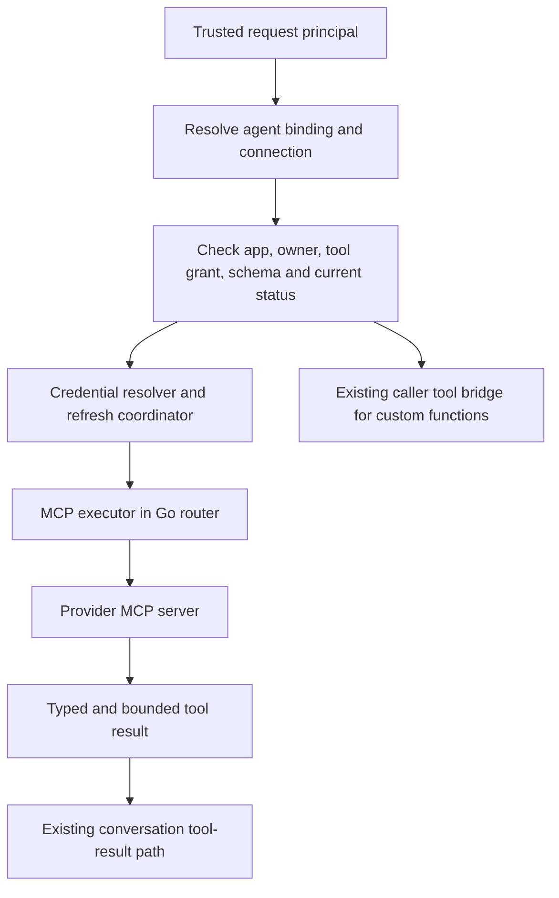

# Connector support for Accelerate

Research, API proposal, and implementation status · 25 September 2026

Base: `origin/accelerate`, commit `89d1193e69e182be8c68850713c96d82aa77be53` (fetched 25 September 2026).
Implementation branch: `codex/connector-support`. Upstream advanced during development; see the [handover](connector-handover.md) for current validation and remaining integration work.

## Recommendation

Evolve Accelerate’s existing plugin implementation into a connector system with three public concepts:

1. **Connector** describes a service and how to reach/authenticate to it.
2. **Connection** represents one authorized account or service instance, independently of agents.
3. **Agent binding** selects a connection, or requires one at session creation, and explicitly grants tools.

Keep credentials private to the backend and resolve them for each invocation. Use remote MCP as the first execution transport and the existing `agent.ToolRunner` boundary to run it. Keep the registry, connection management, credential storage, and execution in the existing Go service initially. These are responsibilities, not a requirement for four new services.

The first useful release should support custom remote MCP plus a small verified catalog, anonymous/bearer/API-key/OAuth authentication, app and user connections, exact tool allowlists, refresh during calls, and explicit failure events. Reuse the existing custom-function bridge for customer APIs. Add native provider adapters only when a concrete workflow cannot be served well through MCP.

The [Eve source study](eve-connectors-research.md) reinforces this separation and adds concrete guidance on account-instance identity, backend-supplied tool arguments, and replaceable authorization providers. Its OpenAPI execution and search-based tool discovery are candidates for later expansion.

Do not ship the five existing catalog entries as five verified integrations. Several definitions do not match the providers’ documented authentication or capabilities.

This proposal treats a connector as **live access to tools**. Background CRM synchronization, document ingestion, triggers, and search indexes are separate products, even when they reuse the same connection. An MCP endpoint does not automatically supply those features.

## What was checked

The supplied report is a useful starting hypothesis. I read its proposed separation of definitions, connections, credentials, and execution; inspected the local Go runtime, OpenAPI, authentication, storage, and SDK integration; and checked current first-party provider/protocol documentation and public SDK source. Vendor behavior below is documented behavior, not a claim about undisclosed internal implementations.

The initial design review did not authorize provider accounts or start live provider calls. On 25 September 2026, the user subsequently authorized a read-only Linear connection and an explicit `list_teams` grant for the local example agent. The live Volt flow completed discovery, browser handoff, consent, encrypted credential storage, tool discovery, grant selection, and an agent tool call; the agent reported 48 teams. Refresh, reconnect, disconnect, and the other six providers still need live interoperability checks. External documentation was checked on 25 September 2026 and may change.

The first local connect attempt failed before reaching any provider because the router had no credential encryption key or public OAuth URL. The local test now uses a persistent private key and a temporary HTTPS relay restricted to OAuth launch, callback, and client metadata paths; management APIs remain local. Volt now explains missing encryption, callback, and OAuth client setup instead of showing a generic HTTP 400. Slack now completes live user OAuth and discovers messaging tools with exactly channels:read, users:read, im:write, and chat:write. Its user-specific authorization endpoint requires the scope parameter; sending user_scope produced a live No scopes requested error and has been corrected with regression coverage. The user approved granting simple_voice_ai only slack_send_message. A dedicated Playground test session sent one approved self-DM and was ended. Slack visibly confirmed delivery, but the agent included the adjacent approval sentence from the test prompt; exact-text fidelity was not established and future tests must delimit the message payload clearly. Channel sending was skipped at the user’s request; refresh and revoke remain untested. The text Playground also needed explicit voice/text detection because the router stores text sessions in its call history; that fix prevents empty-call joins, voice-event errors, and hidden text replies. Reply reconciliation removes duplicate live/persisted messages, and closed sessions no longer block navigation.

## Authentication implementation status

Authentication and agent permissions are separate gates. A backend creates a reusable connection, assigns its owner, and runs OAuth consent. Each agent config then binds an alias to an app-owned fixed connection or to a user-owned connection selected for the session, and grants exact MCP tool names pinned to a digest of each reviewed name, description, and input schema. At session start, the router checks tenant, provider, status, verified user ownership, and the explicit tool grant before exposing tools. A schema change under the same tool name is withheld until an administrator reviews and re-enables it. A session cannot replace a fixed account by supplying a different connection ID.

OAuth uses authorization code with PKCE S256. Discovery tries RFC 8414 metadata and then OIDC discovery; when metadata advertises CIMD, the router uses its public metadata URL as the client ID, with DCR as the compatibility fallback. The router validates the discovered issuer and requires an exact callback `iss` match when advertised. Slack uses an operator-registered confidential client, `client_secret_post`, the documented `https://mcp.slack.com` resource identity, and a caller-selected minimum scope set. Calendly, Cal.com, and Linear use discovered or provider-specific client registration; GitHub defaults to discovery and registration while accepting an optional operator-configured public client ID. Calendly's first-party documentation publishes its resource, issuer, DCR endpoint, public-client method, and scopes, while Cal.com still needs a live registration and refresh round trip. Salesforce uses an operator-registered External Client App, requests `mcp_api` and `refresh_token`, and uses PKCE; its client secret is optional when PKCE is enabled. The provider grant represents the individual Salesforce user who consents, even when Accelerate shares that connection as app-owned. Gong supports its administrator-approved automatic registration flow or its manual integration flow with customer-provided credentials. Gong's MCP-specific documentation publishes the manual token URL but not its token-endpoint client-auth method; the catalog currently uses HTTP Basic based on Gong's general OAuth guidance, so that method needs live validation against an MCP integration. Customer-provided secrets and callback verifier state are encrypted. The callback state is stored as a hash for lookup, expires after ten minutes, and is consumed once. Because the dashboard and router may have different origins, consent starts at a router-hosted launch page: Volt opens it in a popup and transfers the short-lived handoff token with origin-checked `postMessage`; the router then sets the HttpOnly callback cookie on its own origin before sending the browser to the provider. The handoff token never appears in a URL. Access and refresh tokens are kept in an AES-GCM envelope bound to the tenant, connection ID, and credential revision. API keys, connector grants, and pending authorization attempts carry persisted KEK versions; successful API-key or connector use lazily rewraps durable credentials to the current version. Routers accept `ROUTER_AUTH_KEK` as a version-1 compatibility alias or an explicit versioned keyring.

The MCP HTTP transport resolves the bearer token from the connection for each outbound request. It checks connection status at that point and coordinates refresh-token rotation under a database advisory lock. Before sending a refresh token, it durably checkpoints reconnect-required status. Success persists the rotated grant and restores connected status; a lost response or canceled worker leaves reconnect required instead of replaying a potentially consumed token. An `invalid_grant` response marks the grant as requiring reauthorization; a transient refresh failure may use a still-valid access token, while an expired token is not dispatched. Disconnect removes the encrypted grant and blocks later dispatches. The agent's tool allowlist remains narrower than provider scopes; provider scopes are not a substitute for per-agent grants.

The current branch implements the seven named provider catalog entries, tenant-owned custom MCP definitions, OAuth, anonymous, bearer, and API-key connection credentials, and a backend-only OAuth grant import. Imports take no token, token-endpoint, resource, or OAuth issuer URL from the caller: client authentication comes from operator configuration, a fixed provider policy, or validated provider metadata, and the complete grant is encrypted. OAuth discovery checks RFC 8414 and OIDC metadata, validates PKCE and issuer identity, and prefers a Client ID Metadata Document (CIMD) when the authorization server advertises support. The router serves its static public client document at `/.well-known/oauth-client-metadata`; dynamic client registration (DCR) remains the compatibility fallback. The callback validates the `iss` response parameter when advertised and rejects any supplied issuer that differs from the stored issuer. DCR negotiates public or client-secret authentication from advertised methods. OAuth state is one-use and time-limited, and cross-origin dashboard consent uses a router-hosted launch popup with an origin-checked handoff before the router sets its callback cookie. Persisted credentials and attempts carry KEK versions; successful use lazily rewrites API keys and connector grants under the current key while retaining the grant revision. Tool grants now include a SHA-256 digest over the exact MCP name, description, and input schema; session startup withholds a missing or changed tool, logs the unavailable optional grant, or fails a required connector. MCP responses are capped at 4 MiB, OAuth responses at 1 MiB, and tool results sent to the model at 32 KiB with an explicit truncation marker. OAuth token responses populate stable account IDs for Slack, Calendly, and Salesforce when those responses supply them. Reauthorization preserves an existing stable account ID only when the callback returns the same identity; a different or missing identity leaves the connected grant intact and directs the user to create a separate connection. Fake-provider database tests cover this persistence and account-switch rejection; identity mapping still needs verification against live provider responses. The Go, JavaScript, Swift, and Python session clients carry explicit account selections, and Volt's sibling worktree has app-account setup, OAuth/static credential forms, exact per-agent grants, and an explicit review state for changed tool contracts. A database-backed session acceptance test resolves separate user-owned credentials for Alice and Bob, confirms each authenticated owner can select their own connection, and rejects cross-user, anonymous, and guest selections. A database-backed API test confirms only a backend acting for the verified user can create that user's connection; it cannot choose another user's owner ID. Volt currently manages app-owned accounts; it does not yet offer user-account consent and selection in its UI. Provider-side revocation and live provider interoperability testing remain open. Calendly's first-party docs publish its protected-resource and authorization-server metadata, public-client DCR method, and scopes; the live registration, consent, tool, refresh, and disconnect round trip remains untested. Cal.com docs confirm the hosted `https://mcp.cal.com/mcp` endpoint and OAuth 2.1, but not its live server's registration metadata or scopes.

On startup, the router applies the new connection schema, transfers connected Slack, Calendly, Cal.com, and Salesforce accounts into encrypted app-owned connections, verifies that each encrypted grant can be opened, and then removes the old plaintext connection table and `agent_configs.plugins` column. The import is idempotent: it keeps each source row's connection ID, uses conflict checks rather than overwriting an existing connection, and adds a fixed binding only when the former config selected that connector. Every imported connection requires reauthorization because the previous OAuth flow did not retain enough trusted metadata or provider identity to use the grant safely. Its preserved token is encrypted, and its binding has no tools granted. The import therefore requires `ROUTER_AUTH_KEK` when connected supported accounts exist and stops startup before the removal migration if encryption or binding transfer fails. Shopify, inactive logins, and providers outside the new catalog are omitted; Gong, Linear, and GitHub were not in the old catalog. The [router README](../README.md) documents the rollout behavior.

Database-backed session acceptance now exercises two user-owned accounts for the same provider through real local MCP peers: each alias reaches its selected account with that account's bearer token, disconnect blocks a later call through the still-open runtime, and the remaining account stays available without fallback. Optional connectors that cannot start are omitted and reported as replayable `connector_unavailable` session events with a safe reason code; separate session acceptance verifies required connectors fail when reauthorization is needed.

Forks that continue the current config now reload its connector bindings before creating the new session. Stored sessions keep only the non-secret alias and connection ID references needed to re-resolve account selections. Existing selections survive only when the current config still declares that alias as session-selected; startup then rechecks the verified caller, owner, provider, connection status, and reviewed tool schemas. A database-backed API test covers stored selections, refreshed grants, and removal of selections whose aliases no longer qualify. A fork targeting a different config starts from that config's current bindings.

## Findings in the existing branch

Accelerate already has the basic connector path. The work is to replace its account and permission model and complete interoperability, rather than add MCP from scratch.

| Existing component | Observed behavior | Consequence for the design |
|---|---|---|
| [Catalog](../internal/mcp/catalog.go), [definitions](../internal/mcp/connectors.yaml) | The former catalog had Slack, Calendly, Cal.com, Shopify, and Salesforce. The connector catalog keeps four, retires Shopify, and adds Gong, Linear, and GitHub. | Represent actual auth methods and verify each provider. |
| [Connector API](../internal/api/connectors.go) | Lists definitions, starts OAuth against reusable account connections, and separates account linking from per-agent tool grants. | Connecting an account does not grant an agent access. |
| [Migration](../migrations/20260901180000_agent_plugins.sql), [model](../internal/store/models.go) | One live connection per `(config_id, plugin_id)`. Tokens and OAuth attempt fields share the row. | Cannot naturally share a login or attach two accounts of one provider. Separate OAuth attempts, connections, and credentials. |
| [Connection store](../internal/store/connectors.go) | The previous table stored access and refresh tokens in plaintext columns. | Current credentials use authenticated encryption bound to tenant, connection, and revision. |
| [OAuth client](../internal/mcp/oauth.go) | PKCE, random state, metadata discovery, DCR or configured client credentials, exchange, refresh. | Provider-specific metadata and client-auth behavior still need interoperability verification. |
| [Session attachment](../internal/session/connector_tools.go) | Resolves explicitly selected account bindings and current tool grants. | Account selection and reviewed capabilities are enforced at session startup and dispatch. |
| [MCP runtime](../internal/mcp/mcp.go) | Official SDK discovery, paginated tools, prefixed names, credential resolution per request. | Provider behavior and long-lived connections still need interoperability testing. |
| [Session manager](../internal/session/manager.go) | Wraps connector calls in `connectorToolRunner` alongside the caller tool bridge. | Keeps connector execution within the conversation runtime. |
| [Tool bridge](../internal/session/tools.go) | Caller-executed tools have deadlines and cancellation events. MCP tools bypass this bridge. | `tool_timeout_ms` cannot be assumed to bound MCP calls today. |
| [Authentication](../internal/auth/auth.go), [session creation](../internal/api/sessions.go) | Trusted principal has app, user, caller kind, and server-side status. `Spec.Caller` identifies the requesting user. | Reuse these identities. Do not introduce a body field that lets a browser select its own credential owner. |
| [Session spec](../internal/session/spec.go) | `Spec.UserID` is the agent’s call identity, distinct from `Spec.Caller.UserID`. | Personal connectors must use the latter. Phone numbers and participant names are not proof of account ownership. |
| [Background task manager](../internal/harness/manager.go) | Delegated task tools currently expose sandbox code execution only. | Adding connectors to the conversational agent does not automatically grant them to delegated tasks. |
| [Folder settings](../../plugins/stream/vision_agents/plugins/stream/folder.py), [Accelerated wrapper](../../plugins/stream/vision_agents/plugins/stream/accelerated.py) | Folder config has `plugins: list[str]`; the Python wrapper opens backend sessions. | Add references and session bindings through the existing configuration/session APIs, not a second Python credential store. |

Specific correctness gaps in the prototype:

- `StartAuthorize` reads or receives a client secret and explicitly discards it. Exchange and refresh only implement public-client authentication. Slack is a documented counterexample.
- Discovery constructs an origin-level protected-resource URL and one authorization-server metadata URL. It does not implement the full challenge/path discovery process. Requested scopes, issuer binding, and the resource identity are not retained as a complete grant record; exchange omits `resource`.
- OAuth state has no explicit expiration or atomic consumption. A new authorization attempt replaces the existing connection row, including its working tokens. Reauthorization should leave the old grant usable until the new grant succeeds.
- Refresh has no cross-router serialization/version check. On failure, session attachment logs a warning and proceeds with the previous token. Disconnect clears storage but does not invalidate a token already captured by a running MCP client.
- Remote discovery offers every listed tool. There is no explicit per-tool execution policy or required-connector startup policy.
- The MCP client buffers the whole body with `io.ReadAll`; SSE handling selects the last `data:` line rather than processing a protocol stream by request ID. It does not retain negotiated capabilities or legacy HTTP session headers. Results are primarily flattened into text, and a non-text-only `isError` result can take the raw-result success path.
- The HTTP calls use the default client unless supplied otherwise. There is no MCP-specific deadline/response-size limit in this code. Connections open sequentially during session creation.
- Existing tests cover a small local HTTP happy path, an unreachable server, discovery/DCR, and code exchange. They do not establish compatibility with the catalog providers.

There is an existing [AES-GCM sealer](../internal/auth/secret.go) for API secrets. It is useful implementation precedent, not evidence that plugin tokens are already encrypted. A connector credential envelope should also bind ciphertext to its tenant, credential ID, and revision, and support key rotation.

**Volt is a sibling repository**, not `dashboard/` inside this checkout. Its connector UI is being developed in an isolated Volt worktree. It currently connects app-owned accounts and grants exact tools to an agent; it does not yet create user-owned connections or select them when opening a session.

## What the comparison establishes

| Surface | Public contract checked | Lesson for Accelerate |
|---|---|---|
| Anthropic Managed Agents | Agent MCP definitions and session vault references are separate; credentials can be refreshed and rotated. | Reusable agent definitions should not own grants. |
| OpenAI Responses | Remote MCP or private tunnel; application supplies authorization on each request. Legacy connector IDs have a model-specific deprecation policy. | Model-provider MCP support is not a replacement for our connection lifecycle. |
| OpenAI Agents API | Vaults supply reusable credentials; service-origin and environment-origin MCP have different authentication behavior. | Keep network execution location and credential availability explicit. |
| ChatGPT plugin authentication | ChatGPT acts as the OAuth client during account linking. | A product’s “Connect” flow and its underlying model API have different responsibilities. |
| Retell native integrations | Connect accounts at workspace scope and bind tools to a particular account. | Account reuse and multiple accounts matter even for voice-first products. |
| Retell remote MCP | Remote tool discovery/calling, with auth supplied through headers/query parameters. | A minimal transport feature is useful, but leaves OAuth lifecycle work to customers. |
| Eve and Vercel Connect | Eve executes MCP/OpenAPI tools and orchestrates authorization; optional Connect manages provider grants. Dynamic accounts, supplied arguments, and discovery have source-visible implementations. | Separate authorization provider from execution; bind callbacks to account instances; retain backend authority over tenant arguments. |

### Anthropic: use the separation, not implicit identity guarantees

Managed Agents’ vaults have write-only secrets and support `mcp_oauth`, `static_bearer`, and environment credentials. OAuth grants can include refresh metadata. Vault IDs are attached to sessions; credentials are matched to MCP URLs. The documentation also says vaults are workspace-scoped: an API key with workspace access can reference them. An `external_user_id` metadata label is therefore not an application authorization boundary. Multiple matching vaults use ordering, which we should avoid for account selection. [Anthropic vault documentation](https://platform.claude.com/docs/en/managed-agents/vaults)

MCP connection/authentication failures are reported as session errors rather than necessarily refusing session creation. Tool permissions are configured separately from connectivity. Accelerate should make optional versus required dependencies explicit. [Managed Agents MCP connector](https://platform.claude.com/docs/en/managed-agents/mcp-connector)

The starting report blends Claude’s interactive product with Managed Agents. Do not infer that a vault implements initial user consent. Also do not generalize region, vault storage, or compliance claims from a product-specific deployment to all Claude surfaces.

### OpenAI: distinguish three contracts

**Responses:** `server_url`, `tunnel_id`, and legacy `connector_id` are alternative ways to supply MCP-style tools. Applications handle OAuth and send `authorization` on every request; that value is not retained in the response. The documented cutoff is precise: connector IDs are deprecated for models released after 1 September 2026, while existing models retain support. This is not a universal removal of connectors. [Responses MCP guide](https://developers.openai.com/api/docs/guides/tools-connectors-mcp)

**Agents API:** the vault API is real and documented. Applications handle initial authorization/consent and can store refresh metadata. Secret values are not returned. Sandbox environment secrets can use placeholders replaced at an approved network boundary. Deleting a vault credential does not itself revoke its provider token or stop an already-running session. [OpenAI vaults](https://developers.openai.com/api/docs/guides/agents-api/tools/vaults)

Vault authentication for MCP is documented for service-origin connections. Environment-origin HTTP uses inline authentication or a trusted proxy; stdio has separate environment handling. `allowed_tools` and `required` express capability and startup choices. [Agents API MCP connections](https://developers.openai.com/api/docs/guides/agents-api/tools/mcp)

**ChatGPT:** product linking performs authorization-code plus PKCE and supports discovery/client-registration mechanisms. That is a different lifecycle from supplying a token to Responses. [Plugin authentication](https://developers.openai.com/plugins/build/auth)

Secure MCP Tunnel is documented: an outbound client polls, forwards to a private server, and returns results. This makes private networking a deployment capability, independent of the provider account grant. It is not required for Accelerate’s initial public remote-MCP release. [Secure MCP Tunnel](https://developers.openai.com/api/docs/guides/secure-mcp-tunnels)

### Retell: managed integrations and MCP are separate features

Retell says its integration tools handle the provider API and authentication. That establishes a managed integration contract; it does **not** prove whether its internal implementation uses direct REST, MCP, or a mixture. The supplied report’s “native API adapters” characterization is a reasonable inference, not verified internal architecture. [Integration tools](https://docs.retellai.com/build/single-multi-prompt/integration-tools)

Its integration guide documents workspace reuse, multiple accounts, and individual tools bound to particular connections. Knowledge sync and contact sync are separate features. It also documents per-tool timeouts and continuation after failure, useful voice-product precedents. The specific encryption/storage implementation claimed in the supplied report was not established by the pages checked. [Integrations overview](https://docs.retellai.com/integrations/overview)

Remote MCP uses Streamable HTTP and exposes selected tools. Its separate MCP-node documentation explicitly says it does not run interactive OAuth; applications obtain access tokens and pass them, potentially through per-call dynamic variables. [Remote MCP tools](https://docs.retellai.com/build/single-multi-prompt/mcp), [MCP authentication](https://docs.retellai.com/build/conversation-flow/mcp-node)

The public Python SDK confirms `Mcp` fields including `name`, `url`, `headers`, `query_params`, and `timeout_ms`. The latter is documented as a connection-establishment timeout, not a guarantee about tool execution time. This is configuration evidence, not evidence of a managed refresh service. [Retell SDK source](https://raw.githubusercontent.com/RetellAI/retell-python-sdk/main/src/retell/types/llm_create_params.py)

### Eve: execution framework plus optional authorization service

Eve's connection definitions combine a remote MCP or OpenAPI endpoint with auth, filters, and approval hooks. They can be resolved from authenticated session context. Managed account authorization comes from Vercel Connect, while custom token and interactive-auth providers are also supported. This is a useful implementation reference, not evidence that the framework alone supplies a hosted credential vault. [Eve connection contract](https://github.com/vercel/eve/blob/15ad358c7b1f470eb3c9b36a53bf9140eb4f3191/docs/connections/overview.mdx)

The [detailed Eve study](eve-connectors-research.md) covers the inspected runtime, identity/cache boundaries, installation selection, token rejection and revocation, durable consent, supplied arguments, OpenAPI execution, and the resulting API amendments. It is pinned to public commit `15ad358c7b1f470eb3c9b36a53bf9140eb4f3191`; no Eve application or Connect provider flow was run.

### MCP itself has moved since the prototype

The `2026-07-28` transport revision removes protocol-level sessions and the separate GET stream, and changes request metadata and interactions. Older `2025-*` servers still need their version-appropriate lifecycle. Do not “fix” the client by adding legacy session handling and call that support for current MCP. [Versioned transport specification](https://modelcontextprotocol.io/specification/2026-07-28/basic/transports/streamable-http)

The official Go SDK documents discovery through `server/discover` and fallback to legacy initialization. Prefer adopting a reviewed, pinned release behind our runner boundary rather than extending the handwritten transport. Its current main-branch documentation is not a tested dependency pin for this repository. [Official Go SDK protocol documentation](https://github.com/modelcontextprotocol/go-sdk/blob/main/docs/protocol.md)

The current authorization specification supports metadata-based discovery, resource-bound tokens, PKCE, and multiple client registration choices. The MCP project's July 2026 update formally deprecates DCR in favor of CIMD while retaining DCR for compatibility; provider behavior will take time to converge, so keep a tested protocol/auth matrix rather than assuming servers have migrated. [Versioned authorization specification](https://modelcontextprotocol.io/specification/2026-07-28/basic/authorization), [MCP authorization update](https://blog.modelcontextprotocol.io/posts/2026-07-28/)

## Audit of the existing catalog

| Entry | First-party evidence | Decision |
|---|---|---|
| Slack | The configured `https://mcp.slack.com/mcp` endpoint is documented. Slack requires confidential OAuth with a client ID/secret and restricts which app types may use MCP. [Slack docs](https://docs.slack.dev/ai/slack-mcp-server/) | The operator-managed confidential flow is implemented with a caller-selected minimum scope set. Provider live approval and token-refresh behavior still need validation. |
| Calendly | `https://mcp.calendly.com` is documented. Its current MCP guide requires DCR and PKCE; console-issued static OAuth credentials and PATs are not supported for this endpoint. [Calendly docs](https://developer.calendly.com/docs/mcp/calendly-mcp-server) | A good discovery/DCR pilot. Do not advertise a generic “paste API key” alternative. |
| Linear | Hosted Streamable HTTP endpoint is `https://mcp.linear.app/mcp`; OAuth 2.1 uses DCR, with a read-only route and read-only `read` scope option. [Linear MCP docs](https://linear.app/docs/mcp) | DCR is catalogued with read/write scopes. Prefer the `/readonly` endpoint or read-only scope for agents that should not mutate workspace data; validate refresh behavior. |
| GitHub | Hosted endpoint is `https://api.githubcopilot.com/mcp/`. GitHub documents OAuth 2.1 + PKCE, and its CLI accepts an optional static OAuth client ID, which skips the default dynamic registration path. [GitHub remote MCP docs](https://docs.github.com/en/copilot/how-tos/provide-context/use-mcp-in-your-ide/extend-copilot-chat-with-mcp), [GitHub MCP GA notes](https://github.blog/changelog/2025-09-04-remote-github-mcp-server-is-now-generally-available/) | Use discovered authorization metadata and DCR by default, with an optional operator-configured public client ID. Do not send guessed `repo` or `read:user` scopes; validate registration, consented permissions, and tool-level permissions against a test account. |
| Gong | Hosted endpoint is `https://mcp.gong.io/mcp`. An admin registers the connector as either manual (client ID/secret) or automatic, then selects personal or shared authorization context. Automatic registration permits a matching client to register against an approved redirect URI; the MCP-specific guide documents token URL `https://app.gong.io/oauth2/generate-mcp-token`, but does not state that endpoint's client-auth method. The catalog uses HTTP Basic by inference from Gong's general OAuth guide; verify that method for MCP before launch. Personal access follows the connected user's Gong permissions, while shared access grants organization-wide visibility. The server is read-only and requires a paid seat/credits. [Gong integration docs](https://help.gong.io/docs/create-an-integration-to-connect-to-the-mcp-server), [Gong MCP overview](https://help.gong.io/docs/about-gong-mcp-server), [Gong Agentforce MCP setup](https://help.gong.io/docs/connect-salesforce-agentforce-to-the-gong-mcp-server), [Gong OAuth details](https://help.gong.io/docs/create-an-app-for-gong) | Support automatic DCR and manual client credentials, recommend personal access for user-owned connections, and verify both registration modes against a live Gong integration before launch. |
| Salesforce | Hosted MCP endpoints distinguish production and sandbox. Salesforce requires an External Client App (not a Connected App), authorization code with PKCE, and the `mcp_api` scope; its hosted server executes with the consenting Salesforce user's permissions. [Salesforce MCP client setup](https://developer.salesforce.com/docs/platform/hosted-mcp-servers/guide/postman.html), [Salesforce hosted MCP security](https://developer.salesforce.com/blogs/2026/06/how-to-secure-salesforce-hosted-mcp-servers) | Use the operator-registered External Client App ID and require the admin to register the router callback. PKCE permits omitting the client secret. The current catalog requests `mcp_api` and `refresh_token`, uses the documented production/sandbox OAuth endpoints, and grants no Salesforce authority beyond the consenting user's provider permissions; validate consent and a safe tool round trip with a test org before claiming production support. |
| Cal.com | First-party [MCP docs](https://cal.com/docs/mcp-server) document the hosted `https://mcp.cal.com/mcp` endpoint and OAuth 2.1; the [official MCP repository](https://github.com/calcom/cal-mcp) documents the separate self-hosted API-key/stdio mode. Hosted authorization-server metadata, DCR, and supported scopes are not specified by those docs. | Keep the hosted entry with no guessed scopes. Validate its advertised registration method and a live OAuth/tool round trip before production support. |

“Supported” should mean we have exercised account linking, discovery, at least one safe tool, refresh/expiry, and disconnect for the advertised capability. A catalog URL or a successful `tools/list` alone is insufficient.

### Provider identity and revocation are separate capabilities

MCP does not standardize either operation. First-party APIs provide possible identity and revocation paths for several catalog entries: Slack documents `auth.test` for workspace/user identity and `auth.revoke` for a token; Calendly documents `GET /users/me` and `/oauth/revoke`; Linear documents the GraphQL `viewer` query and `/oauth/revoke`; GitHub documents `GET /user` plus OAuth app token/grant deletion; Salesforce documents the hosted MCP `getUserInfo` tool and the OAuth revoke endpoint. [Slack identity](https://docs.slack.dev/reference/methods/auth.test), [Slack revoke](https://docs.slack.dev/reference/methods/auth.revoke), [Calendly current user](https://developer.calendly.com/api-docs/calendly-api/users/get-user), [Calendly revoke](https://developer.calendly.com/api-docs/calendly-o-auth/o-auth/post-oauth-revoke), [Linear viewer](https://linear.app/developers/graphql), [Linear OAuth revoke](https://linear.app/developers/oauth-2-0-authentication), [GitHub current user](https://docs.github.com/en/rest/users/users), [GitHub OAuth revoke](https://docs.github.com/en/rest/apps/oauth-applications), [Salesforce MCP identity](https://developer.salesforce.com/docs/platform/hosted-mcp-servers/guide/postman-testing.html), [Salesforce OAuth revoke](https://developer.salesforce.com/docs/platform/mobile-sdk/guide/oauth-revoking-tokens.html).

Identity is currently populated only when the OAuth token response itself supplies a stable identifier: Slack's workspace/member IDs, Calendly's owner/organization resource IDs, or Salesforce's organization/user IDs from its identity URL. We do not make extra profile requests with MCP-audience tokens or infer identity from an email or display label. Other providers, custom connectors, and imported grants can have an empty `account_id`, which means identity is unknown.

Provider revocation is not implemented. Local deletion blocks future dispatch and erases Accelerate's stored credential; it does not revoke a token already issued by a provider. Gong's reviewed MCP docs describe disconnecting a connection in its admin UI, while the Cal.com MCP docs reviewed do not specify a profile or revoke endpoint. [Gong MCP connection management](https://help.gong.io/docs/manage-mcp-client-connections), [Cal.com MCP server](https://cal.com/docs/mcp-server). Do not infer provider-side revocation from local disconnect. The provider APIs above vary by scopes, audience, registration type, and client authentication, so any remote revoke path needs an explicitly approved token-egress policy and provider-specific contract tests before implementation.

## Proposed object model

All shapes and endpoints from this point onward are **proposed Accelerate APIs**, not existing functionality or copied vendor APIs.

Use “connector” for this product surface. The existing `internal/plugins` package is its prototype; Python provider packages under `plugins/` and portable skill/plugin bundles are different concepts. A future bundle can reference connector definitions, but must not carry a connected account or grant itself permissions by being installed.

| Object | Scope and contents | Lifetime |
|---|---|---|
| Connector definition | Built-in or app-owned ID, display metadata, transport, supported auth modes, validated instance inputs, definition revision | Independent of agents/accounts |
| Connection | `customer_id` (app), connector ID/revision, immutable resolved endpoint, owner, account label/ID, granted scopes, status, credential reference | Reusable across explicitly authorized agents/sessions |
| Credential | Private encrypted auth material, expiry, OAuth issuer/resource/client reference, refresh metadata and version | Rotates without changing connection ID |
| Authorization attempt | Connection ID, initiating identity, hash of state, encrypted verifier, requested scopes, issuer/client binding, expiration, validated return URL | Short-lived and single-use |
| Agent connector binding | Stable alias, connector ID, connection-selection rule, exact tools, execution policy, required flag, deadline | Versioned with agent config |
| Session binding | Alias to authorized connection ID plus resolved policy/schema snapshot | Recomputed at session start/fork; revocation remains live |

No public general-purpose Vault resource in v1. Connections are the public unit; one internal credential reference per connection is enough. A generic vault API can be added if customers need independent secret sharing beyond connectors.

Use the repository’s existing **app** boundary (`Principal.AppID`, currently persisted as `customer_id`). Do not add a separate workspace hierarchy solely because competitors use that term.

Connection ownership:

- `{"type":"app"}`: a service/shared account administered by the customer backend. It is only exposed through explicit agent bindings; being in the app does not expose it to every agent.
- `{"type":"user","user_id":"u_123"}`: a personal grant belonging to a verified application user. Another user’s session cannot use it, even if it knows the connection ID.
- Anonymous and guest callers receive no personal-connection access in the initial design. A backend can explicitly expose constrained app tools for a public agent. A verified phone participant is not automatically a verified application user.

One owner can have multiple connections to the same connector. Account labels are display text; use a stable provider account identifier when the provider supplies one. Generic MCP does not guarantee an account-profile tool, so allow account identity to be unknown. Never invent one from email or a mutable label.

Reconnecting should preserve the account identity when it is verifiable. If consent returns a different account, create a new connection or require an explicit account-change operation and revalidation; do not silently replace the account behind existing agent bindings. When the provider cannot expose identity, require explicit user confirmation of the selected account and report that identity is unverified.

Bind endpoints and authentication audiences immutably to a connection. Editing a definition to point elsewhere creates a revision requiring new validation/reconnection; it must not silently redirect an existing grant. Definition revisions and reviewed tool-schema digests are different versions.

Bind authorization attempts and pending actions to the initiating app/owner, connection ID, endpoint/definition revision, and relevant grant revision. An alias or display name is insufficient. Reject completion after an account/endpoint replacement; never apply an old callback to a newly resolved account. Eve's instance-scoped recovery is a concrete precedent, described in the linked supplement.

## Public API proposal

Use `/v1/agents` to fit the existing API. Connector administration and secret writes are backend-only by default, following the existing OpenAPI `x-client-accessible` mechanism. A browser can receive an authorization URL from its backend without receiving any credential.

| Method and path | Purpose | Access and semantics |
|---|---|---|
| `GET /v1/agents/connectors` | Search built-in and app-defined connector definitions | Backend; query/pagination; returns auth requirements and verification status |
| `GET /v1/agents/connectors/{id}` | Inspect one visible definition | Backend; no secrets |
| `POST /v1/agents/connectors` | Register a custom remote MCP definition | Backend; public HTTPS only in hosted v1; no arbitrary executable |
| `POST /v1/agents/connections` | Create an app/user connection | Backend; supports no-auth, write-only static credentials, or an OAuth connection awaiting authorization |
| `GET /v1/agents/connections` | List account metadata | Backend; filter by owner/connector; never tokens |
| `GET /v1/agents/connections/{id}` | Inspect status/account/scopes/last safe error | Backend; cross-app IDs appear absent |
| `POST /v1/agents/connections/{id}/authorizations` | Begin initial consent, reconnect, or scope upgrade | Backend; new attempt; does not overwrite a working grant |
| `GET /v1/agents/connectors/oauth/callback` | Complete provider redirect | No ordinary API auth; verifies/consumes the authorization attempt |
| `PUT /v1/agents/connections/{id}/credentials` | Replace static credentials or import a grant | Backend only; write-only; revision precondition |
| `POST /v1/agents/connections/{id}/validate` | Check auth/connectivity and refresh discovery | Backend; bounded; may refresh a token; never execute a business tool |
| `GET /v1/agents/connections/{id}/tools` | Read cached tools and schema digest | Backend; paginated; includes discovery time/staleness; GET has no upstream side effect |
| `DELETE /v1/agents/connections/{id}` | Disconnect globally within this app | Backend; immediately prevents new dispatches, invalidates cached credentials, purges local secret material; idempotent |
| Existing agent-config create/update/sync | Save `connectors` bindings | Backend; additive schema evolution, defined below |
| Existing session creation | Supply `connector_bindings` | Existing access rules plus connection ownership and config-grant checks |

An imported OAuth grant needs the same issuer, resource, client-auth, and endpoint validation as an interactive one. Never accept an arbitrary token endpoint and send an existing stored refresh token to it. Replacing that structural binding creates a new connection.

Creation and authorization-start requests should accept an app-scoped idempotency key. Credential replacement and binding updates should require an expected revision/ETag. Preserve the repository's existing config-update semantics for other fields, but specify that omission leaves connector bindings unchanged on updates, while `connectors: []` clears them. A full sync replaces the declarative bindings. Connector removal never deletes the underlying shared connection.

Connection deletion and provider revocation are distinct. Local disconnection must succeed even if the provider is unreachable. If provider revocation is supported, make a bounded attempt before purging local material and return its outcome; do not claim it happened when it did not. Retaining a refresh token indefinitely for a later revocation job defeats deletion semantics. In-flight remote operations may already have committed.

### Example: register a customer MCP service

```json
{
  "id": "customer-crm",
  "name": "Customer CRM",
  "transport": {
    "type": "mcp",
    "url": "https://crm.example.com/mcp"
  },
  "auth": {
    "type": "oauth2"
  }
}
```

Sent to `POST /v1/agents/connectors`. `example.com`, IDs, scopes, and tool names in these examples are illustrative. For a built-in connector, callers select its catalog ID instead. OAuth client registration may be discovered or use an operator-managed/pre-registered client reference; a confidential client secret is never in the connector’s readable definition.

Initial supported authentication forms:

| Form | Secret write shape | Runtime behavior |
|---|---|---|
| `none` | No credential | Anonymous MCP; still subject to endpoint, owner, and tool policy |
| `bearer` | `{"type":"bearer","token":"…"}` | Inject a bearer header only at the bound endpoint |
| `api_key` | `{"type":"api_key","value":"…"}` | Inject into the header name fixed by the definition, e.g. `X-Api-Key` |
| `oauth2` | Consent flow or validated grant import | Resolve/refresh a resource-bound access token |

Arbitrary secret-bearing headers and query-token templates are not the v1 interface. Nonsecret routing headers must be fixed/validated configuration, not model arguments. A provider requiring query authentication needs an explicit, reviewed adapter policy.

An OAuth grant import, sent only to the backend-only credential endpoint with an expected connection revision, would use:

```json
{
  "type": "oauth2",
  "access_token": "<write-only>",
  "expires_at": "2026-09-24T22:00:00Z",
  "granted_scopes": ["contacts.read"],
  "refresh": {
    "refresh_token": "<write-only>",
    "oauth_client_id": "oauth_client_crm"
  }
}
```

The referenced OAuth client record already binds issuer, resource, token endpoint, client ID, and authentication method (`none`, `client_secret_basic`, or `client_secret_post` initially). Confidential secrets are stored separately and write-only. Imports without refresh metadata are valid until expiry, then become reconnect-required. These timestamps are illustrative; this example grants no actual access.

### Example: create and authorize a personal account

`POST /v1/agents/connections`:

```json
{
  "connector_id": "customer-crm",
  "owner": { "type": "user", "user_id": "u_123" },
  "label": "Alice — work",
  "auth": { "type": "oauth2" }
}
```

The backend may name `user_id` because it is already authorized to act for its application’s users. A future browser-accessible connection API would derive this field from the verified principal and reject overrides. Do not expose this backend operation to browsers unchanged.

Response `201`:

```json
{
  "id": "conn_crm_alice",
  "connector_id": "customer-crm",
  "owner": { "type": "user", "user_id": "u_123" },
  "label": "Alice — work",
  "status": "pending",
  "granted_scopes": [],
  "revision": 1
}
```

`POST /v1/agents/connections/conn_crm_alice/authorizations`:

```json
{
  "scopes": ["contacts.read"],
  "return_url": "https://app.example.com/settings/connections"
}
```

Response contains `authorization_url`, `authorization_id`, and `expires_at`. The return URL must match an app-configured destination; it is not an arbitrary redirect. Completion redirects there with an opaque attempt identifier/status, never tokens. The application retrieves the connection to confirm success rather than trusting URL text or a browser message.

### Example: declare the agent’s capabilities

Add this field to existing `AgentConfigRequest`, `AgentConfig`, and `SyncAgentRequest`:

```json
{
  "connectors": [
    {
      "name": "crm",
      "connector_id": "customer-crm",
      "connection": { "type": "session" },
      "tools": [
        { "name": "lookup_contact", "schema_digest": "0123456789abcdef0123456789abcdef0123456789abcdef0123456789abcdef" }
      ],
      "required": true,
      "timeout_ms": 5000
    },
    {
      "name": "store",
      "connector_id": "shopify-storefront",
      "connection": { "type": "fixed", "connection_id": "conn_store" },
      "tools": [
        { "name": "get_product", "schema_digest": "0123456789abcdef0123456789abcdef0123456789abcdef0123456789abcdef" }
      ],
      "required": false,
      "timeout_ms": 3000
    }
  ]
}
```

Exact contract:

- `name` is a unique stable alias within a config. Two accounts of the same service use different aliases.
- `connection` is a discriminated union. `fixed` accepts one app-owned connection, attached only to this binding. `session` requires explicit selection of a user-owned connection belonging to the verified session subject. Do not infer “the first account for this provider.”
- `tools` is required. Each item names a tool and its reviewed schema digest. Presence is the explicit preauthorization; an empty list grants nothing, omitted tools are denied, and no implicit `*` or future-tool auto-enablement is allowed.
- `required` defaults to false. Required missing/unusable bindings prevent readiness; optional failures disable the affected capability and emit an event. Neither is silently replaced with another account.
- `timeout_ms` is an optional per-invocation deadline, capped by server policy. A suggested default is five seconds for voice tools; this is a design target to benchmark, not measured performance. Discovery has a separate bounded startup budget.
- Account access and tool access are both required. A tool allowlist cannot grant OAuth scopes, and broad OAuth scopes do not grant tools absent from this config.
- Fixed user-owned bindings are not offered in v1: they can accidentally expose a personal grant through a publicly callable agent. A user account is supplied at session start and checked against the session’s trusted subject.

Store per-tool schema fingerprints with the reviewed binding. For dynamic user bindings, schema expectations may come from the catalog or a setup connection; a schema mismatch must not broaden a grant. Changes to names, schemas, or descriptions trigger revalidation/review according to the connector’s trust policy. Never silently rewrite an existing approved binding to a newly discovered tool.

### Example: supply the account for one session

`POST /v1/agents/sessions`:

```json
{
  "agent": "support",
  "text": true,
  "connector_bindings": [
    { "name": "crm", "connection_id": "conn_crm_alice" }
  ]
}
```

The existing authenticated principal supplies the app and verified subject. A trusted backend opening the session for a user uses the repository’s existing supported user-delegation header/SDK option; it does not use the body’s agent `user_id`.

Rules for `connector_bindings`:

- Only aliases already declared as `type: session` can be supplied. Unknown aliases and attempted overrides of fixed bindings are rejected.
- The connection must belong to the same app and user, match the definition, and be usable. A guessed ID grants nothing.
- Omitting an optional session binding leaves it unattached; omitting a required one fails preflight. Fixed bindings are resolved from config.
- Clients may select accounts but cannot add tools, change endpoints, relax required status, or replace execution policy through session overrides.
- On initial release, connector-enabled sessions require a stored config. Avoid two competing declaration surfaces for inline/ad-hoc sessions.
- Session forks reauthorize against the new config and requesting principal. History and copied IDs do not confer access. Account switching needs an explicit new session/binding resolution, not a tool argument chosen by the model.

SDK ergonomics should match this wire API. JavaScript exposes `connectorBindings` and serializes it to `connector_bindings`; Go exposes the equivalent on `client.SessionOptions` and `stream.Call`; Python exposes `SessionConnectorBinding` through `SessionOptions` and `stream.Accelerated`. These selection fields contain connection IDs only and never store credentials. Folder configuration gains the declarative `connectors` list; environment-specific fixed IDs should be deployment input, not secret-bearing files committed into an agent package.

### Errors and connection health

Keep lifecycle separate from the last probe result:

- Lifecycle: `pending`, `connected`, `reconnect_required`, `disconnected`.
- Health: `unknown`, `healthy`, `degraded`; include `checked_at` and a redacted error code.
- An upstream outage is degraded health, not necessarily a revoked grant. A permission failure may affect one tool without invalidating the account.

Use the existing API error convention, extended with stable machine-readable codes. Cross-tenant/unauthorized object lookups return the same not-found response. Malformed bindings return `400`; stale configuration/credential revisions or a required connection needing consent return `409`; quota exhaustion returns `429`; required upstream initialization failures return `503` where the existing session contract is extended to represent them. Once a session is running, surface failures through typed session events/tool results.

Useful codes include `connection_required`, `connection_reconnect_required`, `connector_unavailable`, `connector_scope_required`, `connector_tool_denied`, `connector_schema_changed`, `connector_timeout`, and `connector_outcome_unknown`. No raw OAuth response, token, or arbitrary provider error body should reach a browser/model/log.

## Runtime design



At session startup, resolve selected accounts, authorize them, and build a bounded tool catalog before the session reports ready. Discovery can run concurrently within a small limit. Cache only by a key that includes app, connection ID, endpoint/definition revision, granted-scope revision, and protocol version. Tool visibility can depend on the account, so an endpoint-only cache is unsafe.

At invocation time, recheck the binding and current connection state before obtaining a token. The model receives a tool name, description, and schema; it never selects the credential, owner, host, header, or connection ID. Map the exposed name to an internal `(binding, connection, remote_tool)` entry rather than reverse-parsing a string to establish authority.

Keep credential resolution behind an internal boundary accepting trusted principal, connection, audience/scopes, and deadline. The initial implementation owns encrypted storage and refresh coordination; a future managed broker may supply tokens through the same boundary. This does not introduce a customer-configurable token-fetch endpoint or a new service requirement.

For tools requiring application-owned tenant/account arguments, the [Eve supplement](eve-connectors-research.md) specifies a proposed per-tool `provided_arguments` extension. Backend constants or closed trusted references supply those values; the model cannot set them. Validate the complete effective input and bind it to any confirmation. Add this extension with a concrete workflow rather than blocking the basic MCP release.

Search-based discovery remains optional. If large catalogs justify it, search only authorized cached metadata, enforce grants again at execution, and measure first-use latency. A model search request must not broaden tool grants or silently authorize accounts.

Use aliases such as `crm__lookup_contact`, with deterministic escaping/truncation and collision detection for model-specific name limits. Names are presentation; the internal map is authority. Reject collisions with built-ins and caller-hosted tools. This avoids the existing plugin-ID namespace’s inability to distinguish two accounts.

Preserve structured results and `isError`, even when there is no text block. Validate model arguments against the accepted schema before dispatch, cap result size, and explicitly handle unsupported media. Treat descriptions/results as untrusted content, not additional agent instructions. MCP annotations are hints unless supplied by a trusted server; do not derive write authorization solely from `readOnlyHint`. [MCP tools specification](https://modelcontextprotocol.io/specification/2026-07-28/server/tools)

Start with conversational-agent tools. Delegated background tasks require an explicit additional runner integration and a subset of the parent’s grants. They must not inherit every connection because they share a process or session. Keep secrets out of Daytona/code execution; a future sandbox connector API should call the same authorized broker, not inject provider tokens into generated code.

Only advertise protocol capabilities the runtime implements. Prompts, resource subscriptions, model sampling, elicitation, and task extensions are not implicitly enabled by supporting MCP tools. Unsupported requests must return the appropriate protocol response; discovery/initialization instructions from a server cannot widen our policy.

### Voice behavior, deadlines, and side effects

OAuth must complete before an ordinary voice call. An optional expired connection during a call becomes an actionable reconnect event for the application, not a spoken request for a password or an unbounded browser flow.

Reuse existing tool-started/tool-ran events for the conversation’s speech behavior and add connection state/error events. A short acknowledgment can cover a slow lookup; it must not claim a booking/send succeeded before a result arrives. Waiting for a connector must not block media ingestion or turn detection.

Deadlines cover credential resolution, refresh, queueing, and the remote call. Measure those stages separately. Benchmark warm/cold discovery and tool p50/p95/p99, rather than claiming that MCP itself is fast enough for voice.

When a read is interrupted, cancel it when useful. For a dispatched write, cancellation or timeout does not prove the provider rolled it back. Record an invocation identity and report an unknown outcome when appropriate. Do not retry arbitrary writes after a network timeout, interrupted SSE stream, or reconnect. A provider-supported idempotency mechanism can permit retry, but MCP request IDs alone do not provide business idempotency.

Local duplicate suppression prevents repeated dispatch of the same accepted invocation. It cannot guarantee exactly-once behavior across an upstream commit followed by a lost response or router crash. Reconcile using a provider operation ID/status lookup when the integration offers one; otherwise ask the application to resolve the uncertainty.

Disconnect marks the connection unusable before secret deletion, invalidates caches, and closes idle legacy sessions. In-flight operations may complete; new dispatches must fail. Dispatch acceptance must serialize with the local revocation decision, so the API can distinguish already-accepted work from work started after disconnection.

## OAuth and credential lifecycle

Implement these as one backend flow, independent of any model vendor:

1. Validate the connector endpoint and every discovered URL under the egress policy. Discover the protected resource and authorization server; retain the issuer, resource identity, metadata revision, and selected client registration.
2. Prefer CIMD when authorization-server metadata advertises it and the router has a reachable public metadata URL. Otherwise use a trusted configured registration or DCR when the provider supports or requires it. Persist the selected client ID, confidential-client auth method, issuer, and secret reference; do not discard them.
3. Create a short-lived attempt containing a high-entropy state handle, PKCE verifier, connection/owner, requested scopes, expected issuer, and exact callback/return destination. Set an explicit lifetime, for example ten minutes.
4. Bind the browser connect experience to the intended signed-in application user, using a short-lived connect session or equivalent callback confirmation. State/PKCE bind a protocol transaction but do not by themselves prove that a shared authorization URL was opened by the intended person.
5. Atomically claim the attempt at callback and validate its expiry, initiating context, and issuer as applicable. Handle provider denial as a terminal attempt. Exchange with the negotiated client-auth method and resource requirements; redact error responses.
6. Encrypt/store the successful grant, discover tools, and update safe connection metadata. Atomically replace a prior credential only on success. A failed scope upgrade leaves the old grant and its old permissions intact.
7. Before each request, resolve a sufficiently fresh token; never refresh only at session startup. Use a per-credential coordinator across router replicas and a credential-version compare-and-swap. Avoid holding an SQL transaction open across an unbounded network call.
8. Persist refresh-token rotation before allowing other workers to refresh again. Keep the old refresh token if the provider omits a replacement. If the process dies after a single-use refresh token is consumed but before its replacement is stored, automatic recovery may be impossible; surface reconnect-required rather than repeatedly replaying the old token.
9. Distinguish invalid/revoked grants from transient timeouts, rate limits, and upstream failures. A transient failure can use a still-valid token if policy/deadline permits; never knowingly dispatch an expired one. Scope upgrades require new consent, not model-selected broader scopes.

These are proposed lifecycle guarantees informed by the current [MCP authorization requirements](https://modelcontextprotocol.io/specification/2026-07-28/basic/authorization). The storage, locking, browser-binding, and failure choices are Accelerate design decisions.

Store secrets in an encrypted envelope separate from readable connection metadata. Keep key material outside Postgres, record key/credential versions, and bind encrypted payloads to their app/connection. Use the deployment’s KMS/secret facilities for production key management; do not create a public general-purpose secret service to satisfy this feature.

A single Go process necessarily sees a credential briefly when it performs the outbound request. “Never exposed to the model or arbitrary code” is the initial guarantee; “the runtime cannot read secrets” would require a separate egress proxy/security boundary that does not exist yet.

Remote URLs introduce a real server-side request boundary. Enforce HTTPS in hosted deployments; reject userinfo and secret-bearing query strings; validate redirects, DNS resolutions, IPv4/IPv6 destinations, metadata endpoints, and token endpoints at use time. Never forward credentials across an unapproved redirect. Public MCP servers can advertise an unrelated/private authorization URL, so validating only the configured MCP URL is insufficient. Private network access requires operator-managed network policy, not a tenant-supplied `allow_private` flag. [MCP security guidance](https://modelcontextprotocol.io/docs/2026-07-28/tutorials/security/security_best_practices)

An MCP access token and the provider API token used behind an MCP server can be different grants. If Stream later operates adapters, authenticate Accelerate-to-adapter calls with an audience-bound credential and let the adapter resolve its downstream grant. Do not forward an unrelated SaaS token through arbitrary MCP infrastructure.

## Confirmation as a separate execution feature

Avoid treating “read/write/destructive/financial” as a complete authorization model. A read can expose private data; a harmless-looking update can send a message. The launch requirement is explicit tool grants plus account/provider permissions. Customer-owned business constraints should live in the upstream service or an adapter that can enforce them.

The first release supports reads and writes that the backend has explicitly preauthorized by listing the exact tool and reviewed schema digest. Omitted tools are denied. Interactive confirmation is not part of the connection contract; do not infer approval from the allowlist.

Proposed confirmation extension:

```text
connector.approval_required event
  approval_id, session_id, binding name, connection label,
  tool name, safe argument summary, expires_at

POST /v1/agents/sessions/{session_id}/connector-approvals/{approval_id}
  { "decision": "approve" | "deny" }
```

The pending record binds exact canonical effective arguments (including backend-supplied account/tenant values), tool/schema digest, connection and policy versions, session subject, and invocation ID. Resolve and freeze supplied values before confirmation; never substitute another account on resume. The decision is single-use, expires, and cannot edit arguments. Recheck policy/credentials when approval resumes execution. The approving principal must own the session and have authority for that action; a valid session token alone must not approve an app-admin-only operation.

For phone-only calls, a model’s inference that it heard “yes” is not an authenticated approval API call. Either preauthorize a narrowly constrained action, implement an application-owned verification/confirmation flow, or keep the tool unavailable. No UI approval request should wait indefinitely while the caller is left in silence.

## Persistence, operational visibility, and compatibility

Suggested relational boundaries, not migration code:

- `connectors`: app-owned definitions/revisions; built-ins may remain embedded, with stable versioned identities.
- `connector_connections`: app, owner, definition revision, endpoint, account metadata, status/health, credential reference, timestamps.
- `connector_credentials`: encrypted payload, expiry, key version, grant revision, refresh coordination state. Referenced only by internal code.
- `connector_authorization_attempts`: attempt/connection IDs, state hash, protected verifier, initiator/browser binding, expected issuer/client, expiry/consumption state.
- Agent binding configuration: stored with the existing agent config; validated against app-visible definitions/connections.
- Invocation/approval records: add durable records where duplicate suppression, confirmation, or uncertain side-effect reconciliation requires them.

All lookups/updates include tenant identity. A connection ID is a reference, not a bearer capability. Add database constraints and transactional binding/credential changes rather than relying only on application checks.

Events should identify connection, binding, tool, safe status code, trace/invocation ID, and timings. Never log tokens, authorization codes, verifiers, raw OAuth bodies, or full sensitive tool payloads by default. Tool arguments/results can contain PII even after credential redaction.

Respect the existing `incognito` promise. Do not silently persist conversation-linked connector arguments or results for incognito sessions. If a write needs a durable receipt, define and disclose minimal operational retention first or refuse that write in incognito; do not silently weaken either duplicate suppression or privacy semantics.

### Migration from per-agent logins

The router applies migrations through the new connector schema, transfers connected rows for the four providers retained from the former catalog, verifies each encrypted grant, and then applies the final migration that removes the plaintext table and config field. The transfer keeps each login as a separate app-owned connection and reuses its old ID so retries can be detected without a mapping table. It carries the stored token only inside the encrypted envelope and marks the connection as requiring reauthorization: the old row did not retain verified account identity or complete OAuth client metadata. If the former config selected the provider, its binding is transferred with an empty tool list. No discovered or previously implicit tool access carries forward. The router stops before removing the old table if an eligible account cannot be sealed and verified. Unsupported providers (including Shopify), pending logins, and disconnected rows are omitted. The [router README](../README.md) documents the required key and upgrade behavior.

Management API clients and generated schemas follow `acceleration/api/openapi.yaml`. Device SDKs expose only session account selection; connection creation and authorization remain backend operations. Active SDK and config surfaces no longer expose the retired per-agent plugin routes, connection models, or `plugins` fields.

## Delivery sequence and acceptance criteria

### Alternatives considered

| Approach | Benefit | Why it is not the primary recommendation |
|---|---|---|
| Leave tokens in per-agent MCP configuration | Small API change; useful prototype | Keeps account duplication, ambiguous ownership, and refresh/revocation problems |
| Delegate all MCP execution to an LLM provider | Less transport code in Accelerate | Couples permissions, errors, latency, and availability to the selected model API; Accelerate routes across providers |
| Build only native SaaS adapters | Precise schemas and predictable business operations | A broad catalog creates a provider maintenance burden; use selectively for important workflows |
| Require a separate MCP server for every Stream-owned adapter | Uniform external protocol | Adds deployment and transport overhead even where a local runner adapter suffices |
| Adopt a third-party connection broker | Could reduce provider OAuth maintenance | Eve/Vercel Connect's contract was studied; adoption still needs Go integration, ownership/tenancy, deployment auth, latency, residency, export, and pricing validation; no broker selected |
| Generate tools from OpenAPI | Eve demonstrates shared auth/policy across MCP and HTTP operations | Consider after MCP; requires pinned spec/schema, explicit operations, destination controls, and model-quality evaluation |
| Build a plugin marketplace and general vault first | Broad packaging and secret reuse | Delays the concrete connection/account/tool problem; the small public model does not require them |

The preferred hybrid uses provider MCP where it works, the existing custom-function bridge for customer-hosted APIs, and a narrow in-process native adapter when justified. All three must go through the same connection/policy/result boundary. A native adapter can later expose MCP without changing the agent's account model. Before building broad provider-specific HTTP coverage, evaluate Eve-style generation from a reviewed OpenAPI spec.

| Stage | Deliverable | Exit condition |
|---|---|---|
| 1. Contract and safe execution | Connections independent of config, encrypted secrets, app/user authorization, exact tool grants, supported MCP transport library, anonymous/static auth | Two users and two accounts cannot cross; no ungranted tool is dispatched; bounded calls and explicit failure events |
| 2. Managed OAuth and verified catalog | Authorization attempts, public/confidential clients, discovery/CIMD/DCR compatibility, grant import, refresh/rotation, reconnect, disconnect | Local tests cover RFC 8414 and OIDC discovery, CIMD preference, issuer/PKCE checks, DCR, Slack confidential OAuth, Gong Basic-auth request construction, and refresh; each production provider still needs a live end-to-end account-link/tool/refresh/disconnect test |
| 3. Product launch | Account Connect UX, select account/tools per agent, user binding at session creation, Python/JS parity, Volt state/errors | A complete authenticated setup → call → expiry → reconnect workflow without token handling in model/client code |
| 4. Extensions driven by demand | Interactive approvals, supplied arguments, delegated-tool access, OpenAPI/native adapters, discovery search, private networking | Each has an explicit authority boundary and its own integration tests |

Stage 1 is useful for customers who manage OAuth elsewhere; a managed “Connect” launch requires stages 1–3. This avoids declaring a headers-only MCP feature to be a complete connector product.

Behavioral acceptance cases for implementation, using real local HTTP servers/SDK peers and a temporary database rather than mocked method calls:

| Scenario | Expected observable result |
|---|---|
| Same agent, Alice/Bob, different CRM accounts | Each session can read only its explicitly selected owner’s data |
| Same user, two accounts of one provider | Distinct aliases select the correct account; no order-based fallback |
| User supplies another user/app’s connection ID | No outbound call; safe not-found response |
| Agent has no matching binding but DB has a connected account | No tool is exposed or executable |
| Tool added upstream or schema changes | Existing grant does not expand; review/error behavior is explicit |
| Anonymous Shopify-style connection | Discovery and permitted tools work without a fake access token |
| Public/confidential OAuth, denial, expired/replayed state | Correct successful account; failed attempts cannot replace a valid grant or be reused |
| OAuth callback after connection/account replacement | Old attempt is rejected; no token is attached to the replacement account |
| Concurrent refresh with rotating tokens | One committed grant revision, correct subsequent calls, no stale overwrite |
| Refresh consumed but worker crashes before persistence | Reconnect/unknown state is surfaced; no unbounded refresh replay |
| Token expires after a call has started | Next authorized invocation refreshes or reports reconnect-required |
| Disconnect while a session is open | No newly accepted tool dispatch; already-dispatched outcome is reported honestly |
| JSON/SSE, pagination, old/new protocol negotiation | Correct correlated results; no whole-stream hang or omitted tool pages |
| Non-text `isError`, structured content, oversized output | Error remains an error; bounded, typed result handling |
| DNS rebinding, redirects, malicious metadata endpoints | No credential-bearing request reaches an unapproved destination |
| Required versus optional connector outage | Required readiness fails; optional session continues with an explicit unavailable capability |
| Interrupted write and lost response | No blind retry; unknown outcome is distinguishable from rejection |
| Session fork, agent transfer, background task | Grants are revalidated/intersected rather than inherited from history |
| Supplied arguments or confirmation, when enabled | Model cannot override tenant/account fields; resume uses the approved effective input or fails |
| Incognito and sensitive tool outputs | Retention follows the stated session contract; no secret/argument leakage |

Benchmarks should compare no-connector startup, cached discovery, cold discovery, warm tool calls, refresh-in-call, and provider outage under concurrent voice sessions. Set release SLOs from these measurements. No latency or capacity measurements are claimed here.

## Decisions to make before implementation

The recommended defaults above are enough to draft OpenAPI and acceptance scenarios without further architecture research. Product decisions still worth making explicitly:

1. Launch providers: validate the named Gong, Slack, Salesforce, Calendly, Cal.com, Linear, and GitHub paths independently. Cal.com has a documented hosted OAuth MCP server, but its live registration metadata still needs a real interoperability test; Salesforce and Gong need customer/org-specific validation.
2. Initial identity focus: recommend both app and user ownership in the schema, with app/service-account UX first if the first customers are business phone agents. Do not defer the owner boundary and attempt to retrofit it later.
3. Confirmation: recommend explicit preauthorized tools for the initial release; add interactive confirmation only with a complete browser/voice authority flow.
4. Hosting: recommend public remote HTTPS MCP first. Preserve the execution boundary for self-hosted/private environments, but do not build a tunnel product without a customer requirement.
5. Secrets: use the deployment’s existing key-management system and encrypted database envelopes initially. A separate egress secret-injection service is a later isolation improvement, not a prerequisite for keeping tokens out of models.

The central API decision is small: **an agent declares permitted capabilities; a session selects an authorized account; the backend owns the credential lifecycle.** That fits Accelerate’s current Go execution path while addressing the restrictions of the existing config-owned plugin prototype.

## Implementation verification update · 25 September 2026

The runtime now validates each model-supplied argument object against the accepted MCP input schema immediately before dispatch. Before obtaining credentials, it reloads the current stored agent config and confirms that the same alias still selects the session's connection and grants the exact tool/schema digest; removing a grant therefore blocks the next call on an already-open session. It also checks that the connection still points to the endpoint pinned when the session opened, before resolving its credential. Connector bindings without a stored agent config are rejected. Invalid schemas are not exposed, and external JSON Schema `$ref` resources are not fetched. The runtime removes colliding fully prefixed names across connectors; session startup rejects connector tool names that collide with caller or built-in tools. It uses the official Go MCP SDK for the current `2026-07-28` stateless discovery path and legacy initialization fallback, and its paginated tool listing is covered by a fake-server test. Volt's app-account flow can start reauthorization against the existing connection ID, so reconnect does not create a duplicate account. Local UI, MCP, and session tests cover these checks. Fake-provider integration tests now complete DCR, the router-origin browser handoff, issuer-checked PKCE code exchange, encrypted grant storage, callback replay rejection, provider-denial preservation of a working grant, and concurrent refresh-token rotation with one committed grant revision. Live Linear OAuth, discovery, and list_teams execution have passed. Live Slack OAuth, messaging-tool discovery, and an approved agent self-DM have passed; channel sending was skipped at the user’s request. Refresh and revocation remain unverified.

The following broader results were recorded earlier during implementation on base `89d1193e69e182be8c68850713c96d82aa77be53`. Upstream has since advanced; these are historical checks, not final-snapshot certification. See the [handover](connector-handover.md) for fresh checks, the outstanding Volt lint failure, and deferred final SDK regeneration. The full Accelerate `go test ./...` run passes every package except one session attribution test and five simulation tests that cannot find the `llm-flow` target. The same failures reproduce from a clean archive of this exact upstream commit, and their code paths are untouched by connector work. The connector Go packages, API/store/router packages, Go SDK, JavaScript SDK (156 tests), Swift core (32 tests), Dart core (70 tests; 9 live-router cases skipped), Rust SDK, and Python Stream suite (175 passed, 5 integration tests deselected) pass. The JavaScript generated types match the spec. Database-backed connector tests for user/account isolation, selecting two accounts, disconnect during an open session, required/optional connector behavior, current-grant fork revalidation, refresh coordination, and migration import pass when run serially against the `_test` database. Volt's connector/session UI tests pass (11 tests), and its connector lint passed. Python tests used an isolated environment with dummy Stream client values only for constructing a local edge; they made no provider-auth calls. Linear has completed live OAuth, discovery, and an explicitly approved list_teams call against the Stream workspace, returning 48 teams. Slack’s internal Accelerate MCP Test app has been created with channels:read, users:read, im:write, and chat:write, and MCP access enabled; workspace installation has been approved, live OAuth completed, and messaging tools discovered. The example agent sent an approved self-DM successfully; channel sending was skipped at the user’s request. Account ID extraction from Slack, Calendly, and Salesforce token responses, other provider linking and tools, live refresh, and provider-side revocation remain unverified or unimplemented. Volt manages app-owned accounts and agent grants; user-owned accounts are created by a trusted customer backend and selected at session creation through the API/SDK, not through the Volt admin screen.
