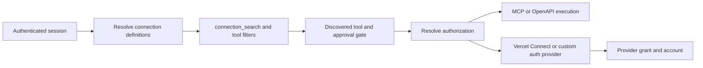

# Eve MCP and connector architecture

Supplement to [Connector support for Accelerate](connector-design.md) · 24 September 2026 · Research only

## Conclusion

Eve is a useful implementation reference for Accelerate because it separates remote tool execution from account authorization. **Eve** supplies connection definitions, MCP/OpenAPI execution, tool discovery, policy hooks, and durable authorization orchestration. **Vercel Connect** is an optional managed authorization service supplying provider grants and tokens. Custom token resolvers and custom interactive authorization work without Connect.

This supports the proposed Accelerate connector → connection → agent binding model. The strongest additions are stable account-instance identity, backend-supplied tool arguments, and an authorization-provider boundary that can support either our encrypted store or a managed broker. OpenAPI-generated tools and search-based discovery are useful later extensions, not prerequisites for the first voice release.

## Evidence and limits

Inspected the public [vercel/eve repository](https://github.com/vercel/eve) at commit `15ad358c7b1f470eb3c9b36a53bf9140eb4f3191`, including documentation and the runtime paths linked below. Also checked Vercel Connect's current first-party documentation. No Eve application was executed, no account was linked, and no latency or provider interoperability was measured. Connect's hosted implementation was not audited; storage/refresh claims are its published contract, not conclusions about its internal database, encryption keys, or refresh locking.

## The layers and their terminology

| Layer | Eve / Connect contract | Accelerate equivalent |
|---|---|---|
| Tool definition | File under `agent/connections/`; MCP URL or OpenAPI document, auth, filters, arguments, approval | Connector definition plus agent binding |
| Runtime connection | Named, resolved MCP/OpenAPI client; may be rebuilt from authenticated session context | Resolved session binding and runner entry |
| Connect connector | Managed service configuration, addressed by UID/ID and linked to projects/environments | Optional authorization-provider configuration; not a one-to-one match to our catalog entry |
| Principal/grant | App or authenticated user; user identity can include issuer | App boundary plus verified owner on our Connection |
| Installation | Selected provider workspace, organization, or tenant | Concrete provider account/installation selected by Connection |
| Tool authorization | Tool filters and approval callbacks | Explicit tool grants and future per-action confirmation |

An Eve connection file does not itself imply a persisted, reusable account resource. Avoid copying its word “connection” directly into our REST API without preserving the account/definition distinction. The MCP URL, Eve alias, Connect connector UID, provider installation, and user principal are different identifiers.



Discovery can also require authorization. The diagram shows the execution responsibilities, not a guarantee of a single fixed network sequence. [Connection overview](https://github.com/vercel/eve/blob/15ad358c7b1f470eb3c9b36a53bf9140eb4f3191/docs/connections/overview.mdx)

## MCP execution and model exposure

`defineMcpClientConnection` declares a remote endpoint. Its filename supplies the alias, and exposed names use `<connection>__<tool>`. MCP transport is delegated to the bundled AI SDK MCP client. The runtime lazily creates the client, shares concurrent initialization/discovery promises, lists tools, applies filters, and builds executable tools from those same filtered definitions. An execution request for an absent tool fails. Streamable HTTP is attempted first; SSE fallback is limited to compatibility failures. These are source observations, not a completed protocol conformance assessment. [MCP client source](https://github.com/vercel/eve/blob/15ad358c7b1f470eb3c9b36a53bf9140eb4f3191/packages/eve/src/runtime/connections/mcp-client.ts)

Current documentation enables protocol discovery by default. A per-connection `protocolVersionDiscovery: false` option selects legacy initialization, initially proposing `2025-11-25`. That is a useful precedent for provider compatibility configuration rather than a single hard-coded protocol version. Filters support either `tools.allow` or `tools.block`; omitting both leaves a broad surface. Accelerate should retain required exact grants and deny newly discovered tools until reviewed. [MCP connection contract](https://github.com/vercel/eve/blob/15ad358c7b1f470eb3c9b36a53bf9140eb4f3191/docs/connections/mcp.mdx)

The model discovers tools through `connection_search`, which accepts keywords, an optional connection, and a result limit. The inspected implementation uses lexical scoring of tool names and descriptions, not embeddings. It stores discovered metadata outside ordinary model history so executable tools can be reconstructed. An untargeted search iterates registered connections and can trigger their upstream discovery/authentication; it is not simply a local lookup in a prebuilt universal index. [Search implementation](https://github.com/vercel/eve/blob/15ad358c7b1f470eb3c9b36a53bf9140eb4f3191/packages/eve/src/execution/tools/connection-search.ts)

For voice, retain a small catalog of preselected tools at readiness. Experiment with search only when tool count warrants it, using cached authorized metadata and a bounded discovery budget. Discovery is a model context optimization, never an authorization boundary. Measure first-use latency and tool-selection accuracy as well as prompt size.

## Identity, dynamic accounts, and recovery

Eve separates inbound route authentication from outbound credential ownership. Raw `auth.getToken` defaults to app ownership; `connect()` defaults to an interactive user grant. A user-owned connection requires an authenticated user already attached to the session. A schedule or internal runtime identity does not become an end user just because a tool needs OAuth. The runtime fails with `principal_required` instead of allowing an arbitrary person to supply credentials. Principal cache keys distinguish issuer and subject. Accelerate should make owner explicit in its public API and continue using trusted request identity. [Principal resolution](https://github.com/vercel/eve/blob/15ad358c7b1f470eb3c9b36a53bf9140eb4f3191/packages/eve/src/runtime/connections/principal.ts)

`defineDynamic` can resolve connections at session or turn start, returning a definition, a named map, or no connections. Resolvers receive session/channel context, not raw conversation/tool inputs. This supports one endpoint with different accounts, or several accounts available to one user. A turn result replaces the same resolver's session result; failure does not silently restore a shadowed static definition. Recovery can rerun resolvers, so they must be idempotent. [Dynamic connection guide](https://github.com/vercel/eve/blob/15ad358c7b1f470eb3c9b36a53bf9140eb4f3191/docs/guides/dynamic-capabilities.md)

Authenticated dynamic definitions require a stable nonsecret `instanceKey`. Eve derives an opaque instance identity from source, connection name, protocol, endpoint, and instance key. Authorization state is scoped to this identity; a resumed callback must not authorize a different account selected after suspension. This is stronger than using the display alias as a cache or callback key. [Instance identity](https://github.com/vercel/eve/blob/15ad358c7b1f470eb3c9b36a53bf9140eb4f3191/packages/eve/src/runtime/connections/instance-identity.ts), [scoped authorization](https://github.com/vercel/eve/blob/15ad358c7b1f470eb3c9b36a53bf9140eb4f3191/packages/eve/src/runtime/connections/scoped-authorization.ts)

For Accelerate, keep explicit session account selection in v1. Bind attempts, caches, and pending actions to app, owner, connection ID, immutable endpoint/definition revision, and the relevant authorization revision. A reconnect or account switch cannot repurpose an old callback. If turn-level account resolution arrives later, it must select from authorized application records and revalidate grants; it cannot treat conversation content as account authority.

## Managed and custom authorization

Vercel Connect's Eve adapter uses deployment authentication to request credentials for an app or user. User consent suspends a turn; completion causes the adapter to obtain a token from Connect again. App authorization is noninteractive. `connectOAuth()` is a separate inbound route-authentication helper. Likewise, managed channel credentials do not automatically expose that provider's tools: the documented Linear example needs a separate MCP connection. These distinctions matter for Accelerate's call channels versus outbound capabilities. [Connect's Eve integration](https://vercel.com/docs/connect/frameworks/eve)

Connect represents provider workspaces/organizations as installations. Token requests can name an installation; omission may use a configured default. Cross-installation selection is provider-dependent. Accelerate should keep an explicit connection/account reference instead of allowing a changed default to redirect an existing agent binding. [Installations](https://vercel.com/docs/connect/concepts/installations)

Connect documents an in-process token cache keyed by connector and request parameters, with an expiry buffer and force-refresh/eviction controls. Its service handles refresh using the stored grant. Revocation is provider-dependent; deleting local/broker state is not proof that an already-issued provider token instantly stops working. These are reasons to specify our own local disconnect guarantee and check connection state before dispatch, even if a broker supplies tokens. [Token lifecycle](https://vercel.com/docs/connect/concepts/tokens)

Eve also supports custom `getToken` and `defineInteractiveAuthorization` with three operations: obtain token, start authorization, complete authorization. The application provides provider integration and storage. The framework supplies the pause/resume machinery. Custom resume data may be journaled, so “bearers are not serialized” must not be generalized to “all authorization state is secret-free.” Keep verifiers and other sensitive attempt state in an appropriately protected store. [Custom authorization contract](https://github.com/vercel/eve/blob/15ad358c7b1f470eb3c9b36a53bf9140eb4f3191/docs/connections/overview.mdx)

Eve's own token cache is virtual, step-local state keyed by authorization scope and principal. It checks expiry and avoids putting bearer tokens into durable step payloads. This differs from Connect's SDK cache and provider refresh service. On a recognized rejected bearer, the MCP client evicts cached auth, closes the client, and raises authorization-required; ordinary permission/server errors are not all converted into consent prompts. Do not infer distributed refresh locking or immediate revocation from this code. [Token cache source](https://github.com/vercel/eve/blob/15ad358c7b1f470eb3c9b36a53bf9140eb4f3191/packages/eve/src/runtime/connections/authorization-tokens.ts), [MCP failure classification](https://github.com/vercel/eve/blob/15ad358c7b1f470eb3c9b36a53bf9140eb4f3191/packages/eve/src/runtime/connections/mcp-client.ts)

For Accelerate, keep credential resolution behind an internal contract carrying connection, verified principal, audience/scopes, deadline, and invalidation context. Initially implement it with our encrypted store and refresh coordinator. A broker adapter can return a short-lived token and expiration later without changing agent bindings. Do not introduce arbitrary token-fetch URLs in browser-controlled config. Broker adoption still needs a Go integration experiment and evaluation of tenancy mapping, deployment authentication, supported providers, latency, outage behavior, residency, export/migration, and cost.

## Application-owned arguments and approvals

Eve's `toolCall.providedArguments` removes application-owned keys from model-facing schemas and inserts resolved values immediately before execution, overriding conflicts. Values can depend on trusted session context, tool name, and a replay-stable call ID. This is useful for tenant IDs, integration metadata, and supported upstream idempotency keys. Approval policies receive model-authored input rather than injected values. [Argument and approval contract](https://github.com/vercel/eve/blob/15ad358c7b1f470eb3c9b36a53bf9140eb4f3191/docs/connections/mcp.mdx)

Proposed Accelerate extension: add **per-tool** `provided_arguments` to an agent binding, controlled by the customer backend. Unlike arbitrary JavaScript callbacks, values use a closed set of trusted references or constants. For example, this is a proposed API fragment, not implemented behavior:

```json
{
  "name": "lookup_contact",
  "execution": "allow",
  "provided_arguments": {
    "tenant_id": { "source": "connection.account_id" }
  }
}
```

Specify the initial union as `{ "value": <JSON> }` or `{ "source": "connection.account_id" | "caller.user_id" | "invocation.id" }`. Each argument is a top-level property in the accepted tool schema. Reject unknown properties/references; absent required context fails before dispatch. Remove supplied properties from the model schema, reject model attempts to set them, inject backend values, then validate the complete arguments against the original schema. Constants belong to backend-controlled config and cannot carry provider secrets. An account ID is only suitable when it matches the upstream tool's expected tenant identifier; do not assume the names are interchangeable.

Resolve and freeze these values before confirmation or dispatch. Future approval records must bind effective arguments, including meaningful injected account/tenant fields, plus schema and policy revisions. Reauthorize on resume; do not silently change an approved account. `invocation.id` is useful for idempotency only if the provider honors it; it does not make an arbitrary write retry-safe. Keep arbitrary nesting/templates and model-selected source paths out of the first version of this extension.

Eve offers session-wide, per-call, custom, and model-evaluated approval policies. Those are UX options, not evidence that model evaluation establishes permission. Accelerate's explicit tool grants remain the authorization boundary. Interactive approval should still wait until its browser/voice identity and resume semantics are complete.

## OpenAPI support and isolation

`defineOpenAPIConnection` accepts OpenAPI 3.x or Swagger 2.0, from a URL or inline document, and produces one tool per operation. Names use `operationId` or a deterministic method/path fallback. It shares authorization, operation filters, supplied arguments, and approvals with MCP. The API supports an explicit base URL and documents HTTPS/redirect checks. This provides a concrete alternative to requiring every customer HTTP API to be wrapped in a separate MCP server. [OpenAPI contract](https://github.com/vercel/eve/blob/15ad358c7b1f470eb3c9b36a53bf9140eb4f3191/docs/connections/openapi.mdx)

Consider this after MCP and the existing customer-function bridge. Import a reviewed spec revision, bind operation IDs and effective schemas, pin the destination, and apply the same egress policy to spec fetching, references, redirects, and execution. Do not let an updated `servers` field redirect credentials. Generic operations can also be poor model tools; narrow authored adapters remain useful for product-specific workflows.

Eve's trusted runtime holds connection/auth callbacks; isolated model-generated code is a different trust domain. Its security documentation describes optional sandbox network credential brokering, but that is separate from ordinary MCP authorization. Accelerate can copy the boundary without introducing a sandbox or assuming tokens never exist in trusted process memory. [Security model](https://github.com/vercel/eve/blob/15ad358c7b1f470eb3c9b36a53bf9140eb4f3191/docs/concepts/security-model.md)

## Changes to the Accelerate proposal

| Decision | Recommendation |
|---|---|
| Public objects | Retain connector, authorized connection, and agent/session binding; Eve does not remove the need for these resources |
| Credential implementation | Internal resolver boundary now; encrypted local implementation first; broker adapter remains optional |
| Account identity | Scope caches/callbacks to immutable connection identity and revisions; never alias alone |
| Supplied arguments | Add the explicit extension above when the first workflow requires backend-owned tool parameters |
| Model tool exposure | Small eager allowlist for voice launch; benchmark authorized search-based discovery later |
| Non-MCP APIs | Existing function bridge first; evaluate pinned OpenAPI operation generation before building broad native adapters |
| In-call consent | Preauthorize voice connections; reconnect event on expiry; defer durable conversational consent |
| Revocation | Accelerate must enforce local state before new dispatch regardless of token/broker cache lifetime |

Additional acceptance cases: a callback returning after account replacement is rejected; a model cannot override a supplied tenant argument; confirmation resumes with the same effective input or fails; per-user/per-installation caches do not mix; broker rejection invalidates the correct scope; discovery never exposes ungranted tools; and an OpenAPI server/spec change cannot redirect a previously granted credential.
