# AI Football Commentator Example

[Vision Agents](https://visionagents.ai/) is our open source framework for quickly building low-latency video AI applications on the edge. It runs on Stream’s global edge network by default, supports any edge provider and integrates with 25+ leading voice and video AI models. 

To put the framework to the test, we built a real-time sports commentator using stock football footage. The system combines Roboflow’s [RF-DETR](https://roboflow.com/model/rf-detr) for real-time player identification with real-time models from [Google Gemini](https://gemini.google/overview/gemini-live) and [OpenAI](https://platform.openai.com/docs/guides/realtime). 

Both models could provide feedback, but neither was accurate or fast enough for live sports. This post covers what we built, how it performed, and what we hope to see from future real-time models to make it viable.

## Code Setup 

Note: You can find the code for this tutorial on the [Vision Agents GitHub page](https://github.com/GetStream/Vision-Agents/tree/main/plugins/roboflow/example).

Given that we were working with complex clips of sports games with motion and differing camera angles, the live models from Gemini and OpenAI needed some help to identify key elements in the frame, such as the players and ball.

The sports commentator uses a two-model architecture: Roboflow’s [RF-DETR](https://github.com/roboflow/rf-detr) handles fast object detection while Gemini/OpenAI reviews the annotated video and provides natural language commentary. 

The data flow through the application works as shown in the diagram:
1. Video input is sent to Roboflow’s RF-DETR model.
2. This emits detection events and allows the video to be annotated with bounding boxes. 
3. The annotated video is sent to the real-time model, as well as to the user’s display.
4. When detection event criteria are met, the application prompts the real-time model to respond to what it sees.
5. The model provides commentary on the match event.

```mermaid
flowchart TD
    A[📹 Video Input] --> B[RF-DETR]
    B -.-> C[Detection Events]
    B --> D[Annotated Video<br>with bounding boxes]
    C --> E{Criteria Met?}
    E -->|Yes| F[Realtime Model]
    D --> G[🖥 User Display]
    D --> F
    F --> H[🎙 Match Commentary]
```



Here's the core configuration:

```python
from vision_agents.core import User, Agent
from vision_agents.plugins import getstream, roboflow, openai

async def create_agent(**kwargs) -> Agent:
    agent = Agent(
        edge=getstream.Edge(),
        agent_user=User(name="AI Sports Commentator", id="agent"),
        instructions="Read @instructions.md",
        processors=[
            roboflow.RoboflowLocalDetectionProcessor(
                model_id="rfdetr-base",
                fps=5,
                conf_threshold=0.5,
                classes=["person", "sports ball"],
            )
        ],
        llm=openai.Realtime(fps=1),
    )
    return agent
```

One of Vision Agents' strengths is hot-swapping models with minimal code changes. During testing, we frequently switched between Gemini Live and OpenAI Realtime with a one-line configuration change to compare their performance:

```python
# Gemini Live
from vision_agents.plugins import getstream, gemini

agent = Agent(
    llm = gemini.Realtime()
    ...
)

# OpenAI Realtime
from vision_agents.plugins import getstream, openai

agent = Agent(
    llm = openai.Realtime()
    ...
)
```

The rest of the agent logic works exactly the same for both, so we could run identical tests across providers without rewriting event handlers or detection logic.

### Configuration Choices

The Vision Agents SDK can be configured very quickly, which allowed us to iterate and find the parameters that worked best for our use case. Here’s a short summary:

- **RF-DETR model**: We wanted a lightweight pretrained model, so we chose \`rfdetr-base\` as a balance between speed and accuracy. The \`rfdetr-nano\` variant runs faster but misses smaller objects. \`rfdetr-large\` is more accurate but couldn't keep up with real-time video on our test hardware.

- **Detection FPS**: We ran RF-DETR at 5 FPS. This is fast enough to \[track player movement]\(https\://getstream.io/blog/ai-ball-player-tracking/) and ball position without overwhelming the system. Higher FPS didn't improve commentary quality since the bottleneck is the real-time model, not Roboflow.

- **Real-time model FPS**: We tried different FPS rates, but these were much lower than the detection FPS, ranging from 1-3 FPS. The real-time models were only able to keep a few frames in context without getting confused or queueing frames. Sending more frames increased cost without improving responsiveness.

- **Confidence threshold**: We set this to 0.5—low enough to detect the ball except during fast motion (when detection confidence drops), but high enough to avoid false positives.

## Initial Results

With our pipeline configured, we ran our first tests using public domain football footage to see how the system would perform as a real-time commentator.

VIDEO NEEDS TO GO HERE!!!!!!!!
VIDEO NEEDS TO GO HERE!!!!!!!!
VIDEO NEEDS TO GO HERE!!!!!!!!
VIDEO NEEDS TO GO HERE!!!!!!!!
VIDEO NEEDS TO GO HERE!!!!!!!!
VIDEO NEEDS TO GO HERE!!!!!!!!
VIDEO NEEDS TO GO HERE!!!!!!!!
VIDEO NEEDS TO GO HERE!!!!!!!!
VIDEO NEEDS TO GO HERE!!!!!!!!
