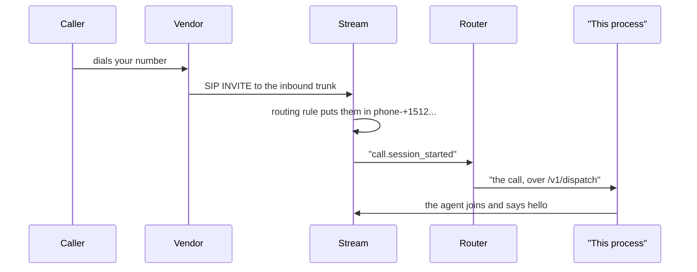

# Inbound Call Example

An agent that answers a real phone call.

Example 13 rings somebody. This one waits to be rung, and that difference is most of the
setup. Nothing here places a call: the caller dials one of your numbers, the vendor hands it
to Stream over SIP, Stream puts them in a call and tells the router about it, and the router
hands the call to a worker that is waiting for one.

The worker is this process. It connects out to the router and waits, so nothing about this
machine has to be reachable from the internet. The router does, because Stream has to be able
to reach it to say a call arrived.



## Prerequisites

- Python 3.13 or higher
- A running acceleration router (see [acceleration/README.md](../../../acceleration/README.md))
- A telephony vendor configured on it, and a number bought and attached
- A public URL for the router, so Stream can deliver call events to it
- API keys for:
    - [Stream](https://getstream.io/?utm_source=github.com&utm_medium=referral&utm_campaign=vision_agents) (for video/audio infrastructure)
    - Whatever providers the router is configured with

## Setting the number up

Three things, once each.

Buy a number, if you do not have one:

```bash
cd acceleration
go run ./cmd/phone search -country US -area 512
go run ./cmd/phone buy -vendor telnyx -number +15125551234
```

Attach it, which creates the SIP trunk at Stream and points the vendor at it. Attaching also
records which Stream call the number's callers land in, which is how an arriving call is
matched back to you:

```bash
go run ./cmd/phone attach -number +15125551234 -customer examples
```

Give the router a public address and tell Stream to deliver call events there. In development
that is a tunnel:

```bash
ngrok http 8080
```

```bash
export ROUTER_PUBLIC_URL=https://your-tunnel.ngrok.app
go run ./cmd/phone hooks -url https://your-tunnel.ngrok.app
```

`hooks` with no arguments prints what the app has, and is worth running first. Event hooks
are one setting on the whole Stream app: `-url` changes only the hook for that url and writes
every other one back untouched, so an app already delivering events somewhere else keeps
doing it. A tunnel address changes each time ngrok restarts, so take the old one back down:

```bash
go run ./cmd/phone hooks -remove https://the-old-tunnel.ngrok.app
```

## Installation

1. Go to the example's directory

    ```bash
    cd examples/old/14_inbound_call_example
    ```

2. Install dependencies using uv:

   ```bash
   uv sync
   ```

3. Create a `.env` file:

   ```
   STREAM_API_KEY=your_stream_key
   STREAM_API_SECRET=your_stream_secret
   STREAM_ACCELERATION_URL=http://localhost:8080
   STREAM_ACCELERATION_CUSTOMER_ID=examples
   INBOUND_NUMBER=+15125551234
   ```

   `STREAM_ACCELERATION_CUSTOMER_ID` has to match the `-customer` the number was attached
   for. That is what connects the call that arrives to the worker that answers it.

## Running the Example

```bash
uv run inbound_call_example.py
```

It waits. Ring the number from a phone, and the agent answers.

## How it works

A dispatch worker waits for calls and runs a handler for each one:

```python
dispatch = stream.StreamDispatch()


@dispatch.wait_for_call()
async def answer(call: InboundCall):
    agent = Agent(
        edge=getstream.Edge(),
        agent_user=User(name="John", id="agent"),
        llm=stream.Accelerated(config="john"),
    )
    async with agent.answer(call):
        await agent.simple_response("greet the caller and ask how you can help")
        await agent.finish()


asyncio.run(dispatch.run())
```

`agent.answer(call)` is the inbound mirror of `agent.outbound_call(...)`. The difference is
which end started it: the caller is already in the call, so `answer` joins theirs rather than
creating one, and it waits for them to finish joining before returning. Greeting a call
before the caller is in it talks to nobody.

The handler runs as its own task, so a second caller is answered while the first is still
talking. How many at once is up to the worker:

```python
dispatch = stream.StreamDispatch(capacity=8)
```

The router passes over a worker that is full rather than queueing behind it, so `capacity` is
a promise about what this process can actually answer rather than a hint.

### Running more than one worker

Start the example twice and calls are shared between them, round robin. Each worker also
reports what it is doing — how many calls it is in, how busy its host is, and the round trip
it measures to the router — which a routing policy will read later. Round robin does not read
any of it yet, so today it is what you look at to see which worker is under load.

Nothing is shared between customers: two customers' workers are two independent rotations.

### When there is no worker

The call rings out. The router logs that nobody could answer it and answers Stream with a
200 anyway, because a retry would not find a worker that is not there and the caller is on
the line for every one of them.

## Learn More

- [The outbound call example](../13_outbound_call_example)
- [The acceleration backend](../../../acceleration/README.md)
- [The stream plugin](../../plugins/stream/README.md)
- [Main Vision Agents README](../../README.md)
